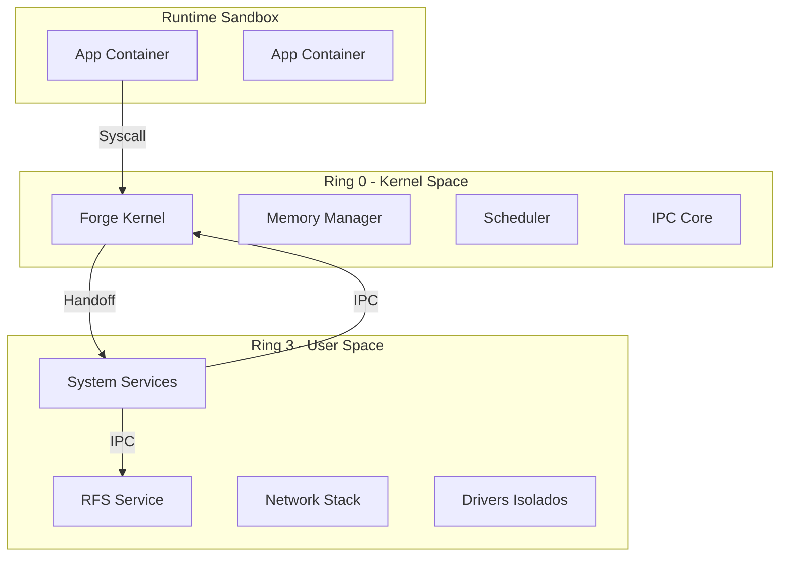

# Forge Kernel

<div align="center">


**O Núcleo Microkernel de Alta Performance do Redstone OS**

*Escrito em Rust puro seguindo padrões Industriais e Militares de confiabilidade*

[🚀 Quick Start](#-quick-start) • [🏛️ Arquitetura](#️-arquitetura) • [💾 RFS & FS](#-sistema-de-arquivos-distribuído-rfs) • [🧠 Memória](#-gerenciamento-de-memória-mm) • [🤝 Contribuir](#-contribuir)

</div>

---

## 📖 Visão Geral

**Forge** é a implementação de referência do kernel para o **Redstone OS**. Projetado como um **microkernel** moderno, ele serve como a fundação segura sobre a qual todo o sistema operacional opera.

### 🛡️ Regras de Ouro (Padrão Industrial)

O desenvolvimento do Forge segue diretrizes estritas para garantir robustez inigualável:

1.  **Zero Panic Policy**: O kernel não deve entrar em pânico em operação normal. O uso de `unwrap()` é proibido fora da inicialização.
2.  **ABI Imutável**: Estruturas de comunicação (como `BootInfo` e mensagens IPC) são congeladas por versão.
3.  **Crash ≠ Reboot**: A falha de um driver ou serviço nunca derruba o sistema. O kernel apenas reinicia o componente falho.
4.  **Single Source of Truth**: Hardware é definido uma única vez na HAL (`arch/`).

---

## 🏛️ Arquitetura do Sistema

O Redstone OS adota um modelo **Micro-Modular Pragmático**.

### Diagrama de Camadas



### O Modelo de Serviços
Ao contrário de kernels monolíticos (Linux/Windows), drivers não rodam com privilégio total.
*   **Drivers são Processos**: Se o driver de vídeo travar, o kernel mata o processo e o reinicia. A tela pisca, mas o sistema não dá Tela Azul.
*   **IPC Tipado**: A comunicação entre serviços é feita via mensagens tipadas e validadas pelo kernel.

---

## 💾 Sistema de Arquivos (RFS) & Layout

O Redstone OS introduz o **RFS (Redstone File System)** e um layout de diretórios moderno.

### Redstone File System (RFS)
Um FS de próxima geração focado em integridade e "viagem no tempo", sem a complexidade de hardware do ZFS.

| Recurso | Descrição |
|---------|-----------|
| **Copy-on-Write (COW)** | Dados nunca são sobrescritos. Novas escritas vão para novos blocos. |
| **Integridade Total** | Checksum em dados e metadados. Bit-rot é detectado e curado automaticamente. |
| **Snapshots Instantâneos** | Estado do sistema congelado em milissegundos sem custo de espaço inicial. |
| **Rollback Atômico** | Atualização falhou? O sistema reverte para o snapshot anterior automaticamente. |

### Hierarquia de Diretórios (Target Layout)

Nada de bagunça em `/`. Cada diretório tem um contrato claro:

```bash
/
├── system/   # IMUTÁVEL. Kernel, drivers e serviços base. (Read-Only)
├── runtime/  # VOLÁTIL. Sockets, locks, PIDs. Limpo no boot (tmpfs).
├── state/    # PERSISTENTE. Config logs e metadados de serviços.
├── data/     # DADOS. Arquivos do usuário, bancos de dados.
├── users/    # HOME. Dados isolados por usuário.
├── apps/     # CONTAINERS. Aplicações instaladas (Sandboxed).
└── snapshots/# HISTÓRICO. Acesso direto a versões passadas do sistema.
```

---

## 🧠 Gerenciamento de Memória (`mm`)

O subsistema `mm` é o coração da segurança do Forge.

### PMM (Physical Memory Manager)
Implementa um **Bitmap Allocator**.
*   **Por que?** Simplicidade e robustez. Bitmaps são fáceis de debugar e garantem uso contíguo.
*   **Segurança**: O `init` do PMM detecta sobreposição com o kernel e consigo mesmo.

### VMM (Virtual Memory Manager)
Resolve o problema clássico de **Huge Pages vs 4KiB Pages**.

> [!WARNING]
> **O Problema**: O bootloader mapeia os primeiros 4GiB como Huge Pages (2MiB). Tentar alterar uma permissão de 4KiB nessa região causa GPF.

**A Solução Forge**:
*   **Scratch Slot**: Uma região virtual (`0xFFFF_FE00...`) reservada para manipulação de frames físicos.
*   **Auto-Split**: Se o VMM detecta uma escrita em Huge Page, ele automaticamente a "quebra" em 512 páginas de 4KiB.

---

## ⚡ Escalonador & Tarefas

O Forge utiliza um scheduler **Round-Robin Preemptivo** com suporte a **Prioridades Dinâmicas**.

### 1. Modelo de Tarefa (Task Class)
*   **Kernel Task (Ring 0)**: Executa código privilegiado.
*   **User Task (Ring 3)**: Isolada, interage via Syscalls.
*   **Service Task**: Prioridade alta, gerencia recursos críticos.

### 2. Context Switch
A troca de contexto é feita manipulando diretamente o **Stack Pointer (RSP)**.
*   A stack do kernel (`kstack`) é **Pinned** na memória.
*   Interrupções salvam o estado na stack da tarefa interrompida.

---

## 🗺️ Roadmap de Refatoração

Seguindo o **Plano Mestre de Refatoração**, estamos na Fase 2.

- [x] **Fase 1: Fundação & Handoff**
    - [x] BootInfo ABI (compatível com Ignite)
    - [x] Stack Setup & SSE

- [ ] **Fase 2: Arquitetura Básica (HAL)**
    - [x] GDT / IDT Setup
    - [ ] Serial Driver (Polling)
    - [ ] Panic Handler Visual

- [ ] **Fase 3: Gerenciamento de Memória**
    - [x] PMM (Bitmap Allocator)
    - [x] VMM (Page Tables & Scratch Slot)
    - [ ] Heap Allocator (Otimizar Linked List)

- [ ] **Fase 4: Multitarefa & IPC**
    - [x] Scheduler Básico (Round Robin)
    - [ ] IPC Messaging (Send/Recv)
    - [ ] Syscall Dispatcher (int 0x80)

---

## 📁 Estrutura do Projeto

```bash
forge/
├── src/
│   ├── arch/           # Hardware Abstraction Layer (HAL)
│   │   └── x86_64/     # GDT, IDT, Interrupts, Context Switch
│   ├── core/           # Lógica Central (Logging, Panic, Entry)
│   ├── drivers/        # Drivers de Boot (Serial, Vídeo Simples)
│   ├── mm/             # Gerenciamento de Memória (PMM, VMM, Heap)
│   ├── sched/          # Scheduler e Tasks
│   ├── sys/            # Definições de Sistema (Constantes, ABI)
│   ├── syscall/        # Interface Kernel <-> User
│   └── main.rs         # Entry Point (_start)
├── Cargo.toml          # Dependências
├── linker.ld           # Layout de Memória
└── x86_64.json         # Target Spec
```

---

<div align="center">

**Redstone OS Team** • *Construindo o Futuro, Byte a Byte*

</div>
