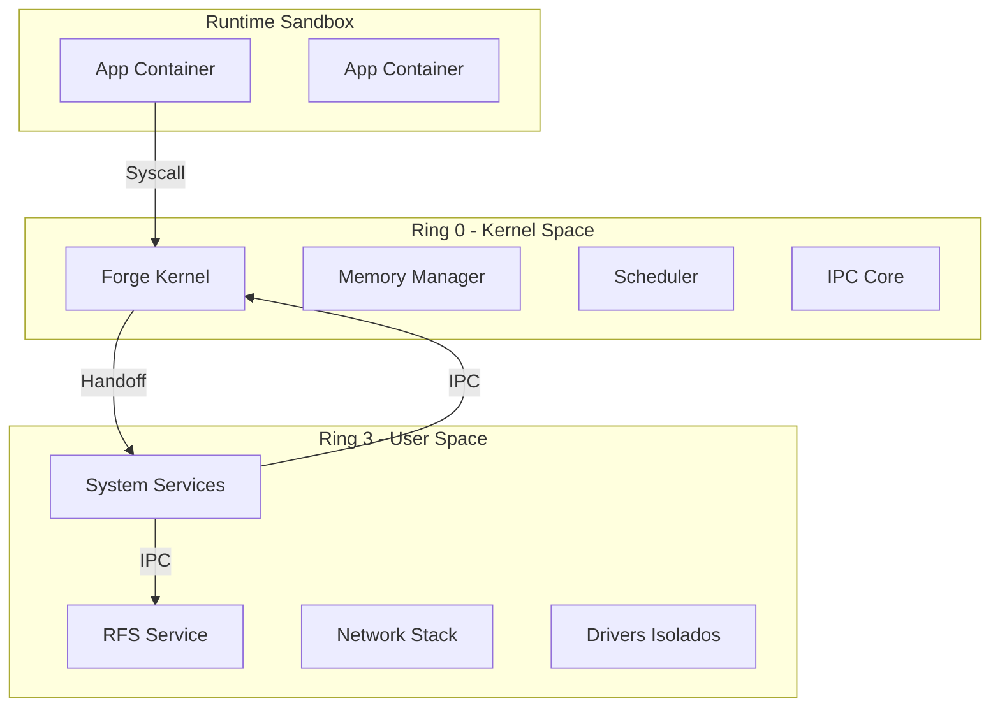

# Forge Kernel

<div align="center">


**O Núcleo Microkernel de Alta Performance do Redstone OS**

*Escrito em Rust puro seguindo padrões Industriais e Militares de confiabilidade*

[🚀 Quick Start](#-quick-start) • [📚 Docs](#-documentação-técnica) • [🏛️ Arquitetura](#️-arquitetura) • [💾 RFS](#-sistema-de-arquivos-rfs--layout) • [🤝 Contribuir](#-contribuir)

</div>

---

## 📖 Visão Geral

**Forge** é a implementação de referência do kernel para o **Redstone OS**. Projetado como um **microkernel** moderno, ele serve como a fundação segura sobre a qual todo o sistema operacional opera.

### 🛡️ Regras de Ouro (Padrão Industrial)

O desenvolvimento do Forge segue diretrizes estritas para garantir robustez inigualável:

1.  **Zero Panic Policy**: O kernel não deve entrar em pânico em operação normal. O uso de `unwrap()` é proibido fora da inicialização.
2.  **ABI Imutável**: Estruturas de comunicação (como `BootInfo` e mensagens IPC) são congeladas por versão.
3.  **Crash ≠ Reboot**: A falha de um driver ou serviço nunca derruba o sistema. O kernel apenas reinicia o componente falho.
4.  **Single Source of Truth**: Hardware é definido uma única vez na HAL (`arch/`).

---

## 📚 Documentação Técnica

Mantemos uma documentação detalhada para cada subsistema do kernel na pasta `doc/`.

| Módulo | Documentação | Descrição |
|:-------|:-------------|:----------|
| **Architecture** | [🏛️ Architecture & HAL](doc/ARCHITECTURE_HAL.md) | Camada de Abstração de Hardware, Boot, Interrupções e Context Switch. |
| **Core** | [⚙️ Kernel Core](doc/KERNEL_CORE.md) | Inicialização (`main.rs`), SMP, Power Management e Debugging. |
| **Memory** | [🧠 Memory Management](doc/MEMORY_MANAGEMENT.md) | PMM, VMM (HHDM), Heap e Alocadores. |
| **Sched** | [⚡ Scheduler](doc/SCHEDULER.md) | Ciclo de vida de Tasks, Algoritmo Round-Robin e Troca de Contexto. |
| **Syscalls** | [📞 Syscall Interface](doc/SYSCALLS.md) | ABI completa, números de syscall (`RAX`), erros e convenções. |
| **IPC** | [💬 IPC System](doc/IPC_SYSTEM.md) | Ports, Channels, Shared Memory e Message Passing. |
| **FS** | [💾 Filesystem](doc/FILESYSTEM.md) | Virtual File System (VFS), Inodes e Drivers de FS. |
| **Drivers** | [🔌 Drivers Model](doc/DRIVERS.md) | Modelo de dispositivos, PCI e inicialização de hardware. |
| **Modules** | [📦 Module System](doc/MODULE_SYSTEM.md) | Carregamento dinâmico de drivers (`.ko`), assinaturas e sandbox. |
| **Security** | [🔒 Security Model](doc/SECURITY_MODEL.md) | Capabilities (OCAP), ACLs e isolamento. |
| **Sync** | [🚦 Synchronization](doc/SYNC_PRIMITIVES.md) | Mutex, Spinlock, Atomics e RCU. |
| **Sys** | [🧱 System Definitions](doc/SYS_DEFINITIONS.md) | Tipos fundamentais (`Pid`, `Tid`) e definições compartilhadas. |
| **Klib** | [🧰 Kernel Library](doc/KERNEL_LIBRARY.md) | Estruturas de dados `no_std` (Bitmap, Lists, Trees). |

---

## 🏛️ Arquitetura do Sistema

O Redstone OS adota um modelo **Micro-Modular Pragmático**.

### Diagrama de Camadas



### O Modelo de Serviços
Ao contrário de kernels monolíticos (Linux/Windows), drivers não rodam com privilégio total.
*   **Drivers são Processos**: Se o driver de vídeo travar, o kernel mata o processo e o reinicia. A tela pisca, mas o sistema não dá Tela Azul.
*   **IPC Tipado**: A comunicação entre serviços é feita via mensagens tipadas e validadas pelo kernel.

---

## 💾 Sistema de Arquivos (RFS) & Layout

O Redstone OS introduz o **RFS (Redstone File System)** e um layout de diretórios moderno.

### Redstone File System (RFS)
Um FS de próxima geração focado em integridade e "viagem no tempo", sem a complexidade de hardware do ZFS.

| Recurso | Descrição |
|---------|-----------|
| **Copy-on-Write (COW)** | Dados nunca são sobrescritos. Novas escritas vão para novos blocos. |
| **Integridade Total** | Checksum em dados e metadados. Bit-rot é detectado e curado automaticamente. |
| **Snapshots Instantâneos** | Estado do sistema congelado em milissegundos sem custo de espaço inicial. |
| **Rollback Atômico** | Atualização falhou? O sistema reverte para o snapshot anterior automaticamente. |

### Hierarquia de Diretórios (Target Layout)

Nada de bagunça em `/`. Cada diretório tem um contrato claro:

```bash
/
├── system/   # IMUTÁVEL. Kernel, drivers e serviços base. (Read-Only)
├── runtime/  # VOLÁTIL. Sockets, locks, PIDs. Limpo no boot (tmpfs).
├── state/    # PERSISTENTE. Config logs e metadados de serviços.
├── data/     # DADOS. Arquivos do usuário, bancos de dados.
├── users/    # HOME. Dados isolados por usuário.
├── apps/     # CONTAINERS. Aplicações instaladas (Sandboxed).
└── snapshots/# HISTÓRICO. Acesso direto a versões passadas do sistema.
```

---

## ⚡ Escalonador & Tarefas

O Forge utiliza um scheduler **Round-Robin Preemptivo** com suporte a **Prioridades Dinâmicas**.

### 1. Modelo de Tarefa (Task Class)
*   **Kernel Task (Ring 0)**: Executa código privilegiado.
*   **User Task (Ring 3)**: Isolada, interage via Syscalls.
*   **Service Task**: Prioridade alta, gerencia recursos críticos.

### 2. Context Switch
A troca de contexto é feita manipulando diretamente o **Stack Pointer (RSP)**.
*   A stack do kernel (`kstack`) é **Pinned** na memória.
*   Interrupções salvam o estado na stack da tarefa interrompida.

---

## 📁 Estrutura do Projeto

```bash
forge/
├── doc/                # 📚 DOCUMENTAÇÃO TÉCNICA (Indexada acima)
├── src/
│   ├── arch/           # Hardware Abstraction Layer (HAL)
│   ├── core/           # Lógica Central (Logging, Panic, Entry)
│   ├── drivers/        # Drivers de Boot & Device Model
│   ├── fs/             # Virtual File System (VFS)
│   ├── ipc/            # Inter-Process Communication (Ports, SHM)
│   ├── klib/           # Estuturas de Dados no_std
│   ├── mm/             # Gerenciamento de Memória (PMM, VMM, Heap)
│   ├── module/         # Carregamento de Drivers Dinâmicos (.ko)
│   ├── sched/          # Scheduler e Tasks
│   ├── security/       # Capabilities & Segurança
│   ├── sys/            # Definições de Sistema (Constantes, ABI)
│   ├── syscall/        # Interface Kernel <-> User
│   └── main.rs         # Entry Point (_start)
├── Cargo.toml          # Dependências
├── linker.ld           # Layout de Memória
└── x86_64.json         # Target Spec
```

---

<div align="center">

**Redstone OS Team** • *Construindo o Futuro, Byte a Byte*

</div>
