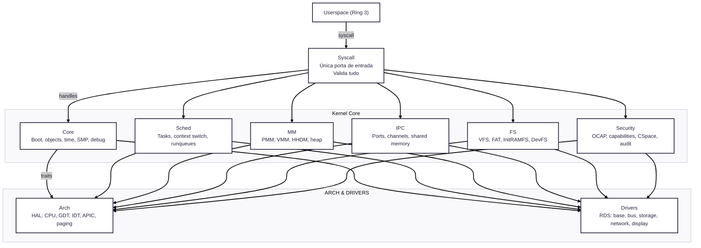

# ⚒️ Forge Kernel

<div align="center">


**Kerner de Alta Performance do RedstoneOS**

*Escrito em Rust puro seguindo padrões Industriais de confiabilidade*

[🚀 Quick Start](#-quick-start) • [📚 Documentação](#-documentação-técnica) • [🏛️ Arquitetura](#️-arquitetura) • [🔌 RDS](#-redstone-drive-system-rds) • [🛡️ Segurança](#️-segurança)

</div>

---

## 📖 Visão Geral

O **Forge** é o kernel do **RedstoneOS**, um sistema operacional moderno projetado para segurança, modularidade e performance. Implementado inteiramente em Rust, o Forge combina um design **kernel pragmático** com uma arquitetura em camadas que isola hardware, subsistemas e interface de sistema.

### 🎯 Objetivos do Projeto

| Objetivo | Descrição |
|----------|-----------|
| **Segurança** | Modelo OCAP (Object-Capability) - sem root, sem UID/GID |
| **Confiabilidade** | Falha de driver ≠ falha do sistema |
| **Modularidade** | Subsistemas desacoplados com interfaces bem definidas |
| **Performance** | Zero-copy IPC, syscalls rápidas via MSR |
| **Portabilidade** | HAL abstrata suportando x86_64, aarch64 e riscv64 |

### 🛡️ Regras de Ouro

O desenvolvimento do Forge segue diretrizes estritas:

1. **Zero Panic Policy**: O kernel não deve entrar em pânico em operação normal
2. **ABI Imutável**: Estruturas de comunicação são congeladas por versão
> **Nota:** ABI ainda pode mudar enquanto o sistema estiver em **alpha**.  
3. **Crash ≠ Reboot**: Falha de driver nunca derruba o sistema
4. **Single Source of Truth**: Hardware definido uma única vez na HAL

---

## 🏛️ Arquitetura

O Forge implementa uma arquitetura em **4 camadas** bem definidas:


```mermaid

---
config:
  theme: redux
---
flowchart TD
    USERSPACE["Userspace (Ring 3)"]
    SYSCALL["Syscall<br/>Única porta de entrada<br/>Valida tudo"]

    USERSPACE -->|syscall| SYSCALL

    subgraph KERNEL["Kernel Core"]
        CORE["Core<br/>Boot, objects, time, SMP, debug"]
        SCHED["Sched<br/>Tasks, context switch, runqueues"]
        MM["MM<br/>PMM, VMM, HHDM, heap"]
        IPC["IPC<br/>Ports, channels, shared memory"]
        FS["FS<br/>VFS, FAT, InitRAMFS, DevFS"]
        SECURITY["Security<br/>OCAP, capabilities, CSpace, audit"]
    end

    SYSCALL -->|handles| CORE
    SYSCALL --> SCHED
    SYSCALL --> MM
    SYSCALL --> IPC
    SYSCALL --> FS
    SYSCALL --> SECURITY

    subgraph LOWLEVEL["ARCH & DRIVERS"]
        ARCH["Arch<br/>HAL: CPU, GDT, IDT, APIC, paging"]
        DRIVERS["Drivers<br/>RDS: base, bus, storage, network, display"]
    end

    CORE -->|traits| ARCH
    SCHED --> ARCH
    MM --> ARCH
    IPC --> ARCH
    FS --> ARCH
    SECURITY --> ARCH

    CORE --> DRIVERS
    SCHED --> DRIVERS
    MM --> DRIVERS
    IPC --> DRIVERS
    FS --> DRIVERS
    SECURITY --> DRIVERS


```

### Camadas do Sistema

| Camada | Módulos | Responsabilidade |
|--------|---------|------------------|
| **L0** | `arch`, `drivers` | Hardware Abstraction Layer e Redstone Drive System |
| **L1** | `klib`, `sync`, `sys` | Primitivas do kernel (estruturas, sincronização, tipos) |
| **L2** | `core`, `mm`, `sched` | Subsistemas centrais (boot, memória, escalonamento) |
| **L3** | `ipc`, `fs`, `security`, `module` | Serviços do kernel |
| **L4** | `syscall` | Interface com userspace |

---

## 📚 Documentação Técnica

Documentação detalhada para cada subsistema está disponível em `doc/`:

| Módulo | Documentação | Descrição |
|:-------|:-------------|:----------|
| **HAL** | [🏛️ ARCH.md](doc/ARCH.md) | Hardware Abstraction Layer, CPU traits, portabilidade |
| **Core** | [⚙️ CORE.md](doc/CORE.md) | Boot sequence, SMP, time, work queues, debug |
| **Drivers** | [🔌 DRIVERS.md](doc/DRIVERS.md) | Redstone Drive System (RDS), recovery, hot-reload |
| **Memory** | [🧠 MM.md](doc/MM.md) | PMM, VMM, HHDM, Heap, alocadores |
| **Scheduler** | [⚡ SCHED.md](doc/SCHED.md) | Tasks, round-robin, context switch |
| **Filesystem** | [📂 FS.md](doc/FS.md) | VFS, FAT, InitRAMFS, syscalls de FS |
| **Syscalls** | [📞 SYSCALL.md](doc/SYSCALL.md) | ABI completa, números, convenções |
| **IPC** | [💬 IPC.md](doc/IPC.md) | Ports, channels, shared memory |
| **Security** | [🛡️ SECURITY.md](doc/SECURITY.md) | OCAP, capabilities, audit, sandbox |
| **Sync** | [🔄 SYNC.md](doc/SYNC.md) | Spinlock, mutex, RwLock, RCU |
| **Sys** | [📋 SYS.md](doc/SYS.md) | Tipos fundamentais, erros, ELF |
| **Klib** | [📚 KLIB.md](doc/KLIB.md) | Biblioteca interna no_std |
| **Module** | [📦 MODULE.md](doc/MODULE.md) | Sistema de módulos carregáveis |

---

## 🔌 Redstone Drive System (RDS)

O RDS é o framework unificado de gerenciamento de hardware do Forge. Diferente de abordagens tradicionais, o RDS implementa **controle centralizado** com recuperação automática de falhas.

### Filosofia

> *"Os drivers não são donos da casa, são hóspedes. A base é o síndico que define as regras."*

### Categorias de Drivers

```bash
drivers/
├── base/       # 🏛️ Infraestrutura central (DriverManager, recovery)
├── bus/        # 🚌 PCI, USB, VirtIO, ACPI, ISA
├── storage/    # 💾 AHCI, NVMe, VirtIO-Blk, Ramdisk
├── network/    # 🌐 Intel e1000, Realtek, VirtIO-Net
├── display/    # 📺 Framebuffer, GPU, VirtIO-GPU
├── input/      # ⌨️ PS/2, HID, VirtIO-Input
├── sound/      # 🔊 HD Audio, AC97, VirtIO-Sound
├── system/     # ⚙️ Timer, INT controller, power
└── comm/       # 📡 Serial, I2C, SPI
```

### Recursos do RDS

- **Recuperação Automática**: Retry → Rebind → Reset → Fallback
- **Driver Zone**: Memória isolada para drivers
- **DMA Pool Centralizado**: Controle de quem aloca o quê
- **Hot Reload**: Atualizar drivers sem reiniciar
- **Fallback Progressivo**: nvidia → vesa → framebuffer → texto

---

## 🛡️ Segurança

O Forge implementa um modelo **Object-Capability (OCAP)**, abandonando completamente UID/GID e o conceito de superusuário.

### Princípios OCAP

| Princípio | Descrição |
|-----------|-----------|
| **Sem Root** | Nenhuma entidade tem poder absoluto |
| **Posse é Poder** | Se você tem o token, você tem acesso |
| **Least Privilege** | Apenas o mínimo necessário |
| **Delegação Explícita** | Acesso só pode ser passado com direito de TRANSFER |
| **Revogável** | Capabilities podem ser revogadas a qualquer momento |

### Capability Rights

```rust
READ | WRITE | EXECUTE | DUPLICATE | TRANSFER | GRANT | REVOKE | WAIT | SIGNAL
```

---

## 📁 Estrutura do Projeto

```bash
forge/
├── doc/                    # 📚 Documentação técnica
│   ├── ARCH.md            # HAL e portabilidade
│   ├── CORE.md            # Subsistema core
│   ├── DRIVERS.md         # Documentação do RDS
│   ├── FS.md              # Sistemas de arquivos
│   ├── KLIB.md            # Biblioteca do kernel
│   ├── SECURITY.md        # Segurança
│   ├── SYNC.md            # Sincronização
│   ├── SYS.md             # Tipos do sistema
│   └── ...
│
├── src/
│   ├── arch/              # 🏛️ HAL (x86_64, aarch64, riscv64)
│   │   ├── aarch64/       # AArch64
│   │   ├── riscv64/       # RISC-V
│   │   ├── traits/        # Traits
│   │   ├── x86_64/        # x86_64
│   │   ├── mod.rs         # HAL
│   │   └── test.rs        # HAL tests
│   │
│   ├── core/              # ⚙️ Boot, SMP, time, work, debug
│   │   ├── boot/          # Ponto de entrada, Panic, initcalls
│   │   ├── debug/         # Logging, status, oops
│   │   ├── smp/           # Multiprocessamento
│   │   ├── time/          # Clocks, timers
│   │   ├── work/          # Filas de trabalho
│   │   ├── power/         # Shutdown, reboot
│   │   └── object/        # Handles do kernel
│   │
│   ├── drivers/           # 🔌 Redstone Drive System
│   │   ├── base/          # DriverManager, recovery
│   │   ├── bus/           # PCI, USB, VirtIO
│   │   ├── storage/       # AHCI, NVMe, Ramdisk
│   │   ├── network/       # Ethernet, WiFi
│   │   ├── display/       # Framebuffer, GPU
│   │   ├── input/         # HID, PS/2
│   │   ├── sound/         # Audio drivers
│   │   ├── system/        # Timer, interrupts
│   │   └── comm/          # Serial, I2C
│   │
│   ├── klib/              # 📚 Kernel Library (no_std)
│   │   ├── primitives/    # align, bits, mem
│   │   ├── collections/   # bitmap, intrusive list
│   │   ├── hash/          # FNV hasher
│   │   └── cstr/          # C-string utils
│   │
│   ├── sync/              # 🔄 Sincronização
│   │   ├── spinlock/      # Interrupt-safe
│   │   ├── mutex/         # Sleep-capable
│   │   ├── rwlock/        # Read-Write
│   │   ├── semaphore/     # Resource counting
│   │   ├── condvar/       # Condition variables
│   │   ├── rcu/           # Read-Copy-Update
│   │   └── atomic/        # Atomic wrappers
│   │
│   ├── sys/               # 📋 System types
│   │   ├── types.rs       # Pid, Tid, Uid, Gid
│   │   ├── error.rs       # KernelError
│   │   └── elf.rs         # ELF64 loader
│   │
│   ├── mm/                # 🧠 Gerenciamento de memória
│   ├── sched/             # ⚡ Scheduler
│   ├── ipc/               # 💬 IPC
│   ├── fs/                # 📂 Filesystem
│   ├── security/          # 🛡️ OCAP Security
│   ├── module/            # 📦 Loadable modules
│   ├── syscall/           # 📞 System calls
│   │
│   ├── lib.rs             # Biblioteca do kernel
│   └── main.rs            # Ponto de entrada
│
├── Cargo.toml             # Dependencies & profiles
├── linker.ld              # Layout de memória
├── x86_64-redstone.json   # Target
└── CHANGELOG.md           # Histórico de versões
```

---

## 🚀 Quick Start

### Requisitos

- Rust nightly (via rustup)
- QEMU (para emulação)
- Anvil (ferramenta de build do RedstoneOS)

### Build

```bash
# Usando Anvil (recomendado)
cd ../anvil

# Windows
.\run.bat

# Linux
./run.sh

# Ou diretamente com cargo
cargo build --release --target x86_64-redstone.json
```

### Executar

```bash
# Via Anvil TUI
# Selecione "Build" → "Release" → "Run QEMU"

# Ou diretamente
qemu-system-x86_64 \
    -bios /path/to/OVMF.fd \
    -drive format=raw,file=dist/redstone.img \
    -serial stdio \
    -m 256M
```

---

## 📊 Status do Projeto

### Subsistemas

| Componente | Status | Descrição |
|------------|--------|-----------|
| **arch/x86_64** | ✅ Funcional | GDT, IDT, APIC, paginação, syscalls |
| **arch/aarch64** | 🔄 Stub | Estrutura básica |
| **arch/riscv64** | 🔄 Stub | Estrutura básica |
| **core/boot** | ✅ Funcional | Inicialização completa |
| **core/debug** | ✅ Funcional | Serial logging |
| **core/smp** | ⚠️ Básico | Bringup, per-CPU |
| **core/time** | ✅ Funcional | Clocks, timers |
| **drivers/base** | 🚧 Em Desenvolvimento | DriverManager |
| **drivers/storage** | 🚧 Em Desenvolvimento | VirtIO-Blk, Ramdisk |
| **fs/vfs** | ✅ Funcional | Routing, file handles |
| **fs/rfs** | 🔄 Stub | Estrutura básica |
| **fs/fat** | 🚧 Em Desenvolvimento | Read-only FAT32 |
| **fs/initramfs** | ✅ Funcional | TAR parser |
| **ipc** | ⚠️ Básico | Ports, channels |
| **klib** | ⚠️ Básico | Bitmap, align, C-strings |
| **mm** | ✅ Funcional | PMM, VMM, HHDM, Heap |
| **module** | 🔄 Estrutura | Estrutura básica |
| **sched** | ✅ Funcional | Round-robin preemptivo |
| **security** | 🔄 Estrutura | OCAP framework |
| **sync** | ⚠️ Básico | Spinlock, Mutex, RwLock, RCU |
| **syscall** | 🚧 Em Desenvolvimento | ~40 syscalls |

### Arquiteturas

| Feature | x86_64 | aarch64 | riscv64 |
|---------|--------|---------|---------|
| Boot | ✅ | 🔄 | 🔄 |
| Syscalls | ✅ | 🔄 | 🔄 |
| Interrupts | ✅ | 🔄 | 🔄 |
| SMP | ⚠️ | 🆕 | 🆕 |
| VMM | ✅ | 🆕 | 🆕 |

**Legenda**: ✅ Produção | ⚠️ Básico | 🔄 Stub | 🆕 Planejado

---

## 🤝 Contribuir

1. Fork o repositório
2. Crie uma branch (`git checkout -b feature/nova-feature`)
3. Commit suas mudanças (`git commit -am 'Adiciona nova feature'`)
4. Push para a branch (`git push origin feature/nova-feature`)
5. Abra um Pull Request

### Guidelines

- Siga as convenções de código Rust
- Documente funções públicas
- Evite `unwrap()` fora de código de inicialização

---

## 📜 Licença

Este projeto está licenciado sob a licença MIT - veja o arquivo [LICENSE](LICENSE) para detalhes.

---

<div align="center">

**Redstone OS Team** • *Construindo o Futuro, Byte a Byte*

*Versão 0.2.0 — Janeiro 2026*

</div>
