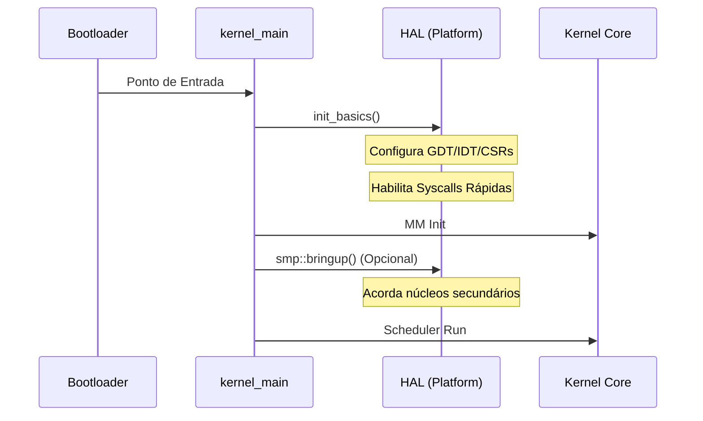

# 🏛️ Hardware Abstraction Layer (HAL)

> **Documentação Oficial v1.0** | Janeiro de 2026  
> Camada de isolamento de hardware do RedstoneOS (`src/arch`)

---

## 📋 Sumário

1. [Visão Geral](#-visão-geral)
2. [Arquitetura](#-arquitetura)
3. [Contratos (Traits)](#-contratos-traits)
4. [Implementações](#-implementações)
    - [x86_64 (PC Moderno)](#-x86_64-pc-moderno)
    - [aarch64 (ARM64 / Apple Silicon)](#-aarch64-arm64--apple-silicon)
    - [riscv64 (RISC-V 64-bit)](#-riscv64-risc-v-64-bit)
5. [Fluxo de Inicialização](#-fluxo-de-inicialização)
6. [Guia de Portabilidade](#-guia-de-portabilidade)
7. [Roadmap](#-roadmap)

---

## 🎯 Visão Geral

A **Hardware Abstraction Layer (HAL)** é a única ponte permitida entre o kernel core e o hardware físico. Ela fornece uma interface uniforme para que subsistemas de alto nível (como o scheduler e o gerenciador de memória) operem sem conhecer os detalhes da CPU ou do chipset.

### Missão

> *"Isolar a complexidade de cada arquitetura sob uma API comum, permitindo que o RedstoneOS seja portado para qualquer plataforma com esforço mínimo no core."*

### Responsabilidades

| Área | Descrição |
|------|-----------|
| **CPU Control** | Gerenciamento de interrupções, halt e estados de energia. |
| **MMU** | Configuração de tabelas de páginas e contextos de memória. |
| **Traps** | Captura e despacho de interrupções, exceções e syscalls. |
| **SMP** | Inicialização e coordenação de múltiplos núcleos (Harts/Cores). |
| **Timers** | Interface com o timer de sistema de hardware mais preciso. |

---

## 🏗️ Arquitetura

O diretório `src/arch` é organizado de forma a separar os contratos abstratos das implementações reais.

### Estrutura de Diretórios

```r
arch/
├── mod.rs              # Seleção condicional de plataforma (cfg)
├── traits/             # 📜 Contratos Absratos
│   ├── mod.rs          
│   └── cpu.rs          # CpuTrait
│
├── x86_64/             # 🖥️ Implementação Intel/AMD
│   ├── cpu.rs          # cli, sti, hlt, MSRs
│   ├── gdt.rs          # Global Descriptor Table
│   ├── idt.rs          # Interrupt Descriptor Table
│   ├── syscall.rs      # MSR-based syscalls
│   └── vmm/            # Paginação de 4 níveis (PML4)
│
├── aarch64/            # 📱 Implementação ARM64
│   ├── cpu.rs          # DAIF, EL1, MPIDR
│   ├── interrupts.rs   # VBAR_EL1, GIC
│   ├── syscall.rs      # SVC-based syscalls
│   └── vmm/            # ARMv8 Paging structure
│
└── riscv64/            # 🎓 Implementação RISC-V
    ├── cpu.rs          # sstatus, CSRs, wfi
    ├── interrupts.rs   # stvec, scause
    ├── syscall.rs      # ecall-based syscalls
    └── vmm/            # Sv39/Sv48 Paging
```

---

## 📜 Contratos (Traits)

Toda nova arquitetura DEVE implementar os traits definidos em `arch/traits/`.

### `CpuTrait`

Define as operações fundamentais da CPU.

```rust
pub trait CpuTrait {
    fn disable_interrupts();  // Desativa IRQs (cli / DAIF)
    fn enable_interrupts();   // Ativa IRQs (sti / DAIF)
    fn halt();                // Economia de energia (hlt / wfi)
    fn current_core_id() -> u32;
    fn interrupts_enabled() -> bool;
}
```

---

## 🖥️ Implementações

### 🔹 x86_64 (PC Moderno)
A arquitetura de referência do RedstoneOS.
- **Memória**: Paginação de 4 níveis com suporte a Huge Pages (2MB/1GB).
- **Interrupções**: Gerenciadas via APIC e IO-APIC, substituindo o PIC legado.
- **Syscall**: Utiliza a instrução `SYSCALL` (via LSTAR MSR) para performance máxima.

### 🔹 aarch64 (ARM64 / Apple Silicon)
Foco em eficiência e dispositivos modernos.
- **Exceções**: Tabela de vetores via `VBAR_EL1`.
- **Níveis de Privilégio**: O kernel roda em **EL1** (Supervisor).
- **SMP**: Utiliza PSCI (Power State Coordination Interface) para acordar núcleos.

### 🔹 riscv64 (RISC-V 64-bit)
Design modular e aberto.
- **Privilégio**: Roda em **Supervisor Mode**.
- **Traps**: Configurado via `stvec` para tratamento unificado de interrupções e exceções.
- **Paginação**: Suporte inicial para o esquema **Sv39** (39 bits de endereço virtual).

---

## 🚀 Fluxo de Inicialização

A inicialização da HAL ocorre em duas fases: **Early** (pré-memória) e **Full** (pós-memória).



---

## 🧩 Guia de Portabilidade

Para adicionar suporte a uma nova arquitetura (ex: `PowerPC` ou `LoongArch`):

1. **Definições**: Adicione o novo `target_arch` em `arch/mod.rs`.
2. **Implementação**:
    - Crie o diretório `arch/<nome>/`.
    - Implemente `CpuTrait` em `cpu.rs`.
    - Configure o handler de syscall em `syscall.rs`.
3. **Boot**: Defina `init_basics()` para configurar o estado inicial da CPU.
4. **Linkagem**: Garanta que o linker script posicione o kernel no endereço virtual correto da nova plataforma.

---

## 🗺️ Roadmap

### Status de Suporte

| Recurso | x86_64 | aarch64 | riscv64 |
|---------|--------|---------|---------|
| Core Init | ✅ | ✅ | ✅ |
| Syscalls | ✅ | 🔄 Stub | 🔄 Stub |
| Interrupts | ✅ | 🔄 Stub | 🔄 Stub |
| SMP | 🔄 Básico | 🆕 Planejado | 🆕 Planejado |
| VMM (Paging) | ✅ | 🆕 Planejado | 🆕 Planejado |

### Próximos Passos
1. **Unificação do VMM**: Criar um trait abstrato para manipulação de tabelas de páginas.
2. **Context Switching Agonístico**: Implementar a troca de contexto via trait `Context`.
3. **Firmware Bridge**: Suporte a UEFI Runtime Services em todas as arquiteturas.
