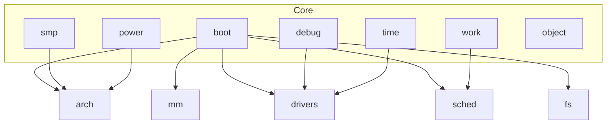
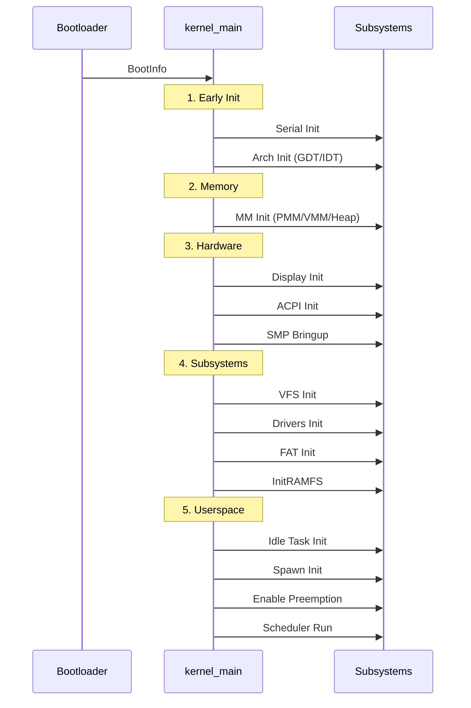

# ⚙️ Core Subsystem (`core`)

> **Documentação Oficial v1.0** | Janeiro de 2026  
> Infraestrutura Central do Kernel Forge

---

## 📋 Sumário

1. [Visão Geral](#-visão-geral)
2. [Arquitetura](#-arquitetura)
3. [Boot Sequence](#-boot-sequence)
4. [Submódulos](#-submódulos)
5. [Sistema de Debug](#-sistema-de-debug)
6. [Guia de Uso](#-guia-de-uso)

---

## 🎯 Visão Geral

O módulo `core` é a **cola do kernel** - integra todos os outros subsistemas e gerencia o ciclo de vida do sistema operacional.

### Missão

> *"Orquestrar a inicialização, gerenciar o tempo, coordenar múltiplos núcleos e fornecer infraestrutura de debug."*

### Responsabilidades

| Área | Descrição |
|------|-----------|
| **Boot** | Inicialização ordenada de todos os subsistemas |
| **SMP** | Gerenciamento de múltiplos núcleos CPU |
| **Time** | Relógios, timers e noção de tempo |
| **Work** | Trabalho diferido (work queues) |
| **Power** | Gerenciamento de energia |
| **Debug** | Logging, tracing, diagnóstico |

---

## 🏗️ Arquitetura

### Estrutura de Diretórios

```r
core/
├── mod.rs              # Re-exports principais
│
├── boot/               # Inicialização do sistema
│   ├── entry.rs        # kernel_main - ponto de entrada
│   ├── handoff.rs      # BootInfo do bootloader
│   ├── panic.rs        # Panic handler
│   ├── initcall.rs     # Sistema de initcalls
│   └── cmdline.rs      # Parser de command line
│
├── debug/              # Diagnóstico e logging
│   ├── klog.rs         # Macros kinfo!, kwarn!, kerror!
│   ├── kdebug.rs       # Breakpoints, assertions
│   ├── oops.rs         # Erros recuperáveis
│   ├── stats.rs        # Contadores de performance
│   ├── trace.rs        # Tracing de execução
│   └── console.rs      # Display visual (stub)
│
├── smp/                # Multiprocessamento
│   ├── bringup.rs      # Acordar CPUs secundárias
│   ├── percpu.rs       # Variáveis per-CPU
│   └── ipi.rs          # Inter-Processor Interrupts
│
├── time/               # Tempo e timers
│   ├── clock.rs        # Relógios do sistema
│   ├── timer.rs        # Timers programáveis
│   └── jiffies.rs      # Contador monótono
│
├── work/               # Trabalho diferido
│   └── workqueue.rs    # Filas de trabalho
│
├── power/              # Energia
│   └── shutdown.rs     # Desligamento e reinício
│
└── object/             # Sistema de objetos
    └── handle.rs       # Handles do kernel
```

### Diagrama de Dependências



---

## 🚀 Boot Sequence

### Ordem de Inicialização



### Detalhamento

| Fase | Componente | Descrição |
|------|------------|-----------|
| 1 | **Serial** | Logging disponível |
| 2 | **Arch** | GDT, IDT, interrupções básicas |
| 3 | **Memory** | PMM, VMM, HHDM, Heap |
| 4 | **Display** | Framebuffer configurado |
| 5 | **ACPI** | Descoberta de hardware |
| 6 | **SMP** | CPUs secundárias acordadas |
| 7 | **VFS** | Sistema de arquivos virtual |
| 8 | **Drivers** | PCI, storage, network, etc |
| 9 | **FAT** | Filesystem montado |
| 10 | **InitRAMFS** | Ramdisk inicial |
| 11 | **Scheduler** | Preempção habilitada |

---

## 📦 Submódulos

### Boot (`boot/`)

Ponto de entrada e inicialização do kernel.

#### `kernel_main`

```rust
#[no_mangle]
pub extern "C" fn kernel_main(boot_info: &'static BootInfo) -> ! {
    // ... inicialização ordenada
    sched::run();  // Nunca retorna
}
```

#### `BootInfo`

Estrutura recebida do bootloader:

```rust
pub struct BootInfo {
    pub magic: u64,           // Validação
    pub version: u32,         // Versão do protocolo
    pub memory_map: MemMap,   // Mapa de memória
    pub framebuffer: FbInfo,  // Informações de vídeo
    pub rsdp_addr: u64,       // ACPI RSDP
    pub initramfs_addr: u64,  // InitRAMFS
    pub initramfs_size: u64,
}
```

---

### SMP (`smp/`)

Gerenciamento de múltiplos núcleos.

| Componente | Função |
|------------|--------|
| `bringup` | Acorda CPUs secundárias via SIPI |
| `percpu` | Variáveis locais por CPU |
| `ipi` | Inter-Processor Interrupts |

```rust
// Enviar IPI para todos os cores
smp::ipi::send_all(IpiMessage::TlbFlush);

// Acessar variável per-CPU
let my_data = smp::percpu::get::<MyData>();
```

---

### Time (`time/`)

Gerenciamento de tempo.

| Componente | Função |
|------------|--------|
| `clock` | Relógios do sistema (monotonic, realtime) |
| `timer` | Timers programáveis |
| `jiffies` | Contador de ticks desde boot |

```rust
// Obter tempo monotônico
let now = time::monotonic();

// Agendar callback
time::schedule(Duration::from_millis(100), || {
    // Executado após 100ms
});
```

---

### Work (`work/`)

Trabalho diferido para evitar bloqueio em IRQ handlers.

```rust
// Em interrupt handler - apenas enqueue
work::queue(|| {
    // Processamento pesado executado fora do IRQ
    process_packet(packet);
});
```

---

### Power (`power/`)

Controle de energia do sistema.

```rust
power::shutdown();  // Desliga
power::reboot();    // Reinicia
power::suspend();   // Suspende (S3)
```

---

### Object (`object/`)

Sistema de handles do kernel.

```rust
// Criar handle para objeto
let handle = object::create(my_object)?;

// Lookup por handle
let obj = object::lookup::<MyType>(handle)?;
```

---

## 🔧 Sistema de Debug

### Macros de Log

```rust
kinfo!("Mensagem");           // [INFO] Mensagem
kinfo!("Valor:", 42);         // [INFO] Valor: 0x2A

kwarn!("Atenção");            // [WARN] Atenção
kerror!("Erro crítico");      // [ERROR] Erro crítico

kdebug!("Debug");             // [DEBUG] Debug (só em debug builds)
ktrace!("Trace");             // [TRACE] Trace (só em debug builds)
```

### Níveis de Log

| Nível | Macro | Quando Usar |
|-------|-------|-------------|
| TRACE | `ktrace!` | Rastreamento detalhado |
| DEBUG | `kdebug!` | Informação de desenvolvimento |
| INFO | `kinfo!` | Eventos normais |
| WARN | `kwarn!` | Situações anormais mas OK |
| ERROR | `kerror!` | Erros que afetam operação |

### Estatísticas

```rust
use crate::core::debug::stats::STATS;

STATS.inc_interrupts();
STATS.inc_syscalls();
STATS.inc_context_switches();
STATS.dump();  // Imprime no log
```

### Oops (Erro Recuperável)

```rust
use crate::core::debug::oops;

if something_wrong {
    oops::oops("Descrição do problema");
    // Kernel tenta continuar
}
```

---

## 📖 Guia de Uso

### Importando

```rust
// Boot info
use crate::core::boot::BootInfo;

// Logging
use crate::{kinfo, kwarn, kerror, kdebug};

// SMP
use crate::core::smp;

// Time
use crate::core::time;

// Stats
use crate::core::debug::stats::STATS;
```

### Adicionando Initcall

```rust
use crate::core::boot::initcall::register_initcall;

fn my_driver_init() {
    // Inicialização
}

register_initcall!(my_driver_init, 5);  // Prioridade 5
```

### Usando Work Queues

```rust
use crate::core::work;

// Em IRQ handler (rápido)
fn irq_handler() {
    let data = read_device();
    work::queue(move || {
        // Processamento lento fora do IRQ
        process_heavy(data);
    });
}
```

---

## 🗺️ Roadmap

### Status Atual

| Componente | Status |
|------------|--------|
| `boot/` | ✅ Produção |
| `debug/` | ✅ Produção (serial) |
| `smp/` | ⚠️ Básico |
| `time/` | ✅ Produção |
| `work/` | ⚠️ Básico |
| `power/` | ⚠️ Stub |
| `object/` | ⚠️ Básico |

### Próximos Passos

1. **SMP completo** - Per-CPU data, IPI robusto
2. **Work queues** - Priority queues, dedicated workers
3. **Power management** - ACPI sleep states
4. **Debug display** - Console visual (futuro, via boot param)
5. **Log em disco** - Persistência de logs
