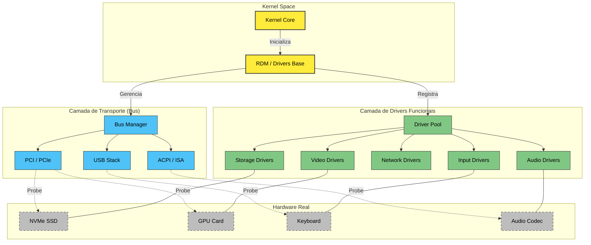

# 🔌 Redstone Driver Model (RDM) - Documentação Técnica

> *Atualizado: Janeiro de 2026 | Versão: RDM 0.2.0*

O **Redstone Driver Model (RDM)**, também conhecido como **Redstone Drive System (RDS)**, é o framework unificado do RedstoneOS para gerenciamento de hardware. Diferente do antigo modelo monolítico ad-hoc, o RDM introduz uma arquitetura orientada a objetos (via Traits), com ciclo de vida definido e capaz de suportar desde dispositivos legados (PS/2, ISA) até tecnologias modernas (NVMe, VirtIO, PCI Express).

---

## 🏛️ Arquitetura do Sistema

O RDM atua como o **núcleo orquestrador** que conecta o hardware físico às interfaces lógicas do kernel. A arquitetura é hierárquica e modular.



---

## ⚙️ Núcleo: `drivers/base`

O coração do sistema reside em `src/drivers/base`. Ele define as regras do jogo.

### Entidades Principais

1.  **`Driver` (Trait)**: O contrato que todo driver deve assinar.
    *   `name()`: Nome amigável.
    *   `device_type()`: Categoria (Storage, Net, Display...).
    *   `probe(&mut Device)`: Chamado quando um hardware compatível é encontrado. É aqui que o driver "nasce".
    *   `remove(&mut Device)`: Chamado no desligamento ou hot-unplug.

2.  **`Device` (Struct)**: A representação do hardware físico.
    *   Contém recursos (Endereços IRQ, Portas I/O, MMIO BARs).
    *   Mantém o estado (`Connected`, `Error`, `Suspended`).

3.  **`DriverManager`**: O registro central.
    *   Mantém a lista de todos os drivers carregados.
    *   Cruza drivers registrados com dispositivos descobertos pelos barramentos.

---

## 🗺️ Mapa Completo de Módulos (`src/drivers`)

A estrutura de diretórios foi desenhada para refletir a organização lógica e física do hardware.

### 🧱 `base/` (Kernel do RDM)
Framework central que define as regras do jogo.
- **`driver.rs`, `device.rs`**: Trait `Driver` e Struct `Device`.
- **`bus.rs`, `class.rs`**: Gerenciamento de topologia e classificação.
- **`power.rs`, `recovery.rs`**: Gestão de energia e recuperação de falhas.

### 🚌 `bus/` (Transporte & Descoberta)
Camada responsável por encontrar dispositivos e prover canais de comunicação.
- **`pci/`**: Escaneamento recursivo PCIe, Enumeration e BAR Mapping.
- **`usb/`**: Stack Universal Serial Bus.
    - **`xhci/`**: Controlador eXtensible Host (USB 3.x).
    - **`ehci/`**: Controlador Enhanced Host (USB 2.0).
    - **`mass_storage/`**: Driver de classe para PenDrives/HDs externos.
- **`virtio/`**: Transporte paravirtualizado (Legacy & Modern) sobre PCI.
- **`acpi/`**: Interface com BIOS/UEFI para IRQs e Power.
- **`isa/`**: Barramento legado para portas seriais e PS/2.

### ⌨️ `input/` (Entrada Unificada)
Subsistema que traduz eventos físicos em `InputEvents` para o OS.
- **`hid/`**: **Universal HID Parser**. Processa USB, I2C e Bluetooth HIDs.
- **`ps2/`**: Controladores 8042 (Teclado/Mouse) para hardware antigo/VMs.
- **`touch/`**: Touchpads modernos (I2C) com suporte a Gestos e Multitouch.
    - **`protocol/`**: Parsers específicos (Synaptics, ELAN).
- **`virtio/`**: Mouse e Tablet absolutos para virtualização.

### 📺 `display/` (Saída Visual)
Gerencia o pipeline gráfico do Kernel.
- **`fb/`**: **Framebuffer Manager**. Abstração KMS (Kernel Mode Setting).
- **`gpu/`**: Drivers de Aceleração.
    - **`generic/`**: Fallback robusto (VGA/LFB/GOP).
    - **`intel/`, `amd/`, `nvidia/`**: Stubs para drivers nativos.
- **`bochs/`, `virtio/`**: Drivers otimizados para QEMU/Bochs/VMware.
- **`edid/`**: Parser de metadados do monitor (Resolução, Hz).

### 🌐 `network/` (Conectividade)
Pilha de drivers para comunicação de dados.
- **`ethernet/`**: Placas de rede cabeadas.
    - **`intel.rs`**: Família e1000/e1000e.
    - **`realtek.rs`**: Família RTL8139/8169.
- **`wifi/`**: Subsistema WLAN 802.11 (Scan, Auth, Crypto).
- **`virtio/`**: VirtIO-Net de alta performance.
- **`mii/`**: Interface de gerenciamento físico (PHY).
- **`loopback/`**: Interface virtual localhost.

### 🔊 `sound/` (Áudio)
Subsistema de som, mixagem e codecs.
- **`intel_hda/`**: Intel High Definition Audio (Azalia).
- **`ac97/`**: Audio Codec '97 (Legado).
- **`virtio/`**: VirtIO-Sound (Paravirtualizado).
- **`mixer/`**: Software Mixer para multiplexação de streams.
- **`codecs/`**: Comandos para convérsa com chips Realtek/Conexant.

### 💾 `storage/` (Armazenamento em Massa)
Módulo crítico de I/O de disco.
- **`ahci/`**: Controladores SATA (Serial ATA).
- **`nvme/`**: Drives SSD via PCIe (Non-Volatile Memory Express).
- **`ata/`**: Drivers PATA/IDE (Legacy PIO/DMA).
- **`virtio/`**: VirtIO-Blk (Block Device virtual).
- **`ramdisk/`**: Discos virtuais em memória volátil.

### 📟 `system/` (Infraestrutura)
Drivers do "chipset" e componentes vitais.
- **`int_ctrl/`**: Gerenciadores de Interrupção (PIC, APIC, IO-APIC).
- **`timer/`**: Fontes de tempo (PIT, HPET, TSC).
- **`dma/`**: Acesso direto à memória legado (8237).
- **`pwr_ctl/`**: Controle de Reset e Shutdown.
- **`speaker/`**: PC Speaker Driver.

### 📡 `comm/` (Baixo Nível)
Interfaces industriais e de debug.
- **`serial/`**: Portas UART (COM1, COM2) para logs seriais.
- **`parallel/`**: Portas LPT.
- **`i2c/`, `spi/`**: Barramentos seriais para sensores e embedded.

---

## 🔄 Fluxo de Vida de um Driver

O diagrama abaixo ilustra o processo desde o boot até o driver assumir o hardware.

```mermaid
sequenceDiagram
    participant Kernel
    participant RDM
    participant Bus (PCI)
    participant Driver (Eth)
    participant Hardware

    Kernel->>RDM: init()
    RDM->>Driver: register_driver(IntelEth)
    Note over Driver: Driver entra no Pool inativo
    
    Kernel->>Bus: init() -> scan()
    Bus->>Hardware: Enumerate Devices
    Hardware-->>Bus: VendorID: 0x8086, DevID: 0x100E
    
    Bus->>RDM: notify_new_device(Device)
    
    RDM->>RDM: check_drivers(Device)
    RDM->>Driver: probe(Device)
    
    rect rgb(0, 50, 0)
        Note over Driver: PROBE START
        Driver->>Hardware: Read Status Register
        Driver->>Hardware: Configure DMA Rings
        Driver->>Hardware: Enable Interrupts
        Driver-->>RDM: Ok(Success)
    end
    
    RDM->>RDM: Mark Device as ACTIVE
    Note over Kernel: Sistema operacional pronto para usar a Rede
```



---

## 🛠️ Como criar um novo Driver

Para adicionar suporte a um novo hardware no RedstoneOS, siga o padrão RDS:

1.  **Crie o Módulo**: Adicione uma nova pasta em `src/drivers/[categoria]/[nome]`.
2.  **Implemente a Trait `Driver`**:

```rust
use crate::drivers::base::driver::{Driver, Device, DeviceType, DriverError};

pub struct MeuDriver;

impl Driver for MeuDriver {
    fn name(&self) -> &'static str { "Meu Hardware Incrível" }
    
    fn device_type(&self) -> DeviceType { DeviceType::Network } // ou Storage, Input...

    fn probe(&self, dev: &mut Device) -> Result<(), DriverError> {
        // 1. Validar hardware (IDs, revisões)
        // 2. Mapear memória (MMIO)
        // 3. Inicializar estruturas internas
        crate::kinfo!("Meu driver assumiu o controle!");
        Ok(())
    }

    fn remove(&self, dev: &mut Device) -> Result<(), DriverError> {
        // Desligar hardware e limpar recursos
        Ok(())
    }
}
```

3.  **Implemente a Trait Funcional**: Se for uma placa de rede, implemente `NetworkAdapter`. Se for áudio, `SoundCard`. Isso conecta seu driver ao resto do OS.
4.  **Registre no `init()`**: Adicione `register_driver(Arc::new(MeuDriver))` no `mod.rs` da categoria.

---

*Documentação mantida pela equipe do Forge Kernel. RedstoneOS © 2026.*
