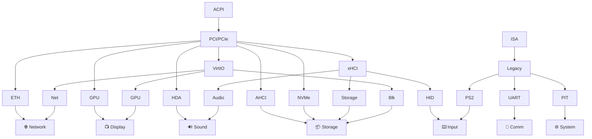
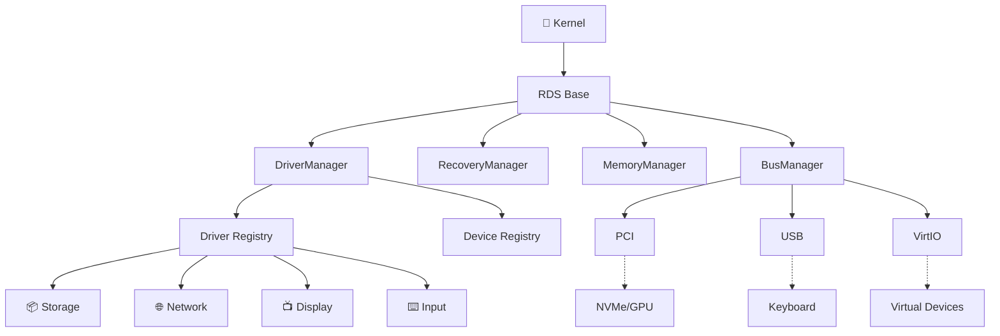
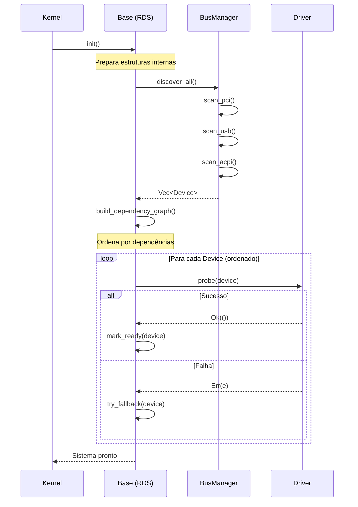
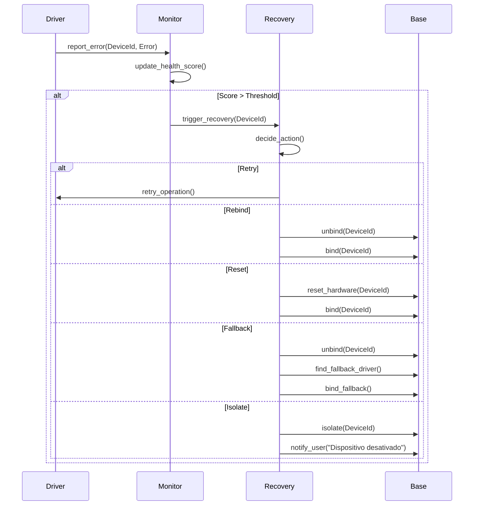
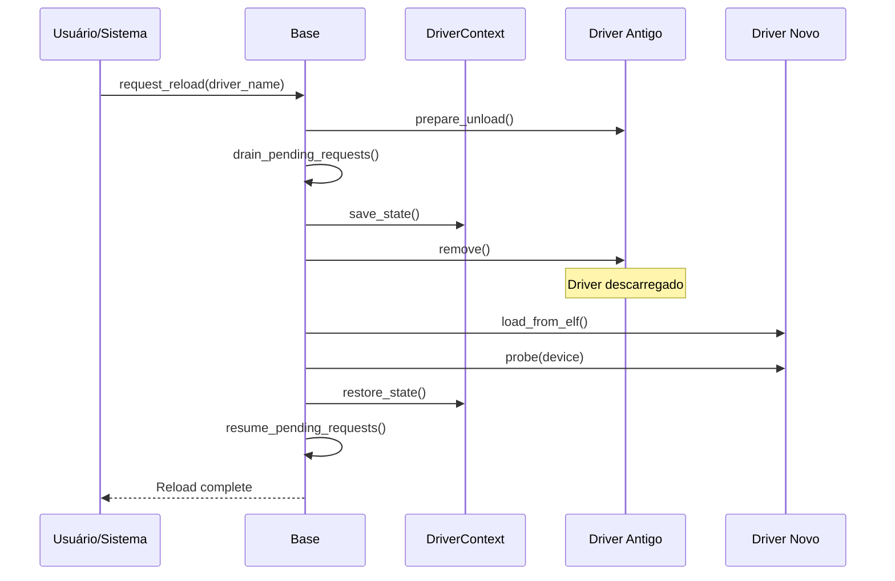

# 🔌 Redstone Drive System (RDS)

> **Documentação Oficial v1.0** | Janeiro de 2026  
> Framework Unificado de Gerenciamento de Hardware do RedstoneOS

---

## 📋 Sumário

1. [Visão Geral](#-visão-geral)
2. [Filosofia e Princípios](#-filosofia-e-princípios)
3. [Decisões Arquiteturais](#-decisões-arquiteturais)
4. [Contratos e Políticas](#-contratos-e-políticas)
5. [Arquitetura Técnica](#-arquitetura-técnica)
6. [Mapa de Módulos](#-mapa-de-módulos)
7. [Fluxos Operacionais](#-fluxos-operacionais)
8. [Guia de Implementação](#-guia-de-implementação)
9. [Roadmap](#-roadmap)

---

## 🎯 Visão Geral

O **Redstone Drive System (RDS)** é a espinha dorsal do gerenciamento de hardware do kernel Forge. Diferente de abordagens tradicionais onde cada driver opera de forma independente, o RDS implementa um modelo de **controle centralizado** onde a infraestrutura base gerencia todos os aspectos críticos.

### Missão

> *"Os drivers não são donos da casa, são hóspedes. A base é o síndico que define as regras."*

### Objetivos Principais

| Objetivo | Descrição |
|----------|-----------|
| **Estabilidade** | Driver falhar ≠ Kernel falhar |
| **Recuperação** | Auto-cura sem intervenção humana |
| **Controle** | Base gerencia memória, recursos e comunicação |
| **Hot Reload** | Atualizar drivers sem reiniciar |
| **Performance** | Latência mínima para operações críticas |
| **Escalabilidade** | Do legado (PS/2) ao moderno (NVMe, PCIe 5.0) |

---

## 🧭 Filosofia e Princípios

### Por que o RDS existe?

Os sistemas operacionais tradicionais sofrem de problemas recorrentes:

1. **Cada driver carrega sua própria mochila** - Duplicação de código, inconsistências
2. **Drivers brigam por recursos** - IRQs, memória, portas I/O
3. **Um driver bugado derruba tudo** - Corrupção de memória, kernel panic
4. **Recuperação é manual** - Usuário precisa reiniciar

O RDS resolve isso com uma abordagem diferente:

### Princípio 1: Fundação Antes do Telhado

Não adianta criar drivers sofisticados se a base não é sólida. O RDS define uma **infraestrutura robusta** antes de qualquer driver funcional.

### Princípio 2: Síndico vs Inquilinos

```
┌─────────────────────────────────────────────────────────────┐
│                    MODELO TRADICIONAL                       │
│  Driver A ──┐                                               │
│  Driver B ──┼──> Kernel (cada um faz o que quer)            │
│  Driver C ──┘                                               │
└─────────────────────────────────────────────────────────────┘

┌─────────────────────────────────────────────────────────────┐
│                    MODELO RDS                               │
│  Driver A ──┐                                               │
│  Driver B ──┼──> [BASE] ──> Kernel (regras definidas)       │
│  Driver C ──┘      │                                        │
│                    └── Memória, Recursos, Comunicação       │
└─────────────────────────────────────────────────────────────┘
```

### Princípio 3: Prefeitura e Rodoviária

- **Base (`drivers/base/`)** = Prefeitura da cidade
  - Define leis, gerencia recursos, cuida da ordem
  
- **Bus (`drivers/bus/`)** = Rodoviária
  - Conhece todas as rotas, sabe quem está onde
  - Facilita transporte de dados entre componentes

### Princípio 4: Tentar Antes de Desistir

Se algo falha, o RDS tenta recuperar. Se não conseguir, tenta fallback. Só desiste quando não há alternativa.

---

## 🏛️ Decisões Arquiteturais

### DA-01: Modelo de Isolamento de Falhas

**Problema:** Drivers em Ring 0 podem corromper memória do kernel.

**Decisão:** Criar uma **Zona de Memória Virtual Dedicada** para drivers.

```
┌─────────────────────────────────────────────────────────────┐
│                    ESPAÇO VIRTUAL x86_64                    │
├─────────────────────────────────────────────────────────────┤
│ 0x0000_0000_0000 ─ 0x0000_7FFF_FFFF │ Userspace (128 TB)    │
├─────────────────────────────────────────────────────────────┤
│ 0xFFFF_8000_0000 ─ 0xFFFF_BFFF_FFFF │ HHDM + Kernel Core    │
├─────────────────────────────────────────────────────────────┤
│ 0xFFFF_C000_0000 ─ 0xFFFF_CFFF_FFFF │ (NEW) DRIVER ZONE     │
├─────────────────────────────────────────────────────────────┤
│ 0xFFFF_D000_0000 ─ 0xFFFF_DFFF_FFFF │ (NEW) DMA POOL        │
├─────────────────────────────────────────────────────────────┤
│ 0xFFFF_E000_0000 ─ 0xFFFF_FFFF_FFFF │ Kernel Stacks         │
└─────────────────────────────────────────────────────────────┘
```

**Justificativa:**
- Ainda é Ring 0 (performance máxima)
- Guard pages ao redor de cada alocação
- Base valida acessos antes de permitir
- Erro detectado imediatamente, não 3 horas depois
- Impede corrupção acidental de memória do kernel

**Resultado:** Se um driver tentar gravar fora de sua zona:
```
[RDS] ERRO: Driver "meu_driver" tentou acessar 0xFFFF_A000_0000
[RDS] Esta região pertence ao Kernel Core, não à Driver Zone
[RDS] Operação bloqueada. Driver será reiniciado.
```

---

### DA-02: Contexto Persistente com Recuperação Inteligente

**Problema:** Quando driver morre, dados em trânsito são perdidos.

**Decisão:** `DriverContext` persiste entre reinícios de driver.

```rust
struct DriverContext {
    device: Arc<Device>,                // Hardware associado (persiste!)
    pending_requests: Queue<Request>,   // Fila pausável
    state_snapshot: Option<StateData>,  // Estado salvo
    recovery_policy: RecoveryPolicy,    // Política por tipo
}
```

**Políticas de Recuperação por Categoria:**

| Categoria | Ao Falhar | Recuperação | Justificativa |
|-----------|-----------|-------------|---------------|
| **Storage** | Pausa I/O, avisa RAM para não liberar buffers | Reinicia driver, resume filas | Dados são críticos |
| **Network** | Pausa fila, conexões perdem alguns pacotes | Reinicia, apps reconectam | TCP já lida com perda |
| **Display** | Fallback progressivo | nvidia→vesa→fb→texto | Manter interface visível |
| **Input** | Buffer eventos | Reconecta, usuário repete | Baixo impacto |
| **Timer** | Fallback imediato | Sem espera | Crítico para scheduler |

---

### DA-03: Hierarquia de Dependências

**Problema:** Driver USB Storage depende de xHCI, que depende de PCI.

**Decisão:** Descoberta central pelo Bus + Inicialização ordenada.

```
┌──────────────────────────────────────────────────────────────┐
│                        BOOT SEQUENCE                          │
├──────────────────────────────────────────────────────────────┤
│ 1. Base.init()           → Prepara infraestrutura            │
│ 2. Bus.discover_all()    → Enumera todo hardware             │
│ 3. Base.build_deps()     → Monta grafo de dependências       │
│ 4. Base.init_drivers()   → Inicializa em ordem topológica    │
└──────────────────────────────────────────────────────────────┘
```

**Grafo de Dependências:**



---

### DA-04: Interface Bus ↔ Driver

**Problema:** Cada driver implementa comunicação própria com hardware.

**Decisão:** Bus como **facilitador de transações**.

```rust
trait BusOperations {
    /// Descobre dispositivos conectados
    fn scan(&self) -> Vec<Device>;
    
    /// Submete comando assíncrono
    fn submit(&self, dev: DeviceId, cmd: Command) -> TransactionId;
    
    /// Verifica status
    fn poll(&self, txn: TransactionId) -> TransactionStatus;
    
    /// Cancela operação
    fn cancel(&self, txn: TransactionId) -> bool;
    
    /// Reset de dispositivo
    fn reset_device(&self, dev: DeviceId) -> bool;
}
```

**Benefício:** Driver USB Storage não precisa saber sobre xHCI:
```rust
// Antes (tradicional):
let xhci = get_xhci_controller();
let slot = xhci.allocate_slot();
xhci.send_command(slot, SetupStage { ... });
// Dezenas de linhas...

// Depois (RDS):
let txn = usb_bus.submit(device, ScsiCommand::Read { lba, count });
```

---

### DA-05: DMA Pool Centralizado

**Problema:** Cada driver aloca DMA de forma independente, sem controle.

**Decisão:** Pool central gerenciado pela Base.

```rust
pub struct DmaPool {
    // Região física contígua na DMA ZONE
}

impl DmaPool {
    pub fn alloc(&mut self, size: usize, align: usize) -> Option<DmaBuffer>;
    pub fn free(&mut self, buf: DmaBuffer);
    pub fn phys_addr(&self, buf: &DmaBuffer) -> PhysAddr;
}

pub struct DmaBuffer {
    virt: *mut u8,
    phys: PhysAddr,
    size: usize,
    owner: DeviceId,  // Quem alocou
}
```

**Benefícios:**
- Controle de quem alocou o quê
- Impossível driver A usar DMA de driver B
- Limpeza automática quando driver morre
- Preparado para IOMMU futuro

---

### DA-06: Módulos Externos via ELF

**Problema:** Como carregar drivers de fora do kernel?

**Decisão:** Formato ELF padrão com header RDS.

```rust
#[repr(C)]
struct RdsModuleHeader {
    magic: [u8; 4],        // "RDSM"
    abi_version: u32,      // Compatibilidade
    flags: u32,            // Capabilities requeridas
    init_fn: extern fn(),  // Ponto de entrada
    fini_fn: extern fn(),  // Cleanup
}
```

**Justificativa:** ELF já é um formato maduro e bem suportado. Reaproveitar o que funciona.

---

### DA-07: Fallback Progressivo

**Problema:** O que fazer quando driver principal falha?

**Decisão:** Descer a escada de fallback até encontrar algo funcional.

**Display:**
```
nvidia (proprietário) 
    ↓ falhou
intel/amd (específico)
    ↓ falhou  
vesa (genérico)
    ↓ falhou
framebuffer (simples)
    ↓ falhou
texto (último recurso)
```

**Storage:**
```
nvme (primário)
    ↓ falhou
ahci (alternativo)
    ↓ falhou
outro disco disponível (sobrevivência)
    ↓ falhou
ramdisk (emergência - dados em memória)
```

**Filosofia:** "Se virar com o que tiver disponível. Tentar antes de desistir."

---

### DA-08: Timeout e Retry Adaptativo

**Problema:** Quanto tempo esperar? Quantas vezes tentar?

**Decisão:** Comportamento adaptativo baseado em recursos disponíveis.

**Timeout:**
```
Fase 1 (Rápida):   100ms - Tenta recuperar rápido
Fase 2 (Normal):   500ms - Diminui prioridade, avisa usuário
Fase 3 (Lenta):    2s    - Segundo plano, não bloqueia boot
Fase 4 (Abandono): -     - "Tentei, não vale gastar mais recursos"
```

**Retry:**
```rust
fn should_retry(device: DeviceId, attempt: u32) -> bool {
    let resources_available = system_resources_status();
    let device_importance = get_importance(device);
    
    if resources_available > 80% {
        // Sobra recurso, pode tentar mais
        attempt < 10
    } else if resources_available > 50% {
        // Recursos normais
        attempt < 5
    } else {
        // Recursos escassos, não comprometer o que funciona
        attempt < 2
    }
}
```

---

## 📜 Contratos e Políticas

### Contrato 1: Trait Driver

Todo driver **DEVE** implementar este contrato:

```rust
pub trait Driver: Send + Sync {
    /// Nome identificador único
    fn name(&self) -> &'static str;

    /// Categoria funcional
    fn device_type(&self) -> DeviceType;

    /// Versão da ABI (para compatibilidade)
    fn abi_version(&self) -> u32 { 0x00_01_00_00 }

    /// Tenta assumir controle do dispositivo
    /// Chamado pela Base durante descoberta
    fn probe(&self, dev: &mut Device) -> Result<(), DriverError>;

    /// Libera recursos e para o hardware
    fn remove(&self, dev: &mut Device) -> Result<(), DriverError>;

    /// Gerenciamento de energia (opcional)
    fn suspend(&self, _dev: &mut Device) -> Result<(), DriverError> { Ok(()) }
    fn resume(&self, _dev: &mut Device) -> Result<(), DriverError> { Ok(()) }
    
    /// Desligamento do sistema
    fn shutdown(&self, _dev: &mut Device) {}
}
```

### Contrato 2: Trait Bus

Todo barramento **DEVE** implementar:

```rust
pub trait Bus: Send + Sync {
    fn name(&self) -> &'static str;
    fn bus_type(&self) -> BusType;
    fn scan(&self) -> Vec<Device>;
    fn reset_device(&self, dev: &mut Device) -> bool;
}

// Extensão para barramentos modernos
pub trait BusOperations: Bus {
    fn submit(&self, dev: DeviceId, cmd: Command) -> TransactionId;
    fn poll(&self, txn: TransactionId) -> TransactionStatus;
    fn cancel(&self, txn: TransactionId) -> bool;
}
```

### Política P1: Alocação de Memória

1. Drivers **NÃO** alocam memória diretamente
2. Toda alocação vai através do `DriverMemoryAllocator`
3. Cada driver tem limite de memória definido
4. Base pode revogar memória de driver problemático

### Política P2: Acesso a Recursos

1. Drivers declaram recursos necessários no `probe()`
2. Base valida e reserva recursos
3. Conflitos são detectados ANTES de causar problemas
4. Recursos são liberados automaticamente no `remove()`

### Política P3: Recuperação de Falhas

1. Primeiro erro: Log + Retry silencioso
2. Erros repetidos: Rebind do driver
3. Falhas persistentes: Reset de hardware
4. Irrecuperável: Isolamento + Fallback
5. Sem fallback: Modo degradado + Notificação

### Política P4: Hot Reload

1. Parar todas as operações em andamento
2. Drenar filas de requisições
3. Salvar estado do DriverContext
4. Descarregar driver antigo
5. Carregar driver novo
6. Restaurar estado
7. Resumir operações

---

## 🏗️ Arquitetura Técnica

### Diagrama de Componentes



### Thread Model

```
┌─────────────────────────────────────────────────────────────┐
│                    THREAD MODEL DO RDS                      │
├─────────────────────────────────────────────────────────────┤
│                                                             │
│  ┌─────────┐ ┌─────────┐ ┌─────────┐                        │
│  │ NVMe    │ │ AHCI    │ │ Network │  ← Threads dedicadas   │
│  │ Thread  │ │ Thread  │ │ Thread  │    (alta demanda)      │
│  └────┬────┘ └────┬────┘ └────┬────┘                        │
│       │           │           │                             │
│       └───────────┼───────────┘                             │
│                   ▼                                         │
│           ┌──────────────┐                                  │
│           │ I/O Worker   │  ← Thread compartilhada          │
│           │ Pool         │    (completion, eventos)         │
│           └──────────────┘                                  │
│                                                             │
│  ┌─────────┐ ┌─────────┐ ┌─────────┐                        │
│  │ PS/2    │ │ Serial  │ │ Speaker │  ← Legado              │
│  └────┬────┘ └────┬────┘ └────┬────┘                        │
│       │           │           │                             │
│       └───────────┼───────────┘                             │
│                   ▼                                         │
│           ┌──────────────┐                                  │
│           │ Legacy Pool  │  ← Thread compartilhada          │
│           └──────────────┘    (baixa demanda)               │
│                                                             │
└─────────────────────────────────────────────────────────────┘
```

### Fast Path para Interrupções

```rust
// IRQs críticas têm caminho direto (sem locks)
#[no_mangle]
extern "C" fn irq_handler(irq: u8) {
    match irq {
        // FAST PATH - Direto, sem EventManager
        TIMER_IRQ => timer::tick(),
        KBD_IRQ   => input::enqueue_scancode(),
        
        // SLOW PATH - Vai pelo sistema de eventos
        _ => rds::events::emit_irq(irq),
    }
}
```

---

## 📂 Mapa de Módulos

### Estrutura de Diretórios

```
src/drivers/
├── base/                    # 🏛️ CORAÇÃO DO RDS
│   ├── mod.rs              # DriverManager principal
│   ├── driver.rs           # Trait Driver
│   ├── device.rs           # Struct Device
│   ├── bus.rs              # Trait Bus + BusOperations
│   ├── class.rs            # Classes funcionais
│   ├── events.rs           # Sistema de eventos
│   ├── monitor.rs          # Health tracking
│   ├── recovery.rs         # Recuperação de falhas
│   ├── power.rs            # Estados D0-D3
│   ├── resource.rs         # IRQ/MMIO/Ports
│   ├── parameters.rs       # Config runtime
│   ├── memory.rs           # Driver Memory Zone
│   ├── dma.rs              # DMA Pool
│   ├── context.rs          # DriverContext persistente
│   ├── async.rs            # Probing assíncrono
│   ├── deps.rs             # Grafo de dependências
│   ├── fallback.rs         # Sistema de fallback
│   └── telemetry.rs        # Diagnósticos
│
├── bus/                     # 🚌 CAMADA DE TRANSPORTE
│   ├── mod.rs
│   ├── pci/                # PCI/PCIe enumeration
│   ├── usb/                # USB stack
│   │   ├── xhci/           # USB 3.x
│   │   ├── ehci/           # USB 2.0
│   │   └── mass_storage/   # Class driver
│   ├── virtio/             # Paravirtualização
│   ├── acpi/               # BIOS/UEFI interface
│   └── isa/                # Legado (PS/2, Serial)
│
├── input/                   # ⌨️ ENTRADA
│   ├── hid/                # Universal HID Parser
│   ├── ps2/                # Teclado/Mouse legado
│   ├── touch/              # Touchpads
│   └── virtio/             # Input virtual
│
├── display/                 # 📺 SAÍDA VISUAL
│   ├── fb/                 # Framebuffer Manager
│   ├── gpu/                # Aceleração
│   │   ├── generic/        # VESA/VGA/GOP
│   │   ├── intel/          # Intel HD Graphics
│   │   ├── amd/            # AMD/ATI
│   │   └── nvidia/         # NVIDIA
│   ├── bochs/              # QEMU/Bochs
│   ├── virtio/             # VirtIO-GPU
│   └── edid/               # Monitor metadata
│
├── network/                 # 🌐 CONECTIVIDADE
│   ├── ethernet/           # Placas cabeadas
│   │   ├── intel.rs        # e1000/e1000e
│   │   └── realtek.rs      # RTL8139/8169
│   ├── wifi/               # WLAN 802.11
│   ├── virtio/             # VirtIO-Net
│   └── loopback/           # localhost
│
├── sound/                   # 🔊 ÁUDIO
│   ├── intel_hda/          # HD Audio
│   ├── ac97/               # Legado
│   ├── virtio/             # VirtIO-Sound
│   └── mixer/              # Software mixer
│
├── storage/                 # 💾 ARMAZENAMENTO
│   ├── ahci/               # SATA
│   ├── nvme/               # NVMe SSD
│   ├── ata/                # PATA/IDE
│   ├── virtio/             # VirtIO-Blk
│   └── ramdisk/            # RAM disk
│
├── system/                  # 📟 INFRAESTRUTURA
│   ├── int_ctrl/           # PIC, APIC, IO-APIC
│   ├── timer/              # PIT, HPET, TSC
│   ├── dma/                # DMA legado
│   └── pwr_ctl/            # Reset/Shutdown
│
└── comm/                    # 📡 COMUNICAÇÃO
    ├── serial/             # UART/COM
    ├── parallel/           # LPT
    ├── i2c/                # I2C bus
    └── spi/                # SPI bus
```

### Status dos Módulos

| Módulo | Status | Descrição |
|--------|--------|-----------|
| `base/mod.rs` | ✅ Existe | DriverManager |
| `base/driver.rs` | ✅ Existe | Trait Driver |
| `base/device.rs` | ✅ Existe | Struct Device |
| `base/bus.rs` | 🔄 Expandir | + BusOperations |
| `base/recovery.rs` | 🔄 Stub | + Fallback |
| `base/memory.rs` | 🆕 Stub | Driver Zone |
| `base/dma.rs` | 🆕 Expandir | DMA Pool |
| `base/context.rs` | 🆕 Stub | DriverContext |
| `base/async.rs` | 🆕 Stub | Async probe |
| `base/deps.rs` | 🆕 Stub | Dependências |
| `base/fallback.rs` | 🆕 Stub | Fallback chain |
| `base/telemetry.rs` | 🆕 Expandir | Diagnósticos |

---

## 🔄 Fluxos Operacionais

### Fluxo 1: Inicialização do Sistema



### Fluxo 2: Recuperação de Falha



### Fluxo 3: Hot Reload de Driver



---

## 📖 Guia de Implementação

### Como Criar um Novo Driver

#### 1. Crie o Módulo

```bash
src/drivers/[categoria]/[nome]/
├── mod.rs
└── hardware.rs   # Específico do hardware
```

#### 2. Implemente a Trait Driver

```rust
// src/drivers/network/meu_driver/mod.rs

use crate::drivers::base::{Driver, Device, DeviceType, DriverError};

pub struct MeuDriver;

impl Driver for MeuDriver {
    fn name(&self) -> &'static str { 
        "meu-driver-de-rede" 
    }
    
    fn device_type(&self) -> DeviceType { 
        DeviceType::Network 
    }

    fn probe(&self, dev: &mut Device) -> Result<(), DriverError> {
        // 1. Verificar se é o hardware certo
        if dev.vendor_id != 0x1234 || dev.device_id != 0x5678 {
            return Err(DriverError::NotSupported);
        }
        
        // 2. Solicitar recursos à Base (NÃO alocar diretamente!)
        let mmio = base::resource::request_mmio(dev.bar0, dev.bar0_size)?;
        let irq = base::resource::request_irq(dev.irq_line)?;
        
        // 3. Inicializar hardware
        self.init_hardware(mmio)?;
        
        // 4. Registrar na classe funcional
        network::register_adapter(dev.id, self);
        
        Ok(())
    }

    fn remove(&self, dev: &mut Device) -> Result<(), DriverError> {
        // 1. Parar hardware
        self.stop_hardware();
        
        // 2. Liberar recursos (automático via Base)
        // 3. Desregistrar da classe
        network::unregister_adapter(dev.id);
        
        Ok(())
    }
}
```

#### 3. Registre no Inicializador

```rust
// src/drivers/network/mod.rs

pub fn init() {
    base::register_driver(Arc::new(meu_driver::MeuDriver));
}
```

### Regras de Ouro

1. **NUNCA** aloque memória diretamente - use `base::memory::alloc()`
2. **NUNCA** configure IRQs diretamente - use `base::resource::request_irq()`
3. **SEMPRE** verifique IDs antes de assumir controle
4. **SEMPRE** libere recursos no `remove()`
5. **SEMPRE** trate erros, nunca use `unwrap()`
