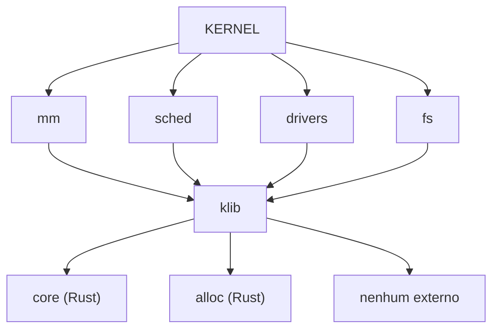

# 📚 Kernel Library (klib)

> **Documentação Oficial v1.0** | Janeiro de 2026  
> Biblioteca Interna de Utilitários `no_std` do RedstoneOS

---

## 📋 Sumário

1. [Visão Geral](#-visão-geral)
2. [Filosofia e Princípios](#-filosofia-e-princípios)
3. [Decisões Arquiteturais](#-decisões-arquiteturais)
4. [Arquitetura Técnica](#-arquitetura-técnica)
5. [Módulos e APIs](#-módulos-e-apis)
6. [Guia de Uso](#-guia-de-uso)
7. [Convenções e Políticas](#-convenções-e-políticas)
8. [Roadmap](#-roadmap)

---

## 🎯 Visão Geral

O **klib** é a biblioteca interna de utilitários do kernel Forge. Fornece estruturas de dados, algoritmos e primitivas que não estão disponíveis em `core` ou `alloc`, ou que precisam de implementação especializada para ambiente bare metal.

### Missão

> *"O que o Rust `std` faz para userspace, o `klib` faz para kernel space — mas sem dependências externas e otimizado para Ring 0."*

### Escopo

```
┌──────────────────────────────────────────────────────────────┐
│                    O QUE O KLIB É                            │
├──────────────────────────────────────────────────────────────┤
│ O - Utilitários que core/alloc NÃO fornecem                  │
│ O - Reimplementações otimizadas para bare metal              │
│ O - Estruturas de dados especializadas (intrusive lists)     │
│ O - Primitivas de baixo nível (bit manipulation)             │
│ O - Funções auxiliares usadas em todo o kernel               │
└──────────────────────────────────────────────────────────────┘

┌──────────────────────────────────────────────────────────────┐
│                  O QUE O KLIB NÃO É                          │
├──────────────────────────────────────────────────────────────┤
│ X - Duplicação do que alloc já fornece bem (Vec, BTreeMap)   │
│ X - Sincronização (isso fica em crate::sync)                 │
│ X - Gerenciamento de memória (isso fica em crate::mm)        │
│ X - Replacement completo da std                              │
└──────────────────────────────────────────────────────────────┘
```

### Dependências

| Permitido | Proibido |
|-----------|----------|
| `core` | Crates externas do crates.io |
| `alloc` (quando disponível) | Qualquer dependência externa |
| Outros módulos internos do Forge | |

> ⚠️ **Política de Zero Dependências Externas**: O kernel não pode ter dependências de terceiros. Todo código deve ser escrito internamente ou copiado/adaptado com devida atribuição.

---

## 🧭 Filosofia e Princípios

### Princípio 1: Complementar, Não Duplicar

O `alloc` fornece `Vec`, `BTreeMap`, `LinkedList`. O klib fornece o que o alloc **não tem**:

```
alloc fornece          │    klib fornece
───────────────────────┼────────────────────────
Vec<T>                 │    Bitmap (array de bits)
BTreeMap<K,V>          │    Intrusive List (zero alloc)
LinkedList<T>          │    Ring Buffer (lock-free)
String                 │    C-String utils (strlen, strcmp)
```

### Princípio 2: Performance é Rei

Código no klib está no **hot path** do kernel. Cada ciclo conta.

```rust
// ❌ ERRADO - Genérico demais, overhead de abstração
fn find_first_zero<T: BitContainer>(container: &T) -> Option<usize>

// ✅ CORRETO - Usa instrução de CPU diretamente
fn find_first_zero(bitmap: &[u64]) -> Option<usize> {
    for (i, &word) in bitmap.iter().enumerate() {
        if word != u64::MAX {
            // bsf = Bit Scan Forward (instrução x86)
            let bit = word.trailing_ones() as usize;
            return Some(i * 64 + bit);
        }
    }
    None
}
```

### Princípio 3: Nunca Panic

Funções do klib **NUNCA** devem chamar `panic!`. Retorne `Result` ou `Option`.

```rust
// ❌ ERRADO
fn get_bit(bitmap: &[u64], index: usize) -> bool {
    bitmap[index / 64] & (1 << (index % 64)) != 0  // Pode panic!
}

// ✅ CORRETO
fn get_bit(bitmap: &[u64], index: usize) -> Option<bool> {
    let word = bitmap.get(index / 64)?;
    Some(word & (1 << (index % 64)) != 0)
}
```

### Princípio 4: Unsafe Justificado

Código `unsafe` é permitido quando necessário, mas deve ser:
1. **Mínimo** - Apenas o essencial
2. **Documentado** - Safety comments explicando invariantes
3. **Encapsulado** - API pública segura, unsafe interno

---

## 🏛️ Decisões Arquiteturais

### DA-01: Estruturas Intrusivas para Scheduler

**Problema:** Listas normais alocam memória em cada `push`. O scheduler não pode falhar por OOM.

**Decisão:** Implementar lista intrusiva onde os ponteiros são parte da struct.

```rust
// Lista NORMAL - Aloca Node separado
struct Node<T> { 
    data: T, 
    next: *mut Node<T>  // Alocado separadamente
}

// Lista INTRUSIVA - Ponteiros embutidos
struct Task {
    pid: u32,
    state: TaskState,
    // Ponteiros DENTRO da struct
    run_next: *mut Task,
    run_prev: *mut Task,
}
```

**Benefícios:**
- ✅ Zero alocação para enqueue/dequeue
- ✅ O(1) garantido
- ✅ Nunca falha por OOM
- ✅ Usado por Linux, Windows, todos os kernels reais

**Trade-offs:**
- ⚠️ Mais complexo de implementar
- ⚠️ Struct precisa conhecer a lista
- ⚠️ Unsafe necessário

---

### DA-02: Bitmap com Instruções de CPU

**Problema:** `find_first_zero` é chamado milhares de vezes por segundo pelo PMM.

**Decisão:** Usar instruções nativas de bit manipulation.

```rust
// Instrução x86 "bsf" (Bit Scan Forward) - encontra primeiro bit 1
// Instrução x86 "bsr" (Bit Scan Reverse) - encontra último bit 1
// popcount - conta bits 1

impl Bitmap {
    fn find_first_zero(&self) -> Option<usize> {
        for (i, &word) in self.data.iter().enumerate() {
            if word != u64::MAX {
                // trailing_ones() compila para bsf ou similar
                let bit = word.trailing_ones() as usize;
                return Some(i * 64 + bit);
            }
        }
        None
    }
}
```

---

### DA-03: C-Strings para Interoperabilidade

**Problema:** Hardware e firmware usam strings terminadas em null (C-style).

**Decisão:** Manter utilitários de C-string no klib.

```rust
pub fn strlen(s: *const u8) -> usize;
pub fn strcmp(s1: *const u8, s2: *const u8) -> i32;
pub fn strncmp(s1: *const u8, s2: *const u8, n: usize) -> i32;
```

**Uso:** ACPI, EDID, Strings de firmware, Nomes de dispositivos.

---

### DA-04: bitflags Interno

**Problema:** A crate `bitflags` é externa (proibida).

**Decisão:** Manter implementação interna da macro `bitflags!`.

```rust
bitflags! {
    pub struct PageFlags: u64 {
        const PRESENT   = 1 << 0;
        const WRITABLE  = 1 << 1;
        const USER      = 1 << 2;
        const NO_EXEC   = 1 << 63;
    }
}
```

---

## 🏗️ Arquitetura Técnica

### Estrutura de Diretórios

```r
src/klib/
├── mod.rs              # Re-exports e documentação
│
├── primitives/         # Utilitários de baixo nível
│   ├── mod.rs
│   ├── align.rs        # align_up, align_down, is_aligned
│   ├── bits.rs         # bsf, bsr, popcount, bit manipulation
│   └── mem.rs          # memcpy, memset, memcmp, memmove
│
├── collections/        # Estruturas de dados especializadas
│   ├── mod.rs
│   ├── bitmap.rs       # Bitmap genérico otimizado
│   ├── intrusive.rs    # Lista duplamente encadeada intrusiva
│   └── ringbuf.rs      # Ring buffer lock-free
│
├── hash/               # Funções de hash para no_std
│   ├── mod.rs
│   └── fnv.rs          # FNV-1a hasher
│
├── cstr/               # Strings estilo C
│   ├── mod.rs
│   └── cstr.rs         # strlen, strcmp, tokenizer
│
└── bitflags.rs         # Macro bitflags interna
```

### Diagrama de Dependências



---

## 📦 Módulos e APIs

### `primitives/align.rs`

Funções de alinhamento de memória para paginação.

```rust
/// Alinha valor para cima (próximo múltiplo de align)
pub const fn align_up(value: usize, align: usize) -> usize;

/// Alinha valor para baixo (múltiplo de align anterior)
pub const fn align_down(value: usize, align: usize) -> usize;

/// Verifica se valor está alinhado
pub const fn is_aligned(value: usize, align: usize) -> bool;
```

**Exemplo:**
```rust
use klib::align_up;

let page_size = 4096;
let aligned = align_up(5000, page_size);  // 8192
```

---

### `primitives/bits.rs`

Operações de manipulação de bits com instruções nativas.

```rust
/// Encontra índice do primeiro bit 1 (Bit Scan Forward)
pub fn bsf(value: u64) -> Option<u32>;

/// Encontra índice do último bit 1 (Bit Scan Reverse)
pub fn bsr(value: u64) -> Option<u32>;

/// Conta número de bits 1 (Population Count)
pub fn popcount(value: u64) -> u32;

/// Verifica se é potência de 2
pub const fn is_power_of_two(value: usize) -> bool;

/// Próxima potência de 2 maior ou igual
pub const fn next_power_of_two(value: usize) -> usize;
```

---

### `primitives/mem.rs`

Funções de memória estilo C (para early boot antes do allocator).

```rust
/// Preenche memória com byte
pub unsafe fn memset(dest: *mut u8, value: u8, count: usize);

/// Copia memória (regiões não podem sobrepor)
pub unsafe fn memcpy(dest: *mut u8, src: *const u8, count: usize);

/// Copia memória (regiões podem sobrepor)
pub unsafe fn memmove(dest: *mut u8, src: *const u8, count: usize);

/// Compara memória
pub unsafe fn memcmp(a: *const u8, b: *const u8, count: usize) -> i32;
```

---

### `collections/bitmap.rs`

Bitmap genérico otimizado para gerenciamento de recursos.

```rust
pub struct Bitmap<'a> {
    data: &'a mut [u64],
    len: usize,  // Número de bits
}

impl Bitmap<'_> {
    /// Cria bitmap sobre slice existente
    pub fn new(data: &mut [u64], bits: usize) -> Self;

    /// Define bit como 1
    pub fn set(&mut self, index: usize);

    /// Limpa bit para 0
    pub fn clear(&mut self, index: usize);

    /// Testa valor de um bit
    pub fn test(&self, index: usize) -> bool;

    /// Encontra primeiro bit 0 (otimizado com bsf)
    pub fn find_first_zero(&self) -> Option<usize>;

    /// Encontra N bits 0 contíguos
    pub fn find_contiguous_zeros(&self, count: usize) -> Option<usize>;

    /// Conta bits 1
    pub fn count_ones(&self) -> usize;

    /// Conta bits 0
    pub fn count_zeros(&self) -> usize;
}
```

---

### `collections/intrusive.rs`

Lista duplamente encadeada intrusiva (zero allocation).

```rust
/// Trait que a struct deve implementar para ser linkável
pub trait Linked {
    fn next(&self) -> *mut Self;
    fn prev(&self) -> *mut Self;
    fn set_next(&mut self, next: *mut Self);
    fn set_prev(&mut self, prev: *mut Self);
}

/// Lista intrusiva
pub struct IntrusiveList<T: Linked> {
    head: *mut T,
    tail: *mut T,
    len: usize,
}

impl<T: Linked> IntrusiveList<T> {
    pub const fn new() -> Self;
    pub fn push_back(&mut self, item: &mut T);
    pub fn push_front(&mut self, item: &mut T);
    pub fn pop_front(&mut self) -> Option<&mut T>;
    pub fn pop_back(&mut self) -> Option<&mut T>;
    pub fn remove(&mut self, item: &mut T);
    pub fn len(&self) -> usize;
    pub fn is_empty(&self) -> bool;
}
```

**Exemplo (Scheduler RunQueue):**
```rust
struct Task {
    pid: u32,
    state: TaskState,
    // Links para a lista
    run_next: *mut Task,
    run_prev: *mut Task,
}

impl Linked for Task {
    fn next(&self) -> *mut Self { self.run_next }
    fn prev(&self) -> *mut Self { self.run_prev }
    fn set_next(&mut self, n: *mut Self) { self.run_next = n; }
    fn set_prev(&mut self, p: *mut Self) { self.run_prev = p; }
}

// Uso no scheduler - ZERO alocação
static mut RUN_QUEUE: IntrusiveList<Task> = IntrusiveList::new();

fn schedule_task(task: &mut Task) {
    unsafe { RUN_QUEUE.push_back(task); }  // Nunca falha por OOM!
}
```

---

### `collections/ringbuf.rs`

Ring buffer (buffer circular) para I/O.

```rust
pub struct RingBuffer<T, const N: usize> {
    buffer: [MaybeUninit<T>; N],
    head: usize,
    tail: usize,
}

impl<T, const N: usize> RingBuffer<T, N> {
    pub const fn new() -> Self;
    pub fn push(&mut self, item: T) -> Result<(), T>;
    pub fn pop(&mut self) -> Option<T>;
    pub fn len(&self) -> usize;
    pub fn capacity(&self) -> usize;
    pub fn is_empty(&self) -> bool;
    pub fn is_full(&self) -> bool;
}
```

---

### `hash/fnv.rs`

Hasher FNV-1a para uso em contextos no_std.

```rust
pub struct FnvHasher {
    state: u64,
}

impl FnvHasher {
    pub fn new() -> Self;
    pub fn with_seed(seed: u64) -> Self;
}

impl core::hash::Hasher for FnvHasher {
    fn write(&mut self, bytes: &[u8]);
    fn finish(&self) -> u64;
}

/// Hash rápido de bytes
pub fn fnv1a_hash(data: &[u8]) -> u64;
```

---

### `cstr/cstr.rs`

Utilitários para strings C-style.

```rust
/// Calcula tamanho de string terminada em null
pub fn strlen(s: *const u8) -> usize;

/// Compara duas strings
pub fn strcmp(s1: *const u8, s2: *const u8) -> i32;

/// Compara com limite
pub fn strncmp(s1: *const u8, s2: *const u8, n: usize) -> i32;

/// Tokenizer seguro
pub struct Tokenizer<'a> {
    // ...
}

impl<'a> Iterator for Tokenizer<'a> {
    type Item = &'a str;
    fn next(&mut self) -> Option<Self::Item>;
}
```

---

## 📖 Guia de Uso

### Importando

```rust
// Re-exports principais
use crate::klib::{align_up, align_down, is_aligned};
use crate::klib::Bitmap;

// Módulos específicos
use crate::klib::primitives::bits::{bsf, popcount};
use crate::klib::collections::IntrusiveList;
use crate::klib::hash::fnv1a_hash;
```

### Quando Usar Cada Estrutura

| Situação | Use |
|----------|-----|
| Preciso de lista dinâmica | `alloc::Vec` |
| Preciso de mapa key-value | `alloc::BTreeMap` |
| Preciso rastrear bits (recursos) | `klib::Bitmap` |
| Preciso de lista sem alocação | `klib::IntrusiveList` |
| Preciso de buffer circular | `klib::RingBuffer` |
| Preciso de hash em no_std | `klib::FnvHasher` |
| Preciso manipular string C | `klib::cstr::*` |

---

## 📜 Convenções e Políticas

### P1: Sem Panic

```rust
// ❌ PROIBIDO
assert!(index < len);
array[index]  // Pode panic

// ✅ CORRETO
array.get(index)  // Retorna Option
```

### P2: Documentação

Toda função pública deve ter:
- Descrição breve
- `# Safety` se for unsafe
- `# Examples` quando útil

### P3: Const Quando Possível

```rust
// ✅ Permite uso em contextos const
pub const fn align_up(value: usize, align: usize) -> usize
```

### P4: Inline para Hot Path

```rust
#[inline]
pub fn is_aligned(value: usize, align: usize) -> bool
```

---

## 🗺️ Roadmap

### Fase 1: Limpeza e Reorganização
- [ ] Reorganizar estrutura de diretórios
- [ ] Remover código não usado
- [ ] Mover arquivos para nova estrutura

### Fase 2: Melhorias
- [ ] Melhorar Bitmap com `find_contiguous_zeros`
- [ ] Adicionar `primitives/bits.rs`
- [ ] Documentar APIs existentes

### Fase 3: Novas Estruturas
- [ ] Implementar `IntrusiveList`
- [ ] Implementar `RingBuffer`

### Fase 4: Integração
- [ ] Migrar scheduler para usar `IntrusiveList`
- [ ] Atualizar PMM para usar klib::Bitmap melhorado

---

## 📚 Referências

- [Linux Kernel Linked List](https://www.kernel.org/doc/html/latest/core-api/list.html)
- [Rust `core` documentation](https://doc.rust-lang.org/core/)
- [FNV Hash Algorithm](http://www.isthe.com/chongo/tech/comp/fnv/)
