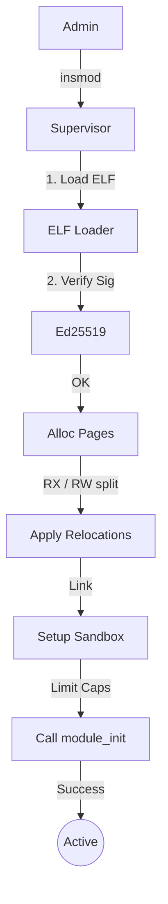

# Documentação do Sistema de Módulos (`src/module`)

> **Caminho**: `src/module`  
> **Responsabilidade**: Carregamento dinâmico, verificação e supervisão de extensões do kernel (Drivers, FS).  
> **Segurança**: Baseada em Assinaturas Digitais (Ed25519) e Capabilities.

---

## 🏛️ Filosofia "Convidado com Crachá"

O kernel RedstoneOS não confia cegamente em módulos. Diferente de sistemas monolíticos tradicionais onde um driver tem acesso total a tudo, aqui o módulo é tratado como um "convidado":

1.  **Identificação Obrigatória**: Todo módulo deve ser assinado criptograficamente.
2.  **Acesso Restrito**: Módulos não acessam símbolos globais arbitrariamente. Eles recebem *Capabilities* explícitas no momento da carga.
3.  **Supervisão Constante**: Um `Watchdog` checa se o módulo está respondendo. Se falhar, é isolado ou reiniciado.

---

## 📂 Estrutura de Arquivos

| Arquivo | Descrição Técnica |
|:--------|:------------------|
| `mod.rs` | Entry point e definições de erro (`ModuleError`). |
| `supervisor.rs` | O "Gerente". Mantém a lista de módulos carregados (`LoadedModule`), gerencia IDs e ciclo de vida. |
| `loader.rs` | Parser ELF customizado. Reloca símbolos e aplica proteções de memória (W^X). |
| `verifier.rs` | Verifica assinaturas Ed25519 antes de permitir o load. |
| `sandbox.rs` | Cria o ambiente isolado (limites de memória/IRQs) para o módulo. |
| `watchdog.rs` | Thread que periodicamente chama healthchecks nos drivers. |

---

## 🔒 Fluxo de Carregamento (Load Path)

### Sandbox e Limites (`supervisor.rs`)
Definimos limites rígidos para evitar que um driver consuma todo o kernel:
*   `max_code_pages`: Limite de tamanho de código.
*   `max_capabilities`: Máximo de recursos que pode solicitar.
*   `init_timeout_ms`: Tempo máximo para inicializar (evita travar o boot).
*   `max_faults`: Se o driver falhar N vezes, é **Banido** automaticamente.

---

## 🛠️ Interface ABI (`abi.rs`)

Para garantir compatibilidade, módulos devem ser compilados contra a mesma versão da `Generic Kernel ABI`.

O `LoadedModule` contém:
*   `entry_point`: Função `init(caps: Vec<Cap>) -> Result`.
*   `exit_fn`: Função `exit()`.
*   `data_pages`: Páginas de memória onde o driver guarda seu estado (heap privado).

---

## ⚠️ Políticas de Falha

Quando um módulo trava (Panic ou Timeout):
1.  **ReportFault**: O Supervisor incrementa o contador de falhas.
2.  **FallbackAction**: Baseado na configuração:
    *   `Disable`: Desativa o hardware.
    *   `Reload`: Tenta recarregar o módulo limpo.
    *   `UseBuiltin`: Troca para um driver genérico (ex: VESA para vídeo).
    *   `Panic`: Se for crítico (ex: driver do HD de boot), dá Panic no sistema.
