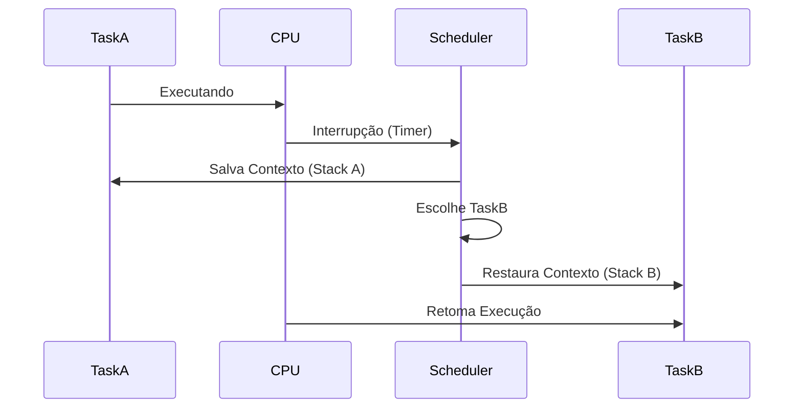

# Gerenciamento de Processos

## 📋 Índice

- [Visão Geral](#visão-geral)
- [Estrutura de Tarefas (Task)](#estrutura-de-tarefas-task)
- [Context Switching](#context-switching)
- [Scheduler](#scheduler)

---

## Visão Geral

O gerenciamento de processos no Forge (`forge::sched`) permite a execução concorrente de múltiplas tarefas. O kernel adota um modelo de **Multitarefa Preemptiva**, onde o scheduler interrompe tarefas periodicamente para garantir justiça na distribuição de tempo de CPU.

### Estrutura do Módulo

-   **`task.rs`**: Define a estrutura `Task` (PCB - Process Control Block).
-   **`context.rs`**: Define o contexto de registradores salvos durante a troca.
-   **`scheduler.rs`**: Lógica de agendamento (Round Robin, Priority).

---

## Estrutura de Tarefas (Task)

Cada unidade de execução é encapsulada em uma struct `Task`.

```rust
pub struct Task {
    pub id: TaskId,
    pub state: TaskState,
    pub context: TaskContext,
    pub stack: KernelStack,
    pub page_table: PhysAddr, // CR3
}

pub enum TaskState {
    Ready,
    Running,
    Blocked,
    Terminated,
}
```

-   **ID**: Identificador único (PID).
-   **State**: Estado atual no ciclo de vida.
-   **Context**: Valores dos registradores (RIP, RSP, RBP, R12-R15).
-   **Stack**: Cada tarefa possui sua própria pilha de kernel.
-   **Page Table**: Ponteiro para o espaço de endereçamento da tarefa.

---

## Context Switching

A troca de contexto é o mecanismo de baixo nível que salva o estado da tarefa atual e restaura o da próxima.

1.  **Interrupção**: Timer ou Syscall aciona o kernel.
2.  **Save**: Registradores da CPU são empilhados na stack da tarefa atual.
3.  **Switch**: O Stack Pointer (RSP) é trocado para o da próxima tarefa.
4.  **Restore**: Registradores são desempilhados da nova stack.
5.  **Retorno**: Instrução `iretq` retorna para a execução da nova tarefa.

### Diagrama de Fluxo



---

## Scheduler

O Forge utiliza um algoritmo de escalonamento para decidir qual tarefa roda a seguir.

### Algoritmo: Round Robin
O algoritmo padrão é o **Round Robin (RR)** com quantum fixo.
-   Todas as tarefas `Ready` estão em uma fila circular.
-   Cada tarefa roda por um tempo fixo (ex: 20ms).
-   Ao fim do tempo, ela vai para o fim da fila.

### Criação de Processos
1.  **kthread_create**: Cria threads apenas de kernel (compartilham espaço de endereçamento).
2.  **fork / exec**: (Futuro) Cria processos de usuário isolados carregando binários ELF.
