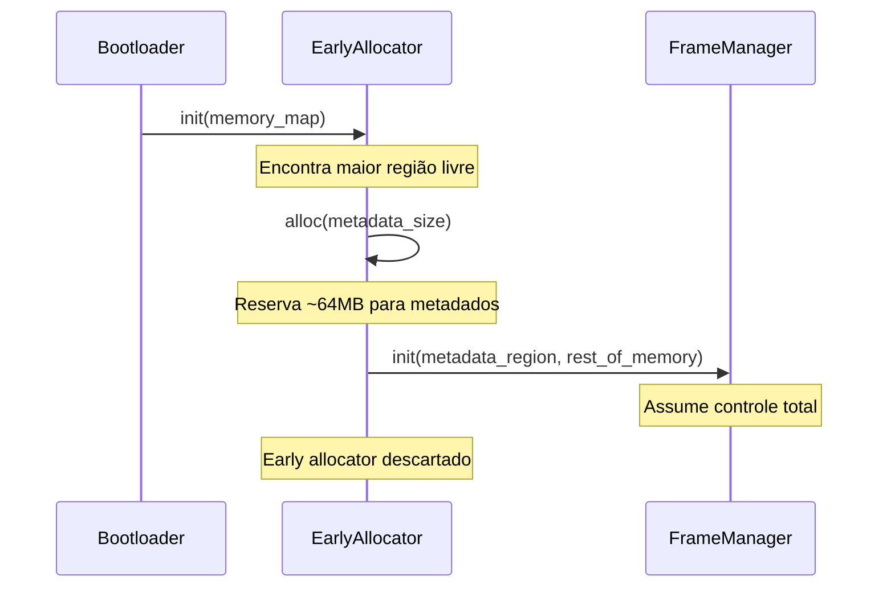
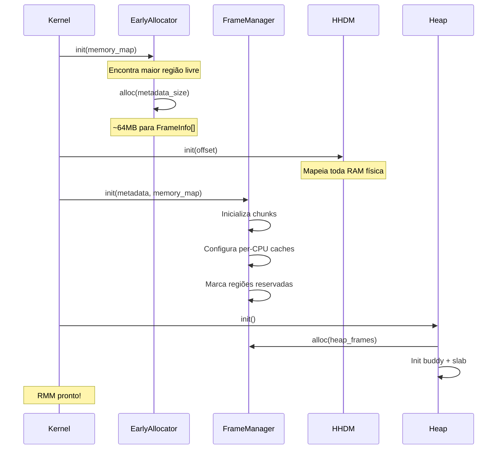
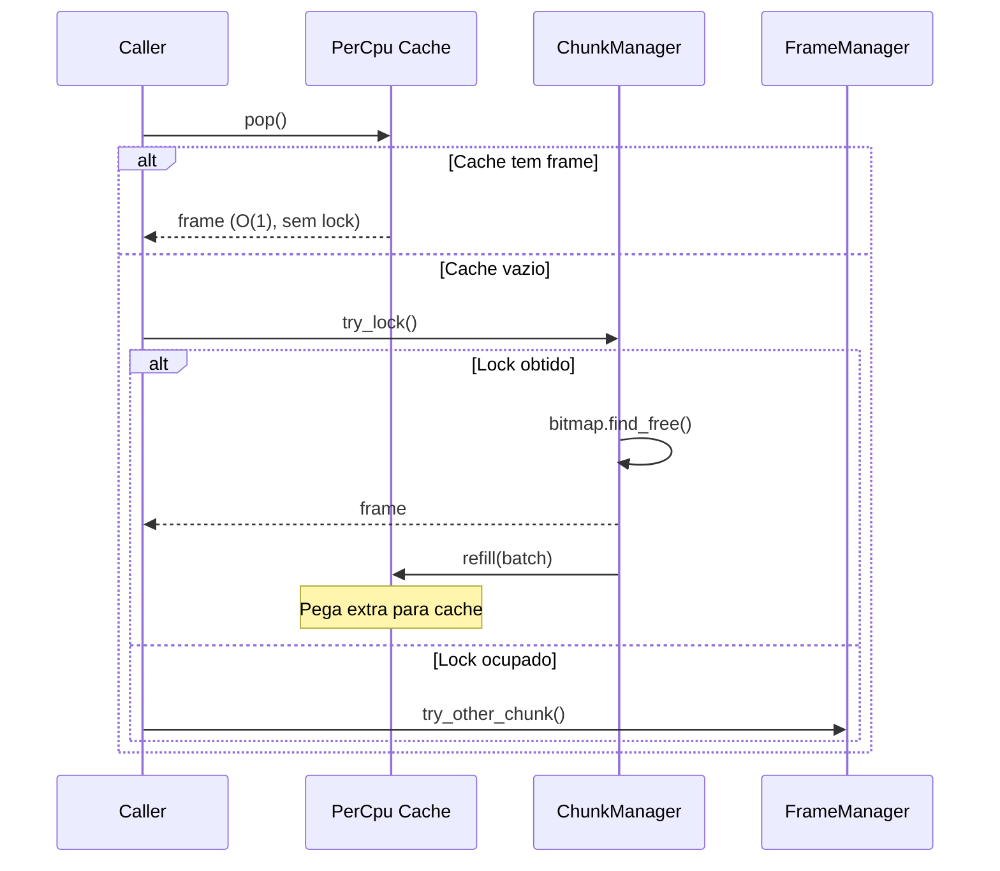

# 🧠 Redstone Memory Manager (RMM)

> **Documentação Oficial v1.0** | Janeiro de 2026  
> Subsistema Unificado de Gerenciamento de Memória do RedstoneOS

---

## 📋 Sumário

1. [Visão Geral](#-visão-geral)
2. [Filosofia e Princípios](#-filosofia-e-princípios)
3. [Decisões Arquiteturais](#-decisões-arquiteturais)
4. [Contratos e Políticas](#-contratos-e-políticas)
5. [Mapa de Memória](#-mapa-de-memória)
6. [Arquitetura Técnica](#-arquitetura-técnica)
7. [Fluxos Operacionais](#-fluxos-operacionais)
8. [API de Referência](#-api-de-referência)
9. [Debug e Observabilidade](#-debug-e-observabilidade)
10. [Stubs e Contratos Futuros](#-stubs-e-contratos-futuros)
11. [Roadmap](#-roadmap)

---

## 🎯 Visão Geral

O **Redstone Memory Manager (RMM)** é o subsistema central de gerenciamento de memória do kernel Forge. Unifica alocação física, mapeamento virtual, heap e memória para drivers em uma arquitetura coesa e bem definida.

### Missão

> *"Cada byte de memória tem dono, endereço e propósito. Nenhuma alocação é anônima."*

### Objetivos Principais

| Objetivo | Descrição |
|----------|-----------|
| **Ownership** | Toda página física tem dono explícito |
| **Zonas** | Separação clara por tipo (DMA, Normal, High) |
| **Unificação** | Um gerenciador, não dois (PMM+PFM → FrameManager) |
| **Segurança** | ASLR, guard pages, zeragem obrigatória |
| **Escalabilidade** | Lock por chunk + per-CPU caches para SMP |
| **Debug** | Endereço físico revela zona, facilitando diagnóstico |

---

## 🧭 Filosofia e Princípios

### Por que o RMM existe?

O antigo módulo `mm` tinha problemas estruturais:

1. **PMM e PFM duplicados** - Dois sistemas fazendo coisas parecidas
2. **Gambiarras hardcoded** - Skip de regiões específicas no código
3. **Double lock** - PFM travava, depois PMM travava novamente
4. **Single global lock** - Não escala para SMP
5. **Stubs sem contrato** - Swap e reclaim eram stubs sem definição clara

### Princípio 1: Ownership First

Toda página física pertence a alguém. Não existe memória "órfã".

```rust
pub enum FrameOwner {
    Free,                      // Disponível para alocação
    Kernel,                    // Kernel core (page tables, stacks)
    Process { pid: Pid },      // Processo userspace
    Driver { id: DeviceId },   // Driver de dispositivo
    Shared { ref_count: u32 }, // Compartilhada (CoW, mmap shared)
    Device,                    // Hardware (framebuffer, MMIO)
    Pinned { owner: Pid },     // Não pode ser swapped/evicted
}
```

### Princípio 2: Zonas Explícitas

Cada endereço físico pertence a uma zona. O endereço revela o tipo.

```
                    MAPA DE ZONAS FÍSICAS
┌─────────────────────────────────────────────────────────────┐
│  0x0000_0000 ─────────────────────────────────────────────  │
│      │  ZONA DMA (0 - 16 MB)                                │
│      │  • Legacy ISA DMA, contiguidade GARANTIDA            │
│  0x0100_0000 ─────────────────────────────────────────────  │
│      │  ZONA DMA32 (16 MB - 4 GB)                           │
│      │  • PCI 32-bit DMA, contiguidade PREFERIDA            │
│  0x1_0000_0000 ───────────────────────────────────────────  │
│      │  ZONA NORMAL (4 GB - MAX)                            │
│      │  • Uso geral kernel e userspace                      │
│  MAX_PHYS ────────────────────────────────────────────────  │
└─────────────────────────────────────────────────────────────┘
```

### Princípio 3: Escalabilidade SMP

Lock por chunk + per-CPU caches para minimizar contention:

```
┌─────────────────────────────────────────────────────────────┐
│                    MODELO DE LOCKING                        │
├─────────────────────────────────────────────────────────────┤
│                                                             │
│  ┌─────────┐  ┌─────────┐  ┌─────────┐  ┌─────────┐         │
│  │ Chunk 0 │  │ Chunk 1 │  │ Chunk 2 │  │ Chunk N │         │
│  │  Lock   │  │  Lock   │  │  Lock   │  │  Lock   │         │
│  └────┬────┘  └────┬────┘  └────┬────┘  └────┬────┘         │
│       │            │            │            │              │
│       └────────────┴────────────┴────────────┘              │
│                         │                                   │
│                         ▼                                   │
│  ┌─────────────────────────────────────────────────────┐    │
│  │              PER-CPU CACHE (Fast Path)              │    │
│  │  CPU0: [f1,f2,f3]  CPU1: [f4,f5]  CPU2: [f6,f7,f8]  │    │
│  └─────────────────────────────────────────────────────┘    │
│                                                             │
│  Fast Path: Pop do cache local (sem lock)                   │
│  Slow Path: Vai ao chunk, pega lock                         │
│                                                             │
└─────────────────────────────────────────────────────────────┘
```

---

## 🏛️ Decisões Arquiteturais

### DA-01: Bootstrapping com Early Bump Allocator

**Problema:** O FrameManager precisa de metadados (~64MB para 8GB RAM), mas quem aloca se o alocador não existe?

**Decisão:** Early Bump Allocator aloca metadados antes do RMM assumir.

```rust
// src/rmm/early.rs

/// Alocador de boot que só avança ponteiro (nunca libera)
/// Usado APENAS para alocar estruturas do FrameManager
pub struct EarlyBumpAllocator {
    start: PhysAddr,
    current: AtomicU64,
    end: PhysAddr,
}

impl EarlyBumpAllocator {
    /// Aloca região física contígua
    pub fn alloc(&self, size: usize, align: usize) -> Option<PhysAddr> {
        // Bump allocation atômica
        let aligned = align_up(self.current.load(), align);
        if aligned + size > self.end {
            return None;
        }
        self.current.store(aligned + size);
        Some(PhysAddr::new(aligned))
    }
}
```

**Fluxo de Boot:**



> [!NOTE]
> **TODO Futuro:** Investigar recuperação da memória do EarlyAllocator após boot. Possível marcar como reclaimable após todos os metadados serem alocados.

---

### DA-02: Lock por Chunk + Per-CPU Caches

**Problema:** Lock global não escala para múltiplas CPUs.

**Decisão:** Dividir memória em chunks (~64KB cada), cada um com seu lock. Per-CPU caches para fast-path.

```rust
pub struct FrameManager {
    /// Chunks de memória (64KB cada = 16 frames)
    chunks: Vec<ChunkManager>,
    
    /// Cache por CPU (hot frames, lock-free)
    percpu_cache: PerCpu<SmallCache>,
    
    /// Metadados de zona
    nodes: Vec<NodeManager>,  // Preparado para NUMA
}

pub struct ChunkManager {
    /// Lock deste chunk apenas
    lock: Spinlock<()>,
    
    /// Bitmap local (16 bits para 16 frames)
    bitmap: AtomicU16,
    
    /// Base física deste chunk
    base: PhysAddr,
    
    /// Migratetype predominante
    migrate_type: MigrateType,
}

pub struct SmallCache {
    /// Até 32 frames hot (pop/push O(1))
    frames: [PhysAddr; 32],
    count: u8,
}
```

**Algoritmo de Alocação:**

```rust
pub fn alloc(zone: Zone, flags: AllocFlags) -> Option<PhysAddr> {
    // 1. Fast path: tenta cache local (sem lock)
    if let Some(frame) = percpu_cache().pop() {
        return Some(frame);
    }
    
    // 2. Slow path: vai ao chunk
    for chunk in self.chunks_in_zone(zone) {
        if let Some(frame) = chunk.try_alloc() {
            return Some(frame);
        }
    }
    
    // 3. Fallback: roubar de outro CPU cache
    // 4. Último recurso: reclaim (futuro)
    None
}
```

---

### DA-03: Interrupt Safety com IRQ Disable + IPI

**Problema:** Se IRQ dispara enquanto CPU segura lock, e IRQ handler tenta alocar → deadlock.

**Decisão:** Desabilitar IRQs locais + IPI para TLB shootdown.

```rust
/// Lock com IRQ disable (evita auto-deadlock)
pub fn alloc_irqsafe(zone: Zone, flags: AllocFlags) -> Option<PhysAddr> {
    // Desabilita IRQs locais (outras CPUs não afetadas)
    let _guard = interrupts::disable_local();
    
    // Agora seguro pegar lock
    let mut chunk = self.find_chunk(zone).lock();
    chunk.alloc()
}

/// TLB shootdown via IPI (Inter-Processor Interrupt)
pub fn flush_tlb_all() {
    // Flush local
    tlb::flush_local();
    
    // Envia IPI para todas as outras CPUs
    for cpu in other_cpus() {
        ipi::send(cpu, IpiMessage::TlbFlush);
    }
    
    // Espera ACK (ou timeout)
    ipi::wait_acks();
}
```

**Para contexto IRQ (não pode bloquear):**

```rust
/// Alocação que nunca bloqueia (para IRQ handlers)
pub fn try_alloc(zone: Zone) -> Option<PhysAddr> {
    // Tenta cache local apenas (sem lock)
    if let Some(frame) = percpu_cache().pop() {
        return Some(frame);
    }
    
    // Tenta try_lock no chunk (falha se ocupado)
    for chunk in self.chunks_in_zone(zone) {
        if let Some(mut guard) = chunk.try_lock() {
            if let Some(frame) = guard.alloc() {
                return Some(frame);
            }
        }
    }
    
    None  // Não conseguiu, caller deve lidar
}
```

> [!IMPORTANT]
> **Regra:** Alocações em IRQ context DEVEM usar `try_alloc()` com `AllocFlags::ATOMIC`. Nunca bloqueie em IRQ!

---

### DA-04: Rmap com Inline + Overflow

**Problema:** `rmap: [u64; 2]` não suporta páginas mapeadas em muitos processos (shared libs).

**Decisão:** 2 slots inline + ponteiro para lista overflow quando necessário.

```rust
pub struct FrameInfo {
    /// Estado e owner (packed)
    state: AtomicU64,
    
    /// Reference count
    ref_count: AtomicU32,
    
    /// Flags (DIRTY, ACCESSED, LOCKED)
    flags: AtomicU32,
    
    /// Rmap inline (2 slots = maioria dos casos)
    rmap_inline: [AtomicU64; 2],
    
    /// Overflow: ponteiro para RmapList no heap
    /// Bit 0: 0 = não usado, 1 = tem overflow
    rmap_overflow: AtomicPtr<RmapNode>,
}

struct RmapNode {
    pte: u64,
    next: *mut RmapNode,
}

impl FrameInfo {
    pub fn rmap_add(&self, pte: u64) {
        // Tenta slot inline 0
        if self.rmap_inline[0].compare_exchange(0, pte).is_ok() {
            return;
        }
        // Tenta slot inline 1
        if self.rmap_inline[1].compare_exchange(0, pte).is_ok() {
            return;
        }
        // Overflow: aloca nó no heap
        self.rmap_overflow_add(pte);
    }
    
    pub fn rmap_remove(&self, pte: u64) {
        // Procura e remove de inline ou overflow
    }
    
    /// Itera todos os PTEs mapeando este frame
    pub fn rmap_iter(&self) -> impl Iterator<Item = u64> {
        // Retorna inline + overflow
    }
}
```

---

### DA-05: Migratetype para Reduzir Fragmentação

**Problema:** Bitmap simples fragmenta, impossibilita alloc_contiguous após tempo.

**Decisão:** Separar frames por "moveability" (inspirado no Linux).

```rust
/// Tipo de migração do frame
#[derive(Debug, Clone, Copy)]
pub enum MigrateType {
    /// Não pode ser movido (page tables, kernel stacks)
    Unmovable,
    
    /// Pode ser movido (userspace, pode compactar)
    Movable,
    
    /// Pode ser descartado (page cache, fácil liberar)
    Reclaimable,
    
    /// Reservado para CMA (Contiguous Memory Allocator)
    Cma,
}

impl ChunkManager {
    /// Cada chunk tem um migratetype predominante
    migrate_type: MigrateType,
}
```

**Benefícios:**

```
┌─────────────────────────────────────────────────────────────┐
│                    SEM MIGRATETYPE                          │
│  [K][U][K][U][K][U][K][U]  ← Fragmentado, impossível        │
│                              alocar 4 contíguos             │
├─────────────────────────────────────────────────────────────┤
│                    COM MIGRATETYPE                          │
│  [K][K][K][K][·][·][·][·]  ← Unmovable separado             │
│  [U][U][U][U][U][U][U][U]  ← Movable: pode compactar        │
│  [C][C][C][C][C][C][C][C]  ← Cache: pode liberar            │
└─────────────────────────────────────────────────────────────┘
```

> [!NOTE]
> **TODO Futuro:** Implementar compaction thread que move páginas Movable para criar regiões contíguas maiores.

---

### DA-06: IOMMU com Device Address

**Problema:** Dispositivos modernos usam IOMMU para tradução de endereços.

**Decisão:** API sempre retorna `dma` address separado de `phys`.

```rust
pub struct DmaBuffer {
    /// Endereço virtual (CPU access)
    pub virt: u64,
    
    /// Endereço físico (RAM real)
    pub phys: u64,
    
    /// Endereço DMA (o que o dispositivo vê)
    /// Com IOMMU: traduzido
    /// Sem IOMMU: == phys
    pub dma: u64,
    
    /// Tamanho
    pub size: usize,
    
    /// Direção do DMA
    pub direction: DmaDirection,
    
    /// Owner
    pub owner: DeviceId,
}

/// Trait para backends de IOMMU
pub trait IommuOps: Send + Sync {
    /// Mapeia região física no domínio do dispositivo
    fn map(&self, phys: PhysAddr, size: usize, dir: DmaDirection) -> DmaAddr;
    
    /// Remove mapeamento
    fn unmap(&self, dma: DmaAddr, size: usize);
    
    /// Sincroniza cache (para arquiteturas não-coerentes)
    fn sync_for_cpu(&self, dma: DmaAddr, size: usize);
    fn sync_for_device(&self, dma: DmaAddr, size: usize);
}

/// Implementação stub (sem IOMMU real)
pub struct NoIommu;

impl IommuOps for NoIommu {
    fn map(&self, phys: PhysAddr, _size: usize, _dir: DmaDirection) -> DmaAddr {
        // Sem IOMMU: dma == phys
        DmaAddr(phys.as_u64())
    }
    
    fn unmap(&self, _dma: DmaAddr, _size: usize) {
        // Nada a fazer
    }
    
    fn sync_for_cpu(&self, _dma: DmaAddr, _size: usize) {
        // x86 é cache-coherent, nada a fazer
    }
    
    fn sync_for_device(&self, _dma: DmaAddr, _size: usize) {
        // x86 é cache-coherent, nada a fazer
    }
}
```

---

### DA-07: Estrutura Preparada para NUMA

**Problema:** Em sistemas NUMA, acessar memória de outro nó é mais lento.

**Decisão:** Estrutura com NodeManager desde o início, V1 usa 1 nó apenas.

```rust
pub struct FrameManager {
    /// Nós NUMA (V1: sempre 1)
    nodes: Vec<NodeManager>,
    
    /// Mapeamento CPU → Node preferido
    cpu_to_node: Vec<u8>,
}

pub struct NodeManager {
    /// ID do nó
    node_id: u8,
    
    /// Zonas deste nó
    zones: [ZoneManager; 3],  // DMA, DMA32, Normal
    
    /// Estatísticas locais
    stats: NodeStats,
}

impl FrameManager {
    /// Aloca no nó da CPU atual (NUMA-aware)
    pub fn alloc_local(&self, zone: Zone, flags: AllocFlags) -> Option<PhysAddr> {
        let cpu = current_cpu();
        let node = self.cpu_to_node[cpu];
        self.nodes[node].alloc(zone, flags)
    }
    
    /// Fallback para outros nós se local cheio
    pub fn alloc_any(&self, zone: Zone, flags: AllocFlags) -> Option<PhysAddr> {
        // Tenta local primeiro
        if let Some(frame) = self.alloc_local(zone, flags) {
            return Some(frame);
        }
        
        // Tenta outros nós
        for node in &self.nodes {
            if let Some(frame) = node.alloc(zone, flags) {
                return Some(frame);
            }
        }
        
        None
    }
}
```

**V1 Inicialização:**

```rust
// V1: Single node (NUMA desabilitado)
let nodes = vec![NodeManager::new(0, all_memory)];
let cpu_to_node = vec![0; num_cpus];  // Todos apontam para node 0
```

---

### DA-08: AllocFlags Completo

**Decisão:** Flags padronizadas para todos os tipos de alocação.

```rust
bitflags! {
    pub struct AllocFlags: u32 {
        /// Zera o frame após alocação (padrão para userspace)
        const ZERO = 0x0001;
        
        /// Não zera (kernel internal, performance)
        const NO_ZERO = 0x0002;
        
        /// Pode ser usado em contexto de interrupção (try, não bloqueia)
        const ATOMIC = 0x0004;
        
        /// Falha rápido, não tenta reclaim
        const NO_WAIT = 0x0008;
        
        /// Precisa de frames contíguos
        const CONTIGUOUS = 0x0010;
        
        /// Alocação para DMA (zona apropriada)
        const DMA = 0x0020;
        
        /// Frame não pode ser evicted/swapped
        const PINNED = 0x0040;
        
        /// Alta prioridade (tenta antes de OOM)
        const HIGH = 0x0080;
        
        /// Bloqueia até conseguir (PERIGOSO, kernel emergencial apenas)
        const NOFAIL = 0x0100;
        
        /// Tipo Movable (pode ser migrado/compactado)
        const MOVABLE = 0x0200;
        
        /// Tipo Reclaimable (pode ser descartado)
        const RECLAIMABLE = 0x0400;
    }
}

// Combinações comuns
impl AllocFlags {
    /// Alocação padrão para kernel
    pub const KERNEL: Self = Self::NO_ZERO;
    
    /// Alocação para userspace (zera por segurança)
    pub const USER: Self = Self::ZERO.union(Self::MOVABLE);
    
    /// Alocação em IRQ handler
    pub const IRQ: Self = Self::ATOMIC.union(Self::NO_WAIT);
    
    /// Alocação DMA
    pub const DMA_BUFFER: Self = Self::DMA.union(Self::CONTIGUOUS).union(Self::PINNED);
}
```

**Assinatura de Alocação:**

```rust
pub fn alloc(
    owner: FrameOwner,
    zone: Zone,
    flags: AllocFlags,
) -> Option<PhysAddr>;

pub fn alloc_contiguous(
    count: usize,
    owner: FrameOwner,
    zone: Zone,
    flags: AllocFlags,
) -> Option<PhysAddr>;
```

---

## 📜 Contratos e Políticas

### Contrato 1: FrameManager

```rust
pub trait FrameManagerContract {
    /// GARANTE: Frame retornado pertence à zona solicitada
    /// GARANTE: Frame é marcado com owner antes de retornar
    /// GARANTE: Frame é zerado se AllocFlags::ZERO
    fn alloc(&mut self, owner: FrameOwner, zone: Zone, flags: AllocFlags) 
        -> Option<PhysAddr>;
    
    /// GARANTE: Todos os frames são contíguos fisicamente
    fn alloc_contiguous(&mut self, count: usize, owner: FrameOwner, zone: Zone, flags: AllocFlags) 
        -> Option<PhysAddr>;
    
    /// REQUER: Caller é o owner registrado
    /// GARANTE: Panic em debug se owner incorreto, Err em release
    fn free(&mut self, phys: PhysAddr, expected_owner: FrameOwner) 
        -> Result<(), RmmError>;
    
    fn inc_ref(&mut self, phys: PhysAddr) -> u32;
    fn dec_ref(&mut self, phys: PhysAddr) -> u32;
}
```

### Política P1: Zeragem Obrigatória

1. `AllocFlags::ZERO`: Frame é zerado após alocação
2. `AllocFlags::NO_ZERO`: Sem zeragem (kernel only)
3. Padrão para userspace: sempre ZERO

### Política P2: Ownership Enforcement

```rust
#[cfg(debug_assertions)]
const STRICT_OWNER: bool = true;  // Panic em debug

#[cfg(not(debug_assertions))]
const STRICT_OWNER: bool = false; // Err em release

pub fn free(phys: PhysAddr, expected: FrameOwner) -> Result<(), RmmError> {
    let actual = self.get_owner(phys);
    if actual != expected {
        kerror!("RMM: Owner mismatch at {:x}: expected {:?}, got {:?}", 
                phys, expected, actual);
        
        if STRICT_OWNER {
            panic!("RMM: Owner mismatch - potential memory corruption!");
        }
        return Err(RmmError::OwnerMismatch);
    }
    // ... free logic
    Ok(())
}
```

### Política P3: Fallback de Zona

1. Se zona solicitada está cheia, **NÃO** faz fallback automático
2. DMA zone é reservada para DMA real
3. Caller pode tentar outra zona explicitamente

### Política P4: Interrupt Safety

1. Lock do FrameManager DEVE usar `spin_lock_irqsave` (desabilita IRQs locais)
2. Alocações em IRQ context DEVEM usar `try_alloc()` com `AllocFlags::ATOMIC`
3. TLB shootdown usa IPI para sincronizar todas as CPUs

### Política P5: Metadados Imutáveis

1. Array `frames` é alocado via EarlyAllocator no boot
2. Tamanho é fixo baseado na RAM total detectada
3. Reside em região Reserved do kernel

---

## 🗺️ Mapa de Memória

### Layout Virtual x86_64

```
┌─────────────────────────────────────────────────────────────┐
│                  ESPAÇO VIRTUAL x86_64                      │
├─────────────────────────────────────────────────────────────┤
│  0x0000_0000_0000_0000 ────────────────────────────────     │
│         │    USERSPACE (0 - 128 TB)                         │
│         │    • Cada processo tem seu mapa                   │
│  0x0000_7FFF_FFFF_FFFF ────────────────────────────────     │
│         │    (Hole - Non-Canonical)                         │
│  0xFFFF_8000_0000_0000 ────────────────────────────────     │
│         │    HHDM (16 TB) - Toda RAM física mapeada         │
│  0xFFFF_9000_0000_0000 ────────────────────────────────     │
│         │    KERNEL HEAP (1 TB) - Box, Vec, Arc             │
│  0xFFFF_A000_0000_0000 ────────────────────────────────     │
│         │    (Reservado)                                    │
│  0xFFFF_C000_0000_0000 ────────────────────────────────     │
│         │    DRIVER ZONE (1 TB) - Memória de drivers        │
│  0xFFFF_D000_0000_0000 ────────────────────────────────     │
│         │    DMA POOL (256 GB) - Buffers DMA                │
│  0xFFFF_E000_0000_0000 ────────────────────────────────     │
│         │    KERNEL STACKS (256 GB) - Stack por task        │
│  0xFFFF_FFFF_8000_0000 ────────────────────────────────     │
│         │    KERNEL CODE (.text, .rodata, .data)            │
│  0xFFFF_FFFF_FFFF_FFFF ────────────────────────────────     │
└─────────────────────────────────────────────────────────────┘
```

### Constantes de Configuração

```rust
// rmm/config.rs

pub const HHDM_BASE: u64 = 0xFFFF_8000_0000_0000;
pub const HEAP_BASE: u64 = 0xFFFF_9000_0000_0000;
pub const DRIVER_ZONE_BASE: u64 = 0xFFFF_C000_0000_0000;
pub const DMA_POOL_BASE: u64 = 0xFFFF_D000_0000_0000;
pub const KSTACK_BASE: u64 = 0xFFFF_E000_0000_0000;

pub const PAGE_SIZE: usize = 4096;
pub const HUGE_PAGE_SIZE: usize = 2 * 1024 * 1024;

pub const ZONE_DMA_END: u64 = 16 * 1024 * 1024;
pub const ZONE_DMA32_END: u64 = 4 * 1024 * 1024 * 1024;

pub const CHUNK_SIZE: usize = 64 * 1024;  // 64KB = 16 frames
pub const PERCPU_CACHE_SIZE: usize = 32;  // 32 frames por CPU
```

---

## 🏗️ Arquitetura Técnica

### Estrutura de Diretórios

```
rmm/
├── mod.rs                    # Entry point, init(), re-exports
├── config.rs                 # Constantes e configuração
├── error.rs                  # RmmError enum
├── addr.rs                   # PhysAddr, VirtAddr
├── early.rs                  # Early Bump Allocator (boot)
│
├── zone/                     # ZONAS DE MEMÓRIA FÍSICA
│   ├── mod.rs               # ZoneManager
│   └── types.rs             # Zone enum, MigrateType
│
├── phys/                     # CAMADA FÍSICA
│   ├── mod.rs               # FrameManager unificado
│   ├── frame.rs             # FrameInfo, FrameOwner, Rmap
│   ├── chunk.rs             # ChunkManager (lock por chunk)
│   ├── percpu.rs            # Per-CPU caches
│   ├── bitmap.rs            # Bitmap helpers
│   └── stats.rs             # Estatísticas por zona
│
├── virt/                     # CAMADA VIRTUAL
│   ├── mod.rs               # VMM entry
│   ├── mapper.rs            # Page table manipulation
│   ├── hhdm.rs              # Higher Half Direct Map
│   ├── tlb.rs               # TLB + IPI shootdown
│   └── aspace/              # Address Space per-process
│       ├── mod.rs           # AddressSpace
│       ├── vma.rs           # Virtual Memory Area
│       └── region.rs        # Region helpers
│
├── heap/                     # HEAP DO KERNEL
│   ├── mod.rs               # GlobalAlloc wrapper
│   ├── allocator.rs         # HeapAllocator (Slab+Buddy)
│   ├── buddy.rs             # Buddy system
│   ├── slab.rs              # Slab allocator
│   └── aslr.rs              # ASLR generation
│
├── driver/                   # MEMÓRIA PARA DRIVERS
│   ├── mod.rs               # API pública
│   ├── dma.rs               # DMA buffer allocation
│   ├── iommu.rs             # IOMMU abstraction
│   ├── buffer.rs            # Device buffers
│   └── pinned.rs            # Pinned memory
│
├── numa/                     # NUMA (Preparado)
│   ├── mod.rs               # NodeManager
│   └── topology.rs          # Detecção via ACPI SRAT
│
├── reclaim/                  # PAGE RECLAIM (Stub)
│   ├── mod.rs               # API stub
│   └── CONTRACT.md          # Contrato
│
├── swap/                     # SWAP (Stub)
│   ├── mod.rs               # API stub
│   └── CONTRACT.md          # Contrato
│
├── cache/                    # PAGE CACHE (Stub)
│   ├── mod.rs               # API stub
│   └── CONTRACT.md          # Contrato
│
└── debug/                    # DEBUG E OBSERVABILIDADE
    ├── mod.rs
    ├── dump.rs              # Memory dumps
    ├── verify.rs            # Integrity checks
    └── stats.rs             # Estatísticas expostas
```

---

## 🔄 Fluxos Operacionais

### Fluxo 1: Inicialização do RMM



### Fluxo 2: Alocação com Per-CPU Cache



---

## 🔧 Debug e Observabilidade

### Verificação de Integridade

```rust
// rmm/debug/verify.rs

pub fn verify_integrity() -> bool {
    let fm = FRAME_MANAGER.lock();
    let mut ok = true;
    
    for (i, info) in fm.frames.iter().enumerate() {
        // Invariante 1: Free implies refcount == 0
        if info.owner() == FrameOwner::Free && info.ref_count() != 0 {
            kerror!("Frame {} is Free but refcount = {}", i, info.ref_count());
            ok = false;
        }
        
        // Invariante 2: refcount > 0 implies not Free
        if info.ref_count() > 0 && info.owner() == FrameOwner::Free {
            kerror!("Frame {} has refcount but is Free", i);
            ok = false;
        }
        
        // Invariante 3: Bitmap consistency
        let bitmap_free = !fm.bitmap.get(i);
        let info_free = info.owner() == FrameOwner::Free;
        if bitmap_free != info_free {
            kerror!("Frame {} bitmap/info mismatch", i);
            ok = false;
        }
    }
    
    ok
}
```

### Estatísticas Expostas

```rust
// rmm/debug/stats.rs

#[derive(Debug)]
pub struct RmmStats {
    // Por zona
    pub zones: [ZoneStats; 3],
    
    // Por nó NUMA
    pub nodes: Vec<NodeStats>,
    
    // Global
    pub total_frames: u64,
    pub free_frames: u64,
    pub kernel_frames: u64,
    pub user_frames: u64,
    pub pinned_frames: u64,
    
    // Performance
    pub alloc_count: u64,
    pub free_count: u64,
    pub cache_hits: u64,
    pub cache_misses: u64,
}

pub fn dump_stats() {
    let stats = get_stats();
    
    kinfo!("=== RMM Statistics ===");
    kinfo!("Total: {} frames ({} MB)", 
           stats.total_frames, 
           stats.total_frames * 4 / 1024);
    kinfo!("Free:  {} frames", stats.free_frames);
    kinfo!("Cache hit rate: {}%", 
           stats.cache_hits * 100 / (stats.cache_hits + stats.cache_misses));
    
    for (i, zone) in stats.zones.iter().enumerate() {
        kinfo!("Zone {:?}: {} / {} frames", 
               Zone::from_index(i), zone.free, zone.total);
    }
}
```

### Invariantes Formais

```rust
// Documentação de invariantes que DEVEM ser verdadeiras

/// INV-1: Frame livre tem refcount 0
/// forall f: frame.owner == Free => frame.ref_count == 0

/// INV-2: Refcount positivo implica não-livre
/// forall f: frame.ref_count > 0 => frame.owner != Free

/// INV-3: Bitmap consistente com FrameInfo
/// forall f: bitmap.get(f) == (frame.owner != Free)

/// INV-4: Soma das zonas é total
/// sum(zone.total) == total_frames

/// INV-5: Rmap consistente com mapeamentos
/// forall pte in frame.rmap: page_table[pte] points to frame
```

---

## 📝 Stubs e Contratos Futuros

### Page Reclaim (`rmm/reclaim/CONTRACT.md`)

**Status:** STUB

```rust
pub fn evict_pages(count: usize) -> usize { 0 }  // TODO
pub fn get_pressure() -> MemoryPressure { MemoryPressure::None }  // TODO
```

**Dependências:** LRU list, page cache, kernel threads

---

### Swap (`rmm/swap/CONTRACT.md`)

**Status:** STUB

```rust
pub fn swap_out(phys: PhysAddr) -> Option<SwapSlot> { None }  // TODO
pub fn swap_in(slot: SwapSlot) -> Option<PhysAddr> { None }  // TODO
```

**Dependências:** Block device, page reclaim

---

### Page Cache (`rmm/cache/CONTRACT.md`)

**Status:** STUB

```rust
pub fn lookup(inode: InodeId, offset: u64) -> Option<PhysAddr> { None }  // TODO
pub fn insert(inode: InodeId, offset: u64, phys: PhysAddr) {}  // TODO
```

**Dependências:** VFS, page reclaim

---

## 🗺️ Roadmap

| Fase | Componentes | Status |
|------|-------------|--------|
| 1 | config, error, addr, early | 🆕 A criar |
| 2 | zone, phys/frame, phys/chunk | 🆕 A criar |
| 3 | phys/percpu, numa (stub) | 🆕 A criar |
| 4 | virt/mapper, virt/hhdm, virt/tlb | 🔄 Migrar |
| 5 | virt/aspace | 🔄 Migrar |
| 6 | heap (buddy, slab, aslr) | 🔄 Migrar |
| 7 | driver (dma, iommu stub) | 🆕 A criar |
| 8 | debug (verify, stats) | 🆕 A criar |
| 9 | reclaim, swap, cache (stubs) | 📝 Stubs |
| 10 | Migrar consumidores | 🔄 Atualizar imports |

---

## 📎 Referências

- [DRIVERS.md](./DRIVERS.md) - Sistema de drivers (consome rmm::driver)
- [CORE.md](./CORE.md) - Boot sequence (chama rmm::init)
- Backup do antigo `mm/` em `z_file/mm/` para referência
