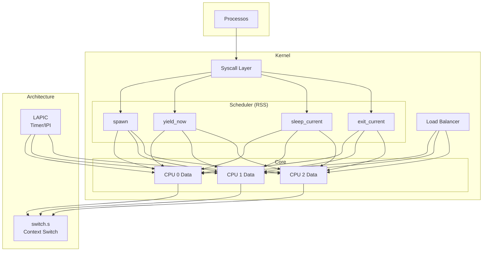
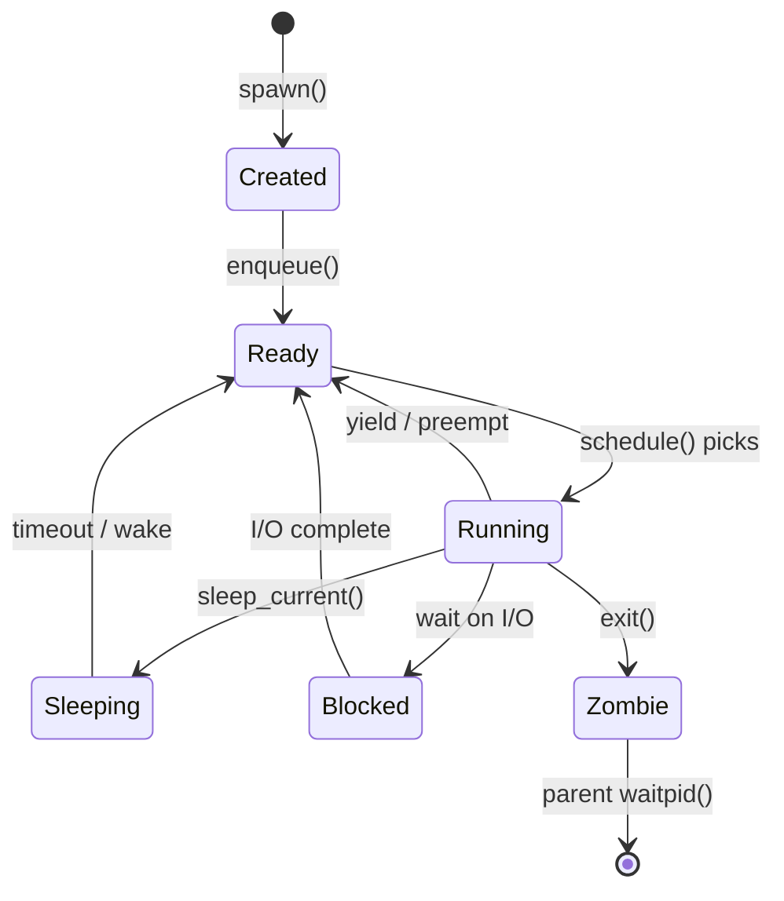
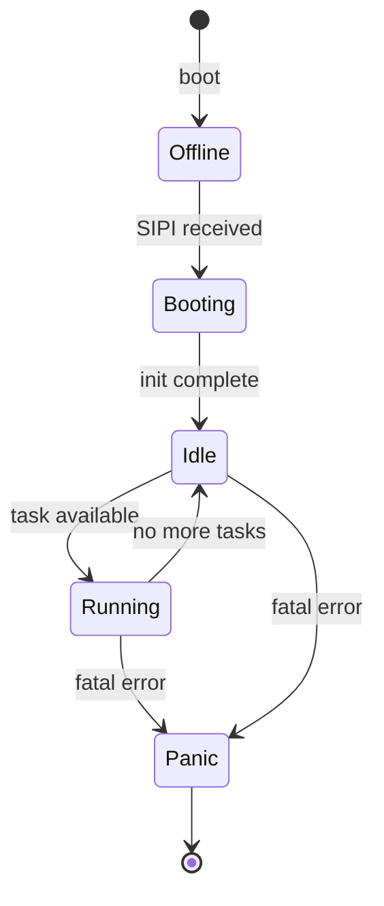
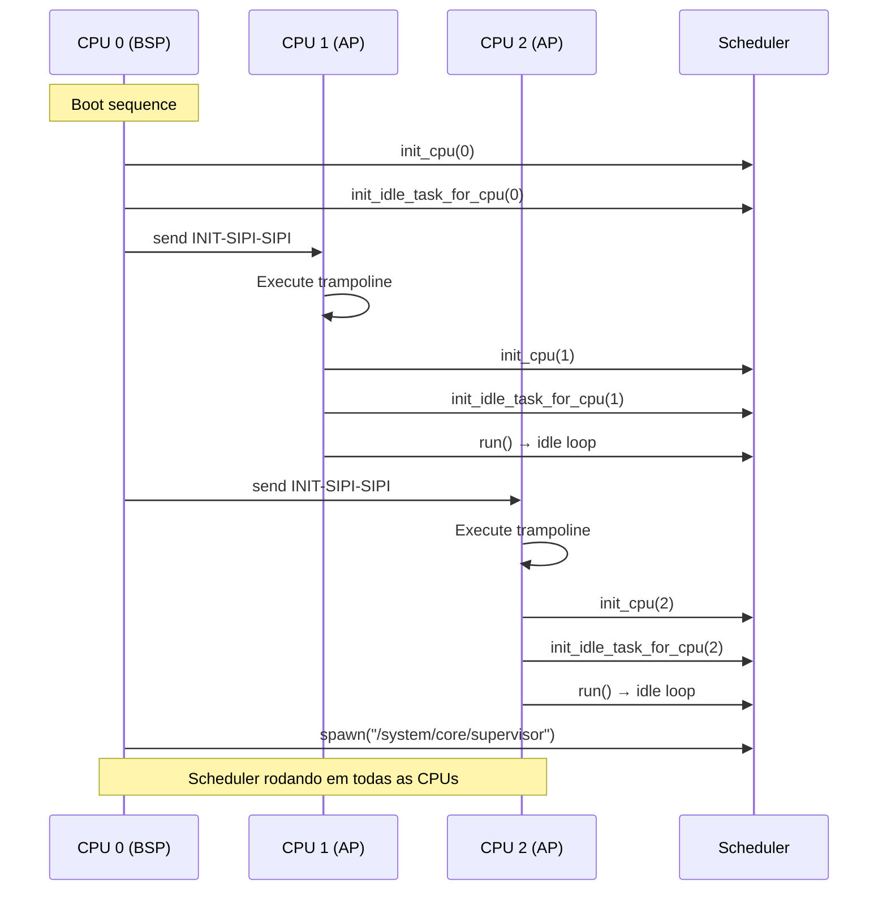
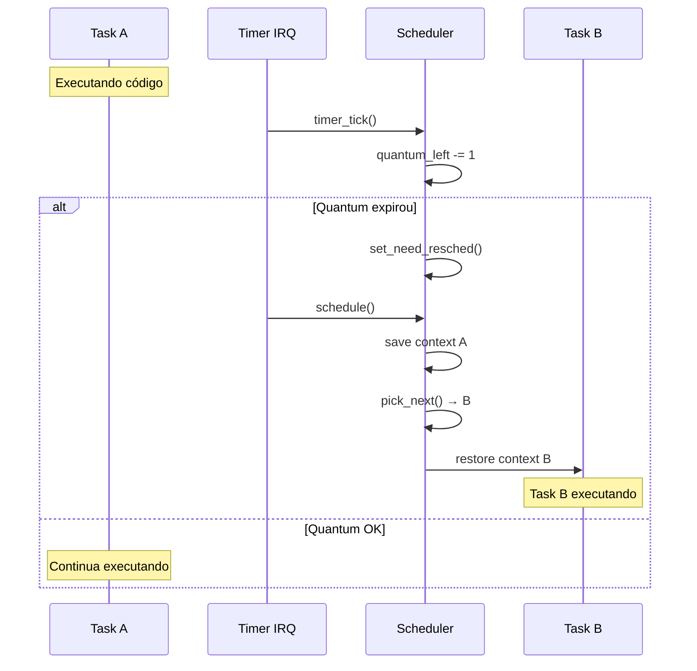

# ⚡ Redstone Scheduler System (RSS)

> **Documentação Oficial v1.0** | Janeiro de 2026  
> Gerenciamento de Tarefas, Context Switch e Escalonamento Multi-Core (SMP)

---

## 📋 Sumário

1. [Visão Geral](#-visão-geral)
2. [Filosofia e Princípios](#-filosofia-e-princípios)
3. [Arquitetura Multi-Core](#-arquitetura-multi-core)
4. [Invariantes de Segurança](#-invariantes-de-segurança)
5. [Estrutura de Módulos](#-estrutura-de-módulos)
6. [Estados e Transições](#-estados-e-transições)
7. [Fluxos Operacionais](#-fluxos-operacionais)
8. [API do Kernel](#-api-do-kernel)
9. [Configurações](#️-configurações)
10. [Roadmap](#-roadmap)

---

## 🎯 Visão Geral

O **Redstone Scheduler System (RSS)** é o coração do gerenciamento de processos e threads no Forge. Ele decide qual tarefa (Task) será executada por qual CPU, gerenciando troca de contexto, estados e filas de execução.

### Missão

> *"Cada CPU tem seu próprio trabalho. Nunca disputar, sempre cooperar."*

### Características Principais

| Feature | Descrição |
|---------|-----------|
| **Multi-Core (SMP)** | Cada CPU tem suas próprias estruturas (runqueue, idle task, current) |
| **Preemptivo** | Timer interrupt pode interromper qualquer task |
| **IRQ-Safe** | Todos os locks desabilitam interrupções automaticamente |
| **Per-CPU Isolation** | Uma CPU só mexe na sua própria runqueue por padrão |
| **Load Balancing** | Balanceamento de carga entre CPUs (Fase 4) |

### Modelo de Execução

```
┌─────────────────────────────────────────────────────────┐
│                    SCHEDULER (MULTI-CORE)               │
├─────────────────────────────────────────────────────────┤
│  CPU 0 (BSP)         CPU 1 (AP)        CPU 2 (AP)       │
│  ┌──────────────┐   ┌──────────────┐  ┌──────────────┐  │
│  │ current      │   │ current      │  │ current      │  │
│  │ runqueue     │   │ runqueue     │  │ runqueue     │  │
│  │ idle_task    │   │ idle_task    │  │ idle_task    │  │
│  │ need_resched │   │ need_resched │  │ need_resched │  │
│  │ state        │   │ state        │  │ state        │  │
│  └──────────────┘   └──────────────┘  └──────────────┘  │
└─────────────────────────────────────────────────────────┘
```

---

## 🧭 Filosofia e Princípios

### Por que Multi-Core?

Sistemas operacionais tradicionais começam single-core e depois tentam adaptar para SMP. Isso causa problemas:

1. **Global Lock** - Todas as CPUs brigam pelo mesmo lock
2. **Cache Invalidation** - Estruturas compartilhadas invalidade caches L1/L2
3. **Escalabilidade Zero** - Adicionar CPUs não melhora performance

O RSS foi redesenhado from scratch para SMP:

### Princípio 1: Per-CPU First

Cada CPU tem suas próprias estruturas. Não há `CURRENT` global - cada CPU tem seu `CURRENT` local.

```
┌─────────────────────────────────────────────────────────────┐
│                    MODELO TRADICIONAL                       │
│                                                             │
│  CPU 0 ──┐                                                  │
│  CPU 1 ──┼──► GLOBAL_RUNQUEUE (todos brigam pelo lock)      │
│  CPU 2 ──┘                                                  │
└─────────────────────────────────────────────────────────────┘

┌─────────────────────────────────────────────────────────────┐
│                    MODELO RSS                               │
│                                                             │
│  CPU 0 ──► [runqueue[0]] ──► [current[0]]                   │
│  CPU 1 ──► [runqueue[1]] ──► [current[1]]                   │
│  CPU 2 ──► [runqueue[2]] ──► [current[2]]                   │
│                                                             │
│            ↓ balance() cruza CPUs (raramente)               │
└─────────────────────────────────────────────────────────────┘
```

### Princípio 2: IRQ Safety

Todo acesso às estruturas do scheduler desabilita interrupções automaticamente. Isso previne self-deadlock quando um timer interrupt ocorre durante um `schedule()`.

```rust
// ERRADO - Self-deadlock se timer interrupt ocorrer
let guard = RUNQUEUE.lock();  // ← Timer pode chamar schedule()
                               //   que tenta pegar o mesmo lock

// CORRETO - IRQ desabilitada automaticamente
let guard = RUNQUEUE.lock_irq();  // ← Timer não pode interromper
```

### Princípio 3: Lock Order Estrito

Quando balanceamento de carga precisa acessar múltiplas CPUs, sempre trava na ordem crescente de ID para evitar deadlock ABBA.

```rust
// Se CPU 3 quer roubar de CPU 1:
let guard1 = CPUS[1].lock();  // Menor ID primeiro
let guard2 = CPUS[3].lock();  // Depois maior ID
```

### Princípio 4: Idle Task é Especial

Cada CPU tem uma idle task que:
- Nunca entra na runqueue
- Nunca migra para outra CPU
- Nunca morre
- Sempre está disponível como fallback

---

## 🏗️ Arquitetura Multi-Core

### Visão Geral por Camadas



### Estrutura Per-CPU

```rust
pub struct PerCpuData {
    /// ID desta CPU (0, 1, 2, ...)
    pub cpu_id: usize,
    
    /// Estado atual da CPU
    pub state: CpuState,
    
    /// Task atualmente em execução
    pub current: Option<Pin<Box<Task>>>,
    
    /// Fila de tasks prontas
    pub runqueue: VecDeque<Pin<Box<Task>>>,
    
    /// Idle task permanente
    pub idle_task: Option<Pin<Box<Task>>>,
    
    /// Flag de preempção solicitada
    pub need_resched: AtomicBool,
}

pub enum CpuState {
    Offline,    // Não inicializada  
    Booting,    // Em inicialização (ap_entry)
    Idle,       // Rodando idle task
    Running,    // Executando task normal
    Panic,      // Erro fatal
}
```

### Mapa de Memória do Scheduler

```
┌─────────────────────────────────────────────────────────────┐
│                 ESPAÇO VIRTUAL (KERNEL)                     │
├─────────────────────────────────────────────────────────────┤
│ 0xFFFF_8000_0000_0000 │ HHDM (RAM física mapeada)           │
├─────────────────────────────────────────────────────────────┤
│ 0xFFFF_9000_0000_0000 │ Kernel Data (PER_CPU[], tasks)      │
│ 0xFFFF_9100_0000_0000 │ Kernel Stacks (64KB por task)       │
├─────────────────────────────────────────────────────────────┤
│ 0xFFFF_FFFF_8000_0000 │ Kernel Code (text, rodata)          │
└─────────────────────────────────────────────────────────────┘
```

---

## 🛡️ Invariantes de Segurança

> [!CAUTION]
> Estas regras são **invioláveis**. Quebrá-las causa deadlock ou corrupção.

| # | Invariante | Consequência da Violação |
|---|------------|--------------------------|
| **I1** | `schedule()` só toca na runqueue da própria CPU | Corrupção de dados |
| **I2** | `balance()` é a única função que cruza CPUs | Deadlock |
| **I3** | Só migre tasks em estado `Ready` | Corrupção de contexto |
| **I4** | `this_cpu_id()` usa LAPIC ID (lock-free) | Deadlock na inicialização |
| **I5** | Todo lock de scheduler desabilita IRQ | Self-deadlock |
| **I6** | Lock order: menor CPU ID primeiro | Deadlock ABBA |
| **I7** | Idle task nunca entra em runqueue | Scheduler quebrado |

### Exemplo de Violação I5 (Self-Deadlock)

```rust
// ❌ ERRADO: Timer interrupt pode causar deadlock
fn schedule() {
    let guard = RUNQUEUE.lock();  // ← CPU segura o lock
    // ... Timer interrupt ocorre aqui ...
    //     Timer handler chama schedule()
    //     schedule() tenta RUNQUEUE.lock()
    //     DEADLOCK!
}

// ✅ CORRETO: IRQ desabilitada
fn schedule() {
    let guard = RUNQUEUE.lock_irq();  // cli implícito
    // Timer não pode interromper
    // ...
}  // sti implícito
```

---

## 📂 Estrutura de Módulos

```
src/sched/
├── mod.rs                 # 🎯 Entry point, re-exports
├── config.rs              # ⚙️ Configurações (quantum, stack sizes)
│
├── core/                  # 🔧 O MOTOR DO SCHEDULER
│   ├── mod.rs            # Re-exports
│   ├── cpu.rs            # PerCpuData, this_cpu_id()
│   ├── scheduler.rs      # schedule(), yield_now(), timer_tick()
│   ├── runqueue.rs       # VecDeque de tasks prontas
│   ├── idle.rs           # Idle task per-CPU
│   ├── switch.rs         # Wrapper para context_switch assembly
│   ├── sleep_queue.rs    # Tasks dormindo com timeout
│   ├── entry.rs          # Trampolins para novas tasks
│   ├── policy.rs         # Políticas (RR, FIFO, etc)
│   └── debug.rs          # dump_tasks() para diagnóstico
│
├── task/                  # 📋 ENTIDADE TASK
│   ├── mod.rs            # Re-exports
│   ├── entity.rs         # struct Task principal
│   ├── context.rs        # CpuContext (registradores salvos)
│   ├── state.rs          # enum TaskState
│   ├── lifecycle.rs      # Criação, zombie cleanup
│   └── accounting.rs     # Estatísticas (quantum usado, etc)
│
├── exec/                  # 🚀 CARREGADOR DE PROCESSOS
│   ├── mod.rs            # Re-exports
│   ├── spawn.rs          # spawn() principal
│   ├── process.rs        # Setup de AddressSpace
│   ├── context.rs        # Setup de trap frame
│   ├── error.rs          # ExecError
│   ├── config.rs         # Endereços (USER_STACK_TOP, etc)
│   └── fmt/              # Parsers de formato
│       ├── elf.rs        # ELF64
│       └── script.rs     # Shebang (#!)
│
├── signal/               # 📡 SINAIS
│   └── ...
│
└── sync/                 # 🔄 WAIT QUEUES
    └── waitqueue.rs      # WaitQueue para I/O blocking
```

### Status dos Módulos

| Módulo | Status | Descrição |
|--------|--------|-----------|
| `core/cpu.rs` | 🚧 Refatorando | Migrando para PerCpuData |
| `core/scheduler.rs` | 🚧 Refatorando | Migrando para per-CPU |
| `core/runqueue.rs` | 🚧 Refatorando | Runqueue local por CPU |
| `core/idle.rs` | 🚧 Refatorando | Idle task per-CPU |
| `core/switch.rs` | ✅ Funcional | IRQ-safe |
| `task/entity.rs` | ✅ Funcional | Task struct |
| `task/context.rs` | ✅ Funcional | Callee-saved regs |
| `exec/spawn.rs` | ✅ Funcional | ELF loader |

---

## 🔄 Estados e Transições

### Task States



### CPU States



---

## 🔄 Fluxos Operacionais

### Fluxo 1: Inicialização Multi-Core



### Fluxo 2: Preempção por Timer



### Fluxo 3: Context Switch

```
┌─────────────────────────────────────────────────────────────┐
│                    CONTEXT SWITCH                           │
├─────────────────────────────────────────────────────────────┤
│                                                             │
│  1. SALVAR REGISTRADORES DA TASK ANTIGA                     │
│     push rbp, rbx, r12, r13, r14, r15                       │
│     mov [old_ctx.rsp], rsp                                  │
│                                                             │
│  2. TROCAR STACK POINTER                                    │
│     mov rsp, [new_ctx.rsp]                                  │
│                                                             │
│  3. RESTAURAR REGISTRADORES DA NOVA TASK                    │
│     pop r15, r14, r13, r12, rbx, rbp                        │
│                                                             │
│  4. RETORNAR                                                │
│     ret  ← "retorna" para onde nova task parou              │
│                                                             │
└─────────────────────────────────────────────────────────────┘
```

---

## 📖 API do Kernel

### Funções Principais

#### `sched::spawn(path) -> Result<Pid, ExecError>`

Cria novo processo a partir de executável ELF.

```rust
use crate::sched::exec::spawn;

match spawn("/bin/init", None) {
    Ok(pid) => kinfo!("Processo criado: PID", pid.as_u32()),
    Err(ExecError::NotFound) => kerror!("Arquivo não encontrado"),
    Err(e) => kerror!("Erro ao spawnar processo"),
}
```

#### `sched::yield_now()`

Cede CPU voluntariamente. Útil em loops longos.

```rust
// Em um loop de polling:
loop {
    if device.ready() { break; }
    sched::yield_now();  // Deixa outras tasks rodarem
}
```

#### `sched::sleep_current(ms: u64)`

Dorme por N milissegundos.

```rust
sched::sleep_current(100);  // Dorme 100ms
```

#### `sched::exit_current(code: i32) -> !`

Termina o processo atual. Nunca retorna.

```rust
// Ao final de um processo
sched::exit_current(0);
```

#### `sched::core::current() -> Option<*const Task>`

Retorna ponteiro para task atual desta CPU.

```rust
if let Some(task_ptr) = sched::core::current() {
    let task = unsafe { &*task_ptr };
    kinfo!("PID atual:", task.tid.as_u32());
}
```

### Funções Per-CPU (Internas)

```rust
// ID da CPU atual (lock-free, usa LAPIC)
let id = sched::core::cpu::this_cpu_id();

// Inicializa dados per-CPU (chamado no boot)
sched::core::cpu::init_cpu(id);

// Inicializa idle task para esta CPU
sched::core::idle::init_idle_task_for_cpu(id);

// Entra no loop do scheduler (nunca retorna)
sched::core::scheduler::run();
```

---

## ⚙️ Configurações

### Parâmetros em `config.rs`

| Constante | Valor | Descrição |
|-----------|-------|-----------|
| `DEFAULT_QUANTUM` | 10 ticks | Tempo antes de preempção |
| `KERNEL_STACK_SIZE` | 64 KB | Stack Ring 0 por task |
| `USER_STACK_SIZE` | 2 MB | Stack Ring 3 por task |
| `PRIORITY_DEFAULT` | 128 | Prioridade padrão (0-255) |
| `MAX_CPUS` | 64 | CPUs suportadas |

### Estados de Preempção

```rust
// Timer decrementa quantum a cada tick
pub fn timer_tick() {
    if task.accounting.quantum_left > 0 {
        task.accounting.quantum_left -= 1;
    }
    
    if task.accounting.quantum_left == 0 {
        cpu::set_need_resched();  // Sinaliza preempção
    }
}
```

---

## 🔮 Roadmap

### Fase 1: Per-CPU Básico ⬅️ **Atual**
- [x] Analisar estrutura existente
- [ ] Criar `SpinlockIrqSave`
- [ ] Implementar `PerCpuData`
- [ ] Migrar `scheduler.rs` para per-CPU
- [ ] Migrar `idle.rs` para idle task per-CPU
- [ ] Integrar com SMP bringup

### Fase 2: Testes e Estabilização
- [ ] Testar com 4 CPUs no QEMU
- [ ] Verificar spawn do init
- [ ] Verificar sem deadlocks

### Fase 3: Load Balancing
- [ ] Implementar `balance()`
- [ ] Work stealing com try_lock
- [ ] Métricas de carga por CPU

### Fase 4: Otimizações
- [ ] IPI para acordar CPUs ociosas
- [ ] NUMA awareness
- [ ] Real-time scheduling classes (FIFO, RR)

---

## 📊 Comparação com Outros Sistemas

| Feature | Linux | Windows | Redox | **Forge** |
|---------|-------|---------|-------|-----------|
| Per-CPU Runqueue | ✅ | ✅ | ✅ | ✅ |
| Work Stealing | ✅ | ✅ | 🔄 | 🔮 Fase 3 |
| IRQ-Safe Locks | ✅ | ✅ | ✅ | ✅ |
| NUMA Aware | ✅ | ✅ | ❌ | 🔮 Fase 4 |
| Real-Time Classes | ✅ | ✅ | ❌ | 🔮 Fase 4 |

---

<div align="center">

**Redstone OS Team** • *Construindo o Futuro, Core a Core*

*SCHED.md v2.0 — Janeiro 2026*

</div>
