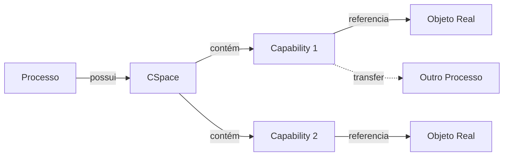
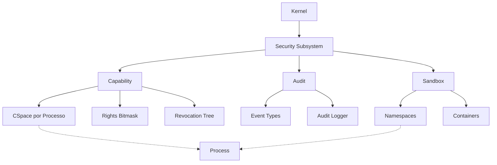
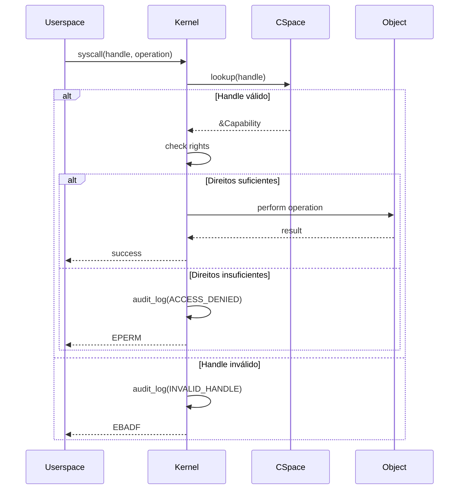

# 🛡️ Security Subsystem

> **Documentação Oficial v1.0** | Janeiro de 2026  
> Sistema de Segurança baseado em Capabilities do RedstoneOS

---

## 📋 Sumário

1. [Visão Geral](#-visão-geral)
2. [Filosofia OCAP](#-filosofia-ocap)
3. [Arquitetura Técnica](#-arquitetura-técnica)
4. [Sistema de Capabilities](#-sistema-de-capabilities)
5. [Auditoria](#-auditoria)
6. [Sandboxing](#-sandboxing)
7. [Guia de Uso](#-guia-de-uso)
8. [Roadmap](#-roadmap)

---

## 🎯 Visão Geral

O subsistema de segurança do RedstoneOS implementa um modelo **Object-Capability (OCAP)**, abandonando completamente o modelo tradicional baseado em identidade (UID/GID) e ACLs.

### Missão

> *"Não existe superusuário. Não existe 'root'. O poder vem da posse de tokens, não de quem você é."*

### Princípios Fundamentais

| Princípio | Descrição |
|-----------|-----------|
| **Sem Superusuário** | Nenhuma entidade tem poder absoluto |
| **Posse é Poder** | Se você tem o token, você tem acesso |
| **Least Privilege** | Cada entidade tem apenas o mínimo necessário |
| **Delegação Explícita** | Acesso só pode ser passado com direito de TRANSFER |
| **Revogável** | Capabilities podem ser revogadas a qualquer momento |

---

## 🧭 Filosofia OCAP

### Por que abandonar UID/GID?

O modelo Unix de segurança tem 50 anos e sofre de problemas fundamentais:

```
┌──────────────────────────────────────────────────────────────┐
│              MODELO TRADICIONAL (UID/GID)                    │
├──────────────────────────────────────────────────────────────┤
│  X - Root pode tudo (single point of failure)                │
│  X - Identidade != Autorização (confused deputy)             │
│  X - ACLs são estáticos e difíceis de gerenciar              │
│  X - Privilege escalation é comum                            │
│  X - Revogar acesso requer mudar o recurso, não o processo   │
└──────────────────────────────────────────────────────────────┘

┌──────────────────────────────────────────────────────────────┐
│              MODELO OCAP (Capabilities)                      │
├──────────────────────────────────────────────────────────────┤
│  O - Poder é distribuído, não concentrado                    │
│  O - Token = Autorização (sem ambiguidade)                   │
│  O - Direitos são dinâmicos e granulares                     │
│  O - Privilege é mínimo por design                           │
│  O - Revogar = invalidar o token                             │
└──────────────────────────────────────────────────────────────┘
```

### Modelo Mental



Um processo **não sabe** o que existe no sistema. Ele só conhece o que foi explicitamente dado a ele via capabilities.

---

## 🏗️ Arquitetura Técnica

### Estrutura de Diretórios

```r
security/
├── mod.rs              # Core + init() + re-exports
├── traits.rs           # Interfaces comuns
│
├── capability/         # Sistema OCAP
│   ├── mod.rs          # Re-exports
│   ├── cap.rs          # Capability, CapType, CapHandle
│   ├── rights.rs       # CapRights (bitmask)
│   ├── cspace.rs       # CSpace (tabela por processo)
│   └── revocation.rs   # Sistema de revocação
│
├── audit/              # Logging de segurança
│   ├── mod.rs          # Re-exports + log()
│   ├── events.rs       # Tipos de eventos
│   └── policy.rs       # Política de auditoria
│
└── sandbox/            # Isolamento
    ├── mod.rs          # Re-exports
    ├── namespace.rs    # Tipos de namespace
    └── container.rs    # Container (sandbox completo)
```

### Diagrama de Componentes



---

## 🔑 Sistema de Capabilities

### Conceitos Fundamentais

#### Capability

Token **unforgeable** que concede acesso a um recurso:

```rust
pub struct Capability {
    pub cap_type: CapType,    // Tipo do objeto
    pub rights: CapRights,    // O que pode fazer
    pub object_ref: u64,      // Referência interna
    pub badge: u64,           // Identificação em IPC
    pub generation: u32,      // Para revocação
}
```

#### CapType (Tipos de Objeto)

| Tipo | Descrição |
|------|-----------|
| `Memory` | VMO (Virtual Memory Object) |
| `Port` | Endpoint IPC |
| `Channel` | Canal bidirecional IPC |
| `Thread` | Thread de execução |
| `Process` | Processo |
| `Event` | Objeto de sincronização |
| `Timer` | Timer do sistema |
| `Irq` | Linha de interrupção |
| `Mmio` | Região de I/O mapeada |
| `File` | Arquivo/recurso de FS |

#### CapRights (Direitos)

```rust
pub const READ: CapRights      = 1 << 0;   // Ler dados
pub const WRITE: CapRights     = 1 << 1;   // Modificar dados
pub const EXECUTE: CapRights   = 1 << 2;   // Executar código
pub const DUPLICATE: CapRights = 1 << 3;   // Duplicar o handle
pub const TRANSFER: CapRights  = 1 << 4;   // Enviar via IPC
pub const GRANT: CapRights     = 1 << 5;   // Criar derivado
pub const REVOKE: CapRights    = 1 << 6;   // Revogar derivados
pub const WAIT: CapRights      = 1 << 7;   // Esperar evento
pub const SIGNAL: CapRights    = 1 << 8;   // Sinalizar evento
```

#### CSpace (Capability Space)

Tabela de capabilities **por processo**, similar a file descriptor table:

```rust
pub struct CSpace {
    slots: [Option<Capability>; 256],
    generation: u32,
}

// Operações
cspace.insert(cap) -> CapHandle
cspace.lookup(handle) -> Option<&Capability>
cspace.remove(handle) -> Option<Capability>
cspace.duplicate(handle) -> Option<CapHandle>
```

### Fluxo de Acesso



---

## 📋 Auditoria

### Eventos de Auditoria

O sistema loga eventos importantes de segurança:

| Categoria | Eventos |
|-----------|---------|
| **Capability** | Granted, Denied, Revoked, Transferred |
| **Process** | Created, Exited, Exec |
| **Access** | Denied, Violation |
| **System** | ModuleLoad, ConfigChange |

### Integração

Os logs de audit são enviados para `core::debug` (sistema de logging do kernel).
Futuramente: persistência em disco, análise em tempo real.

---

## 📦 Sandboxing

### Conceito

Cada processo pode rodar em um **container** com visão limitada do sistema:

```rust
pub struct Container {
    namespaces: NamespaceSet,   // O que o processo "vê"
    cspace: CSpace,             // Capabilities disponíveis
    limits: ResourceLimits,     // Limites de recursos
}
```

### Tipos de Namespace

| Namespace | Isola |
|-----------|-------|
| `Mount` | Pontos de montagem do FS |
| `Pid` | Espaço de PIDs |
| `Net` | Stack de rede |
| `Ipc` | Recursos IPC |

### Aplicação: Módulos de Kernel

Módulos de kernel rodam com **capabilities limitadas**:

```
┌──────────────────────────────────────────────────────────────┐
│                    MÓDULO DE KERNEL                          │
│                                                              │
│  O módulo NÃO É dono da casa.                                │
│  O módulo É convidado com crachá.                            │
│                                                              │
│  - Recebe apenas as capabilities necessárias                 │
│  - Não pode acessar memória do kernel diretamente            │
│  - É monitorado pelo audit                                   │
│  - Pode ter capabilities revogadas a qualquer momento        │
└──────────────────────────────────────────────────────────────┘
```

---

## 📖 Guia de Uso

### Validando Acesso em Syscall

```rust
fn sys_write(handle: CapHandle, data: &[u8]) -> Result<usize, Error> {
    let proc = current_process();
    
    // 1. Buscar capability
    let cap = proc.cspace.lookup(handle)
        .ok_or(Error::InvalidHandle)?;
    
    // 2. Verificar tipo
    if cap.cap_type != CapType::File {
        audit::log(AuditEvent::TypeMismatch, proc.pid);
        return Err(Error::TypeMismatch);
    }
    
    // 3. Verificar direitos
    if !cap.rights.has(CapRights::WRITE) {
        audit::log(AuditEvent::AccessDenied, proc.pid);
        return Err(Error::PermissionDenied);
    }
    
    // 4. Operação permitida
    do_write(cap.object_ref, data)
}
```

### Transferindo Capability via IPC

```rust
// Processo A envia capability para Processo B
fn transfer_cap(src_handle: CapHandle, dest_port: CapHandle) -> Result<()> {
    let cap = cspace.lookup(src_handle)?;
    
    // Precisa de TRANSFER
    if !cap.rights.has(CapRights::TRANSFER) {
        return Err(Error::NotTransferable);
    }
    
    // Cria cópia para destino (sem direito TRANSFER)
    let transfered = cap.clone().without(CapRights::TRANSFER);
    
    send_via_ipc(dest_port, transfered)
}
```

### Derivando Capability com Menos Direitos

```rust
// Pai cria capability derivada para filho
let full_cap = CapRights::READ | CapRights::WRITE | CapRights::GRANT;
let child_cap = parent_cap.derive(CapRights::READ)?;  // Só leitura

// child_cap não pode escrever nem criar derivados
```

---

## 🗺️ Roadmap

### Status Atual

| Módulo | Status | Descrição |
|--------|--------|-----------|
| `capability/` | ✅ Funcional | CSpace, Rights, CapHandle |
| `audit/` | 🔄 Estrutura | Eventos definidos, logger básico |
| `sandbox/` | 🔄 Estrutura | Namespace types, Container |

### Próximos Passos

1. **Revocação de Capabilities** - Invalidar árvore de derivados
2. **Audit Persistente** - Salvar logs em disco
3. **Namespace Isolation** - Implementar isolamento real
4. **Security Policy Engine** - Políticas declarativas

---

## 📚 Referências

- [seL4 Capabilities](https://sel4.systems/Info/Docs/seL4-manual-latest.pdf)
- [Fuchsia Zircon Handles](https://fuchsia.dev/fuchsia-src/concepts/kernel/handles)
- [Capsicum (FreeBSD)](https://www.freebsd.org/cgi/man.cgi?capsicum(4))
