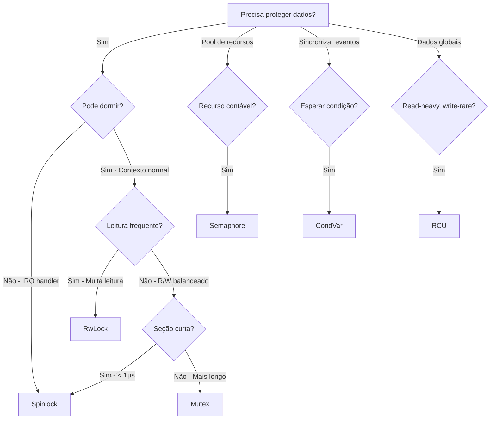
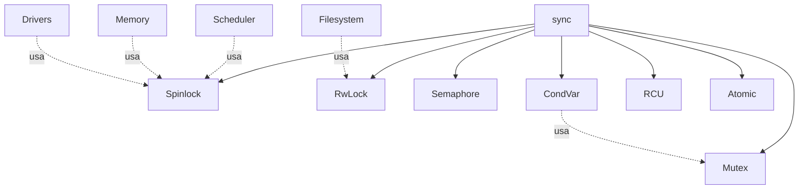

# 🔄 Synchronization Primitives (`sync`)

> **Documentação Oficial v1.0** | Janeiro de 2026  
> Primitivas de Controle de Concorrência do Kernel Forge

---

## 📋 Sumário

1. [Visão Geral](#-visão-geral)
2. [Guia de Escolha](#-guia-de-escolha)
3. [Primitivas](#-primitivas)
4. [Regras de Segurança](#-regras-de-segurança)
5. [Arquitetura](#-arquitetura)
6. [Guia de Uso](#-guia-de-uso)

---

## 🎯 Visão Geral

O módulo `sync` fornece primitivas de sincronização para o kernel. Como o RedstoneOS é **preemptivo** e **SMP** (Symmetric Multi-Processing), o acesso a estruturas compartilhadas deve ser estritamente controlado.

### Missão

> *"Garantir thread-safety sem sacrificar performance. Use a primitiva certa para cada situação."*

### Princípios

| Princípio | Descrição |
|-----------|-----------|
| **Interrupt-Safety** | Spinlocks desabilitam interrupções |
| **Minimal Hold Time** | Segure locks pelo menor tempo possível |
| **Lock Ordering** | Sempre adquira na mesma ordem global |
| **No Sleeping in IRQ** | Nunca use Mutex em handlers de interrupção |

---

## 🧭 Guia de Escolha

### Qual primitiva usar?



### Tabela Resumo

| Primitiva | Comportamento | Uso Ideal | Proibido Em |
|-----------|---------------|-----------|-------------|
| **Spinlock** | Busy-wait + CLI | Seções < 1µs, IRQ handlers | Seções longas |
| **Mutex** | Sleep (futuro) | Seções longas, I/O | IRQ handlers |
| **RwLock** | N leitores OR 1 escritor | Dados muito lidos | - |
| **Semaphore** | Contador | Pool de recursos | - |
| **CondVar** | Espera por condição | Sincronização | - |
| **RCU** | Lock-free reads | Configs globais | Consistência forte |

---

## 🔧 Primitivas

### Spinlock

Bloqueio com busy-wait e **desabilitação de interrupções**.

```rust
pub struct Spinlock<T> {
    locked: AtomicBool,
    data: UnsafeCell<T>,
}
```

**Características:**
- ✅ Interrupt-safe (desabilita IRQs)
- ✅ Mais rápido para seções curtas
- ❌ Desperdiça CPU se seção longa
- ❌ Não pode dormir dentro

**API:**
```rust
let lock = Spinlock::new(data);
let guard = lock.lock();     // Bloqueia, desabilita IRQs
let guard = lock.try_lock(); // Tenta sem bloquear
// guard.deref() -> &T
// guard.deref_mut() -> &mut T
// Drop restaura IRQs
```

---

### Mutex

Bloqueio que pode colocar thread para dormir.

```rust
pub struct Mutex<T> {
    locked: AtomicBool,
    owner: AtomicU32,
    data: UnsafeCell<T>,
}
```

**Características:**
- ✅ Não desperdiça CPU (futuro: dorme)
- ✅ Bom para seções longas
- ❌ **PROIBIDO** em IRQ handlers
- ⚠️ Atualmente usa spin-wait (TODO: scheduler)

**API:**
```rust
let mutex = Mutex::new(data);
let guard = mutex.lock();     // Pode bloquear
let guard = mutex.try_lock(); // Tenta sem bloquear
```

---

### RwLock

Read-Write Lock: múltiplos leitores OU um escritor.

```rust
pub struct RwLock<T> {
    state: AtomicI32,  // >0: leitores, -1: escritor
    data: UnsafeCell<T>,
}
```

**Características:**
- ✅ Leitura paralela
- ✅ Escritor tem acesso exclusivo
- ❌ Writer starvation possível

**API:**
```rust
let lock = RwLock::new(data);
let read_guard = lock.read();   // Múltiplos permitidos
let write_guard = lock.write(); // Exclusivo
```

---

### Semaphore

Controla acesso a pool de recursos contáveis.

```rust
pub struct Semaphore {
    count: AtomicI32,
}
```

**Características:**
- ✅ Limita concorrência
- ✅ Pool de N recursos

**API:**
```rust
let sem = Semaphore::new(5);  // 5 recursos
sem.acquire();                 // P/wait/down
sem.try_acquire();             // Tenta sem bloquear
sem.release();                 // V/signal/up
```

---

### CondVar

Condition Variable: espera por condição específica.

```rust
pub struct CondVar {
    signal_counter: AtomicUsize,
}
```

**Características:**
- ✅ Sincronização baseada em eventos
- ⚠️ Requer Mutex associado
- ⚠️ Atualmente usa spin-wait

**API:**
```rust
let cond = CondVar::new();
cond.wait(&mut guard);  // Libera mutex, espera, readquire
cond.notify_one();      // Acorda uma thread
cond.notify_all();      // Acorda todas
```

---

### RCU (Read-Copy-Update)

Lock-free para leituras, copy-on-write para escritas.

```rust
pub struct Rcu<T> {
    inner: AtomicPtr<T>,
}
```

**Características:**
- ✅ Leitura sem lock
- ✅ Ideal para dados muito lidos
- ❌ Escrita aloca nova cópia
- ❌ Consistência eventual

**API:**
```rust
let rcu = Rcu::new(config);
let guard = rcu.read();     // Lock-free
rcu.update(new_config);     // Cria cópia, troca ponteiro
```

---

### Atomics

Wrappers convenientes sobre `core::sync::atomic`.

```rust
pub struct AtomicFlag(AtomicBool);
pub struct AtomicCounter(AtomicU64);
pub struct AtomicCell<T: Copy> { ... }
```

**API:**
```rust
// AtomicFlag
let flag = AtomicFlag::new(false);
flag.set(true);
flag.get();
flag.test_and_set();
flag.clear();

// AtomicCounter
let counter = AtomicCounter::new(0);
counter.inc();
counter.dec();
counter.add(5);

// AtomicCell (tipos pequenos)
let cell = AtomicCell::new(value);
cell.load();
cell.store(new_value);
```

---

## ⚠️ Regras de Segurança

### Regra 1: IRQ = Spinlock

```rust
// ❌ ERRADO - vai crashar
fn irq_handler() {
    let guard = MUTEX.lock();  // PROIBIDO!
}

// ✅ CORRETO
fn irq_handler() {
    let guard = SPINLOCK.lock();  // OK
}
```

### Regra 2: Ordem de Aquisição

```rust
// ❌ DEADLOCK (ABBA)
// Thread 1: lock(A), lock(B)
// Thread 2: lock(B), lock(A)

// ✅ CORRETO - Sempre mesma ordem
// Thread 1: lock(A), lock(B)
// Thread 2: lock(A), lock(B)
```

### Regra 3: Hold Time Mínimo

```rust
// ❌ ERRADO - Segura lock muito tempo
let guard = LOCK.lock();
do_slow_io();  // NÃO!
drop(guard);

// ✅ CORRETO - Copia dados, libera rápido
let data = {
    let guard = LOCK.lock();
    guard.clone()
};  // Lock liberado
do_slow_io_with(data);
```

### Regra 4: Não Aninha Spinlocks

```rust
// ❌ PERIGOSO - Pode causar deadlock
let g1 = LOCK_A.lock();
let g2 = LOCK_B.lock();  // Se B já tiver A...

// ✅ MELHOR - Lock único ou ordem garantida
```

---

## 🏗️ Arquitetura

### Estrutura de Diretórios

```r
sync/
├── mod.rs          # Re-exports
├── spinlock/       # Busy-wait + interrupt-safe
├── mutex/          # Sleep-capable (futuro)
├── rwlock/         # Read-Write lock
├── semaphore/      # Contador de recursos
├── condvar/        # Condition variable
├── rcu/            # Read-Copy-Update
└── atomic/         # Wrappers atômicos
```

### Dependências



---

## 📖 Guia de Uso

### Importando

```rust
use crate::sync::{Spinlock, SpinlockGuard};
use crate::sync::Mutex;
use crate::sync::RwLock;
use crate::sync::Semaphore;
use crate::sync::{AtomicFlag, AtomicCounter};
```

### Exemplo: Proteção de Estado Global

```rust
use crate::sync::Spinlock;

static STATE: Spinlock<SystemState> = Spinlock::new(SystemState::new());

fn update_state() {
    let mut guard = STATE.lock();
    guard.counter += 1;
}  // Lock automaticamente liberado
```

### Exemplo: Pool de Recursos

```rust
use crate::sync::Semaphore;

static BUFFER_POOL: Semaphore = Semaphore::new(10);

fn get_buffer() -> Buffer {
    BUFFER_POOL.acquire();  // Espera recurso disponível
    allocate_buffer()
}

fn return_buffer(buf: Buffer) {
    deallocate_buffer(buf);
    BUFFER_POOL.release();
}
```

### Exemplo: Configuração RCU

```rust
use crate::sync::rcu::Rcu;

static CONFIG: Rcu<Config> = Rcu::new(Config::default());

fn read_config() -> Config {
    let guard = CONFIG.read();
    guard.clone()
}

fn update_config(new: Config) {
    CONFIG.update(new);  // Leitores antigos continuam OK
}
```

---

## 🗺️ Roadmap

### Status Atual

| Componente | Status |
|------------|--------|
| Spinlock | ✅ Produção |
| Mutex | ⚠️ Spin-wait (TODO: scheduler) |
| RwLock | ✅ Produção |
| Semaphore | ⚠️ Spin-wait (TODO: scheduler) |
| CondVar | ⚠️ Spin-wait (TODO: scheduler) |
| RCU | ✅ Produção |
| Atomic | ✅ Produção |

### Próximos Passos

1. **Mutex com Sleep** - Integrar com wait queue do scheduler
2. **Semaphore com Sleep** - Idem
3. **CondVar Real** - Integrar com scheduler
4. **RCU Grace Period** - Epoch-based reclamation
