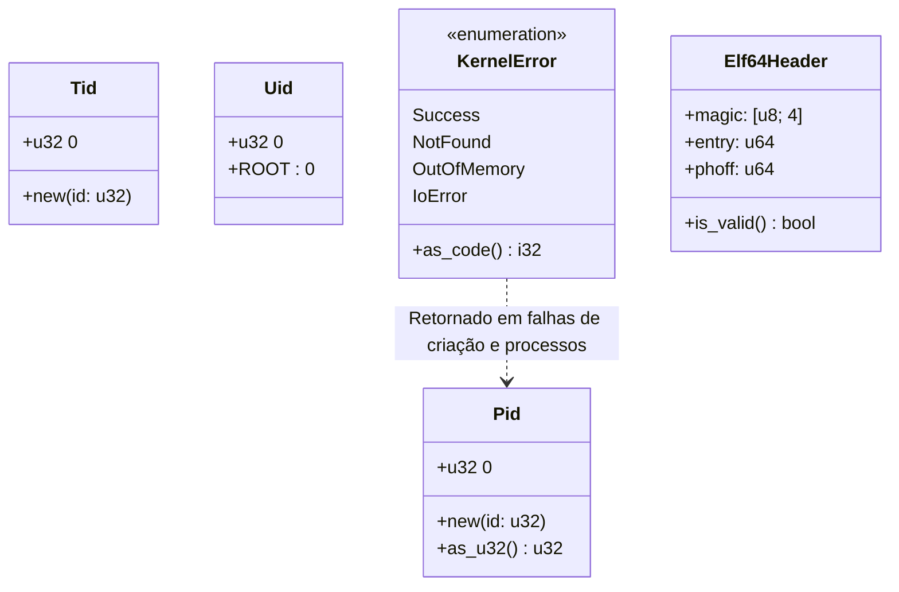

# Documentação do Módulo System (`src/sys`)

> **Caminho**: `src/sys`  
> **Responsabilidade**: Definições fundamentais de tipos, constantes e estruturas de dados compartilhadas por todo o kernel (Forge).  
> **Status**: Estável (Tipos Base) / Em Migração (Syscalls Legadas)

---

## 🏛️ Visão Geral

O módulo `sys` serve como um repositório central para tipos primitivos que possuem significado semântico específico no contexto do Sistema Operacional (como `Pid`, `Uid`, códigos de erro internos e formatos de binários).

Diferente do módulo `syscall` (que foca na *interface* com o usuário), este módulo foca na **representação interna** de dados do sistema.

---

## 📂 Estrutura de Arquivos

| Arquivo | Propósito | Status |
|:--------|:----------|:-------|
| `mod.rs` | Exporta os submódulos e simplifica imports (`use crate::sys::Pid`). | ✅ Ativo |
| `types.rs` | Define *Strong Types* para identificadores (`Pid`, `Tid`, `Uid`, `Gid`) para evitar confusão com inteiros `u32` crus. | ✅ Ativo |
| `elf.rs` | Estruturas oficiais do formato ELF64 (Executable and Linkable Format) usadas pelo loader do kernel. | ✅ Ativo |
| `error.rs` | Enum `KernelError` para erros internos de lógica do kernel, mapeáveis para erros de syscall. | ✅ Ativo |
| `syscall.rs` | Lista de números de syscall estilo POSIX/Linux (`SYS_READ=0`, `SYS_WRITE=1`). **⚠️ LEGADO**: Conflita com `src/syscall/numbers.rs`. | ⚠️ Deprecado |

---

## 🧱 Tipos Fundamentais (`types.rs`)

O RedstoneOS utiliza o padrão "NewType" do Rust para garantir segurança de tipos em tempo de compilação. Isso impede, por exemplo, passar um `Uid` onde se espera um `Pid`.

### Identificadores

| Tipo | Struct Rust | Representação | Constantes Predefinidas |
|:-----|:------------|:--------------|:------------------------|
| **Process ID** | `struct Pid(u32)` | Identificador único de Processo. | `KERNEL=0`, `INIT=1` |
| **Thread ID** | `struct Tid(u32)` | Identificador único de Thread. | - |
| **User ID** | `struct Uid(u32)` | Identificador de Usuário. | `ROOT=0` |
| **Group ID** | `struct Gid(u32)` | Identificador de Grupo. | `ROOT=0` |

> **Nota**: Todos os tipos possuem `#[repr(transparent)]`, garantindo que em memória são idênticos a um `u32`, sem overhead de performance.

---

## 📦 Formato ELF (`elf.rs`)

O kernel possui um parser ELF64 embutido para carregar executáveis. As estruturas seguem o layout binário padrão System V.

### `Elf64Header`
Cabeçalho principal de 64 bytes localizado no início do arquivo.
- **Magic**: `[0x7F, 'E', 'L', 'F']`
- **Entry Point**: Endereço virtual inicial (`entry`).
- **PhOff**: Offset da tabela de Program Headers.

### `PhType` (Program Header Type)
Tipos de segmentos suportados pelo loader:
1.  **LOAD**: Segmento carregável em memória (Código/Dados).
2.  **DYNAMIC**: Informações de linkagem dinâmica.
3.  **INTERP**: Caminho do interpretador (ld-linux, etc).
4.  **TLS**: Thread Local Storage.

---

## 🚫 Erros Internos (`error.rs`)

O enum `KernelError` reporta falhas internas entre subsistemas do Kernel.

| Código interno | Variante | Descrição |
|---------------:|:---------|:----------|
| `0` | `Success` | Operação bem sucedida. |
| `-1` | `PermissionDenied`| Falta de privilégios. |
| `-2` | `NotFound` | Recurso não localizado. |
| `-3` | `AlreadyExists` | Colisão de nomes/IDs. |
| `-4` | `OutOfMemory` | Heap do kernel ou frames esgotados. |
| `-5` | `InvalidArgument` | Parâmetros de função incorretos. |
| `-9` | `InvalidHandle` | Manipulador inválido ou expirado. |
| `-12` | `IoError` | Falha de hardware ou driver. |
| `-99` | `Internal` | Bug, Estado inconsistente ou Panic recuperável. |

> **Diferença para `SysError`**:
> - `KernelError`: Usado **dentro** das funções do kernel (ex: driver falhou ao inicializar).
> - `SysError`: Usado na **borda** da syscall (retorno para o usuário).
> Geralmente um `KernelError` é convertido em um `SysError` antes de retornar ao userspace.

---

## ⚠️ Análise do Arquivo `syscall.rs`

Este arquivo define constantes de syscall seguindo o padrão **Linux (x86_64)**:

```rust
pub const SYS_READ: usize = 0;
pub const SYS_WRITE: usize = 1;
pub const SYS_OPEN: usize = 2;
// ...
```

**Conflito Identificado**:
O módulo `src/syscall/numbers.rs` (a nova implementação oficial) define uma tabela totalmente diferente, baseada em categorias (`0x60` para Filesystem, etc).

**Recomendação**:
O arquivo `src/sys/syscall.rs` parece ser um resquício de uma tentativa anterior de compatibilidade binária com Linux ou código legado. **Desenvolvedores devem usar `src/syscall/numbers.rs` para novas implementações.**

---

## 📊 Diagrama de Tipos


