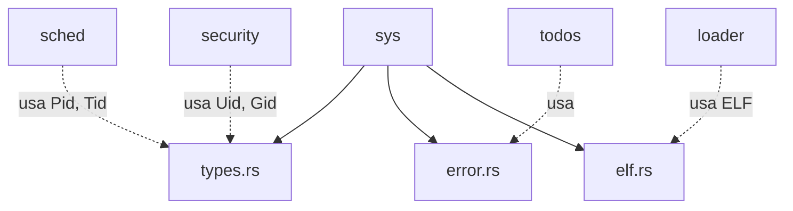

# 📋 System Definitions (`sys`)

> **Documentação Oficial v1.0** | Janeiro de 2026  
> Tipos Fundamentais e Definições do Kernel Forge

---

## 📋 Sumário

1. [Visão Geral](#-visão-geral)
2. [Arquitetura](#-arquitetura)
3. [Tipos Fundamentais](#-tipos-fundamentais)
4. [Códigos de Erro](#-códigos-de-erro)
5. [Formato ELF](#-formato-elf)
6. [Guia de Uso](#-guia-de-uso)

---

## 🎯 Visão Geral

O módulo `sys` serve como repositório central para **tipos primitivos** que possuem significado semântico específico no contexto do Sistema Operacional.

### Missão

> *"Tipos seguros em tempo de compilação. Nunca confunda um Pid com um Uid."*

### Diferença de Outros Módulos

| Módulo | Foco |
|--------|------|
| `sys` | Representação **interna** de dados (Pid, erros, ELF) |
| `syscall` | **Interface** com userspace |
| `ipc` | **Comunicação** entre processos |

---

## 🏗️ Arquitetura

### Estrutura de Diretórios

```r
sys/
├── mod.rs      # Re-exports principais
├── types.rs    # Tipos fundamentais (Pid, Tid, Uid, Gid)
├── error.rs    # KernelError enum
└── elf.rs      # Estruturas ELF64 para loader
```

### Diagrama de Dependências


```mermaid
graph TB
    sys[sys]
    
    types[types.rs]
    error[error.rs]
    elf[elf.rs]
    
    sys --> types
    sys --> error
    sys --> elf
    
    sched[sched] -.->|usa Pid, Tid| types
    security[security] -.->|usa Uid, Gid| types
    loader[loader] -.->|usa ELF| elf
    all[todos] -.->|usa| error
```

---

## 🧱 Tipos Fundamentais

O RedstoneOS utiliza o padrão **NewType** do Rust para garantir segurança de tipos em tempo de compilação.

### Identificadores

| Tipo | Struct | Descrição | Constantes |
|------|--------|-----------|------------|
| **Process ID** | `Pid(u32)` | Identificador único de processo | `KERNEL=0`, `INIT=1` |
| **Thread ID** | `Tid(u32)` | Identificador único de thread | - |
| **User ID** | `Uid(u32)` | Identificador de usuário (auditoria) | `KERNEL=0` |
| **Group ID** | `Gid(u32)` | Identificador de grupo (auditoria) | `KERNEL=0` |

### Por que NewTypes?

```rust
// SEM NewType - PERIGOSO
fn kill(pid: u32, signal: u32) { ... }
kill(signal, pid);  // Compilou! Mas está ERRADO

// COM NewType - SEGURO
fn kill(pid: Pid, signal: Signal) { ... }
kill(signal, pid);  // ERRO DE COMPILAÇÃO!
```

### Aliases de Tipo

| Alias | Tipo Base | Uso |
|-------|-----------|-----|
| `FileOffset` | `i64` | Offset em arquivo (pode ser negativo para seek) |
| `Size` | `usize` | Tamanho em bytes |
| `Time` | `i64` | Timestamp (segundos desde epoch) |

---

## 🚫 Códigos de Erro

O enum `KernelError` representa erros internos do kernel.

### Tabela de Erros

| Código | Variante | Descrição |
|-------:|:---------|:----------|
| `0` | `Success` | Operação bem sucedida |
| `-1` | `PermissionDenied` | Falta de privilégios/capabilities |
| `-2` | `NotFound` | Recurso não localizado |
| `-3` | `AlreadyExists` | Colisão de nomes/IDs |
| `-4` | `OutOfMemory` | Heap ou frames esgotados |
| `-5` | `InvalidArgument` | Parâmetros incorretos |
| `-6` | `NotSupported` | Operação não implementada |
| `-7` | `Busy` | Recurso em uso |
| `-8` | `Timeout` | Operação expirou |
| `-9` | `InvalidHandle` | Handle inválido ou expirado |
| `-10` | `BufferTooSmall` | Buffer insuficiente |
| `-11` | `EndOfFile` | Fim do arquivo/stream |
| `-12` | `IoError` | Falha de hardware/driver |
| `-13` | `Interrupted` | Operação interrompida |
| `-14` | `Again` | Tente novamente (EAGAIN) |
| `-15` | `Cancelled` | Operação cancelada |
| `-99` | `Internal` | Bug ou estado inconsistente |

### Conversão

```rust
// Erro para código
let code = error.as_code();  // -4

// Código para erro
let error = KernelError::from_code(-4);  // OutOfMemory

// Result type
fn allocate() -> KernelResult<*mut u8> {
    Err(KernelError::OutOfMemory)
}
```

---

## 📦 Formato ELF

O kernel possui um parser ELF64 para carregar executáveis.

### Estruturas

#### `Elf64Header`

Cabeçalho principal de 64 bytes:

| Campo | Tipo | Descrição |
|-------|------|-----------|
| `magic` | `[u8; 4]` | `[0x7F, 'E', 'L', 'F']` |
| `class` | `u8` | 1=32bit, 2=64bit |
| `entry` | `u64` | Endereço de entrada |
| `phoff` | `u64` | Offset dos Program Headers |
| `phnum` | `u16` | Número de Program Headers |

#### `Elf64Phdr` (Program Header)

Descreve um segmento a ser carregado:

| Campo | Tipo | Descrição |
|-------|------|-----------|
| `p_type` | `u32` | Tipo do segmento |
| `p_flags` | `u32` | Flags (R/W/X) |
| `p_offset` | `u64` | Offset no arquivo |
| `p_vaddr` | `u64` | Endereço virtual |
| `p_filesz` | `u64` | Tamanho no arquivo |
| `p_memsz` | `u64` | Tamanho em memória |

### Tipos de Segmento

| Tipo | Valor | Descrição |
|------|-------|-----------|
| `Null` | 0 | Ignorar |
| `Load` | 1 | Carregar em memória |
| `Dynamic` | 2 | Linkagem dinâmica |
| `Interp` | 3 | Caminho do interpretador |
| `Note` | 4 | Informações auxiliares |
| `Tls` | 7 | Thread Local Storage |

### Flags de Segmento

| Constante | Valor | Descrição |
|-----------|-------|-----------|
| `PF_R` | 0x4 | Legível |
| `PF_W` | 0x2 | Escrevível |
| `PF_X` | 0x1 | Executável |

---

## 📖 Guia de Uso

### Importando

```rust
// Tipos principais
use crate::sys::{Pid, Tid, Uid, Gid};
use crate::sys::{KernelError, KernelResult};

// ELF
use crate::sys::elf::{Elf64Header, Elf64Phdr, PhType};
```

### Criando Tipos

```rust
// Process ID
let pid = Pid::new(42);
let kernel_pid = Pid::KERNEL;  // 0
let init_pid = Pid::INIT;      // 1

// Verificar
if pid == Pid::KERNEL {
    // É o kernel
}

// Converter para u32
let raw: u32 = pid.as_u32();
```

### Trabalhando com Erros

```rust
fn do_something() -> KernelResult<()> {
    if !check_permission() {
        return Err(KernelError::PermissionDenied);
    }
    
    let resource = find_resource()
        .ok_or(KernelError::NotFound)?;
    
    Ok(())
}

// Tratando
match do_something() {
    Ok(()) => { /* sucesso */ }
    Err(KernelError::NotFound) => { /* não achou */ }
    Err(e) => { /* outro erro */ }
}
```

### Validando ELF

```rust
use crate::sys::elf::{Elf64Header, ELF_MAGIC};

fn load_elf(data: &[u8]) -> KernelResult<()> {
    let header = unsafe { 
        &*(data.as_ptr() as *const Elf64Header) 
    };
    
    if !header.is_valid() {
        return Err(KernelError::InvalidArgument);
    }
    
    // Processar program headers...
    Ok(())
}
```
