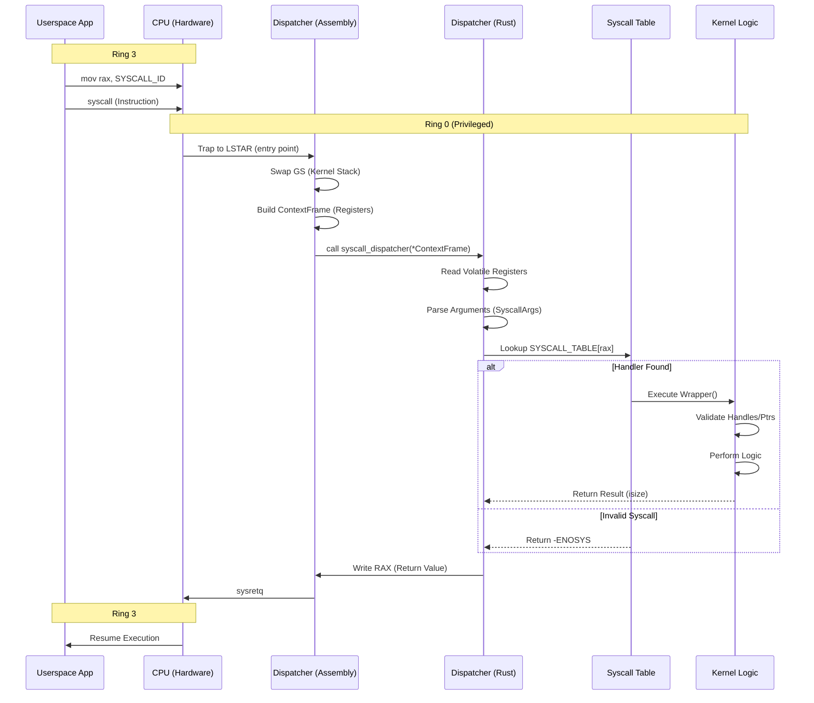

# Documentação Técnica: Subsistema de Syscalls (Forge Kernel)

> **Projeto**: RedstoneOS / Forge Kernel
> **Módulo**: `src/syscall`
> **Nível de Acesso**: Ring 0 (Kernel) <-> Ring 3 (Userland)
> **Arquitetura**: x86_64 (System V AMD64 ABI customizada)
> **Status da Documentação**: Completa / Tabela de Referência

---

## 1. �️ Arquitetura e Fluxo de Execução

O subsistema de syscalls é a fronteira de trust boundary definitiva do sistema. Nenhuma instrução privilegiada pode ser executada pelo userspace sem passar por este portal.

### 1.1 Diagrama de Fluxo (Ring Transition)

O diagrama abaixo ilustra o ciclo de vida exato de uma chamada de sistema, desde a instrução até o retorno.



### 1.2 Convenção de Chamada (ABI)

O RedstoneOS segue estritamente a convenção de registradores abaixo para garantir performance máxima (passagem em registradores, sem stack overhead).

| Registrador | Direção | Uso na Syscall | C/Rust Type | Observação |
|:-----------:|:-------:|:---------------|:-----------:|:-----------|
| **RAX**     | Input   | **Syscall ID** | `usize`     | Número único da operação (ver Seção 5) |
| **RAX**     | Output  | **Retorno**    | `isize`     | Valor >= 0 (Sucesso), < 0 (Erro) |
| **RDI**     | Input   | Argumento 1    | `usize`     | Geralmente ponteiros ou handles |
| **RSI**     | Input   | Argumento 2    | `usize`     | Tamanhos, flags ou ponteiros secundários |
| **RDX**     | Input   | Argumento 3    | `usize`     | Terceiro argumento |
| **R10**     | Input   | Argumento 4    | `usize`     | **Substitui RCX** (RCX é usado pelo hardware na instrução `syscall`) |
| **R8**      | Input   | Argumento 5    | `usize`     | Quinto argumento |
| **R9**      | Input   | Argumento 6    | `usize`     | Sexto argumento |
| **RCX**     | Destr.  | RIP salvo      | -           | Destruído pela CPU (salva endereço de retorno) |
| **R11**     | Destr.  | RFLAGS salvo   | -           | Destruído pela CPU (salva flags) |

---

## 2. 📂 Estrutura de Arquivos e Código Fonte

O módulo está organizado para separar definições de interface (ABI) da implementação lógica.

### Raiz `src/syscall/`
| Arquivo | Descrição Técnica |
|:--------|:------------------|
| `mod.rs` | Entry point do módulo. Inicializa MSRs para `syscall/sysret`. |
| `numbers.rs` | **Catálogo Mestre**. Define constantes `pub const SYS_*: usize` para cada operação. |
| `error.rs` | Enum `SysError` com mapeamento para códigos negativos (-errno). |

### Diretório `src/syscall/abi/`
Definições compartilhadas que **devem** ser idênticas no Kernel e na Libc.
| Arquivo | Conteúdo Principal |
|:--------|:-------------------|
| `args.rs` | Struct `SyscallArgs` para extração segura de argumentos do `ContextFrame`. |
| `flags.rs` | Constantes de bitmask: `O_RDONLY`, `MAP_SHARED`, `PROT_EXEC`, etc. |
| `types.rs` | Structs "POD" (Plain Old Data): `TimeSpec`, `Stat`, `IoVec`, `PollFd`. |
| `version.rs` | Controle de versão da ABI (`ABI_VERSION`) e Magic Numbers. |

### Diretório `src/syscall/dispatch/`
| Arquivo | Descrição Técnica |
|:--------|:------------------|
| `mod.rs` | Contém `syscall_dispatcher`: função `extern "C"` que faz a leitura `volatile` dos registradores. |
| `table.rs` | Array estático `[Option<Fn>; 256]` que mapeia IDs para ponteiros de função. O(1). |

### Diretórios de Implementação (Lógica)
| Diretório/Arquivo | Responsabilidade |
|:------------------|:-----------------|
| `process/` | `lifecycle.rs` (spawn, exit, wait), `info.rs` (getpid, taskinfo). |
| `memory/` | `alloc.rs` (heap user), `mmap.rs` (mappings), `brk.rs`. |
| `fs/` | `basic.rs` (bridges para o VFS: open, read, write, close). |
| `ipc/` | `port.rs` (Message Passing), `shm.rs` (Shared Memory Manager). |
| `display/` | `display.rs` (Framebuffer legada), `buffer.rs` (Buffer management), `input.rs`. |
| `time/` | `clock.rs` (Timers, Sleep, Monotonic Clock). |
| `system/` | `info.rs` (Reboot, Poweroff, Debug commands). |
| `handle/` | Gestão da tabela de handles do processo (dup, close). |

---

## 3. 🚫 Catálogo de Erros (SysError)

Todos os erros retornados em `RAX` são negativos. A tabela abaixo mapeia os códigos.

| Código (RAX) | Enum Rust (`SysError`) | Significado |
|-------------:|:-----------------------|:------------|
| -1 | `NotImplemented` | Feature não existe nesta versão do kernel. |
| -2 | `InvalidSyscall` | ID de syscall fora do range ou desconhecido. |
| -3 | `InvalidArgument` | Argumento inválido (nulo, desalinhado, flag ilegal). |
| -4 | `InvalidHandle` | Handle não existe, está fechado, ou tipo incorreto. |
| -5 | `PermissionDenied` | Acesso negado ao recurso (ACL/Rights). |
| -6 | `NotFound` | Arquivo, porta ou recurso não encontrado. |
| -7 | `AlreadyExists` | Tentativa de criar recurso duplicado (ex: porta nomeada). |
| -8 | `Busy` | Recurso bloqueado ou em uso exclusivo. |
| -9 | `Timeout` | Operação excedeu o tempo limite. |
| -10 | `OutOfMemory` | Kernel ou Processo sem memória disponível. |
| -11 | `BufferTooSmall` | Buffer do usuário insuficiente para os dados. |
| -12 | `Interrupted` | Chamada interrompida por sinal ou evento. |
| -13 | `EndOfFile` | Fim do stream/arquivo. |
| -14 | `BrokenPipe` | Escrita em pipe/socket sem leitores. |
| -15 | `IsDirectory` | Tentativa de tratar diretório como arquivo. |
| -16 | `NotDirectory` | Componente do path não é diretório. |
| -17 | `NotEmpty` | Remoção de diretório não vazio. |
| -18 | `IoError` | Erro genérico de dispositivo/hardware. |
| -19 | `LimitReached` | Cota excedida (handles, processos, memória). |
| -20 | `NotSupported` | Operação válida, mas não suportada pelo alvo (ex: seek em pipe). |
| -21 | `BadAddress` | Ponteiro aponta para kernel space ou memória não mapeada. |

---

## 4. 📚 Referência Completa de Syscalls

Abaixo listamos todas as syscalls implementadas, agrupadas por subsistema.

### 4.1 Process Management (0x01 - 0x0F)

| ID | Nome (Constante) | Arg1 (RDI) | Arg2 (RSI) | Arg3 (RDX) | Arg4 (R10) | Retorno |
|:--:|:-----------------|:-----------|:-----------|:-----------|:-----------|:--------|
| `0x01` | **SYS_EXIT** | `int code` | - | - | - | *Não retorna* |
| `0x02` | **SYS_SPAWN** | `ptr path` | `len path` | `ptr args` | `len args` | `PID` ou Erro |
| `0x03` | **SYS_WAIT** | `usize pid` | `u64 timeout` | - | - | `ExitCode` |
| `0x04` | **SYS_YIELD** | - | - | - | - | `0` |
| `0x05` | **SYS_GETPID** | - | - | - | - | `PID` atual |
| `0x06` | **SYS_GETTASKINFO**| `usize pid` | `ptr TaskInfo`| - | - | `0` ou Erro |
| `0x07` | **SYS_GETTID** | - | - | - | - | `TID` atual |
| `0x08` | **SYS_THREAD_CREATE** | `ptr entry` | `ptr stack` | `usize arg` | - | `TID` ou Erro |
| `0x09` | **SYS_THREAD_EXIT** | `int code` | - | - | - | *Não retorna* |

### 4.2 Memory Management (0x10 - 0x1F)

| ID | Nome | Arg1 | Arg2 | Arg3 | Arg4 | Descrição |
|:--:|:-----|:-----|:-----|:-----|:-----|:----------|
| `0x10` | **SYS_ALLOC** | `size` | `flags` | - | - | Aloca heap. Retorna ponteiro. |
| `0x11` | **SYS_FREE** | `addr` | `size` | - | - | Libera memória (atualmente no-op). |
| `0x12` | **SYS_MAP** | `addr` | `size` | `flags` | `handle` | Mapeia handle em memória virtual. |
| `0x13` | **SYS_UNMAP** | `addr` | `size` | - | - | Remove mapeamento. |
| `0x14` | **SYS_MPROTECT** | `addr` | `size` | `flags` | - | Altera permissões (RWX) de páginas. |

### 4.3 Handle Manipulation (0x20 - 0x2F)

| ID | Nome | Arg1 | Arg2 | Descrição |
|:--:|:-----|:-----|:-----|:----------|
| `0x20` | **SYS_HANDLE_DUP** | `handle` | `new_rights` | Duplica handle aplicando máscara de direitos. |
| `0x21` | **SYS_HANDLE_CLOSE** | `handle` | - | Fecha explicitamente um handle. |
| `0x22` | **SYS_CHECK_RIGHTS** | `handle` | `rights` | Verifica se o handle possui as permissões. |

### 4.4 IPC & Shared Memory (0x30 - 0x3F)

| ID | Nome | Arg1 | Arg2 | Arg3 | Arg4 | Descrição |
|:--:|:-----|:-----|:-----|:-----|:-----|:----------|
| `0x30` | **SYS_CREATE_PORT** | `ptr name` | `len name` | `capacity` | - | Cria porta nomeada. |
| `0x31` | **SYS_SEND_MSG** | `handle` | `ptr data` | `len` | `flags` | Envia mensagem para porta. |
| `0x32` | **SYS_RECV_MSG** | `handle` | `ptr buf` | `len` | `timeout` | Lê mensagem da fila. |
| `0x35` | **SYS_SHM_CREATE** | `size` | - | - | - | Cria bloco de memória compartilhada. |
| `0x36` | **SYS_SHM_MAP** | `shm_id` | `hint_addr` | - | - | Mapeia SHM no processo. |
| `0x37` | **SYS_PORT_CONNECT** | `ptr name` | `len` | - | - | Conecta a uma porta existente. |
| `0x38` | **SYS_SHM_GET_SIZE** | `shm_id` | - | - | - | Consulta tamanho de um bloco SHM. |

### 4.5 Graphics & Input (0x40 - 0x4F)

| ID | Nome | Arg1 | Arg2 | Arg3 | Descrição |
|:--:|:-----|:-----|:-----|:-----|:----------|
| `0x40` | **SYS_FB_INFO** | `ptr Info` | - | - | Preenche struct `FramebufferInfo` (legado). |
| `0x41` | **SYS_FB_WRITE** | `offset` | `ptr data` | `len` | Escreve pixels diretamente no FB. |
| `0x42` | **SYS_FB_CLEAR** | `color` | - | - | Preenche tela com cor sólida (ARGB). |
| `0x48` | **SYS_MOUSE_READ** | `ptr State` | - | - | Lê estado XY e botões do mouse. |
| `0x49` | **SYS_KBD_READ** | `ptr Events` | `max` | - | Lê buffer de eventos de teclado. |

### 4.6 Time (0x50 - 0x5F)

| ID | Nome | Arg1 | Arg2 | Descrição |
|:--:|:-----|:-----|:-----|:----------|
| `0x50` | **SYS_CLOCK_GET** | `clock_id` | `ptr TimeSpec` | Obtém tempo atual (Realtime/Monotonic). |
| `0x51` | **SYS_SLEEP** | `ms` | - | Coloca thread para dormir. |

### 4.7 Filesystem (0x60 - 0x6F)

| ID | Nome | Arg1 | Arg2 | Arg3 | Descrição |
|:--:|:-----|:-----|:-----|:-----|:----------|
| `0x60` | **SYS_OPEN** | `ptr path` | `len` | `flags` | Abre arquivo/diretório. Retorna Handle. |
| `0x61` | **SYS_CLOSE** | `handle` | - | - | Alias para `HANDLE_CLOSE`. |
| `0x62` | **SYS_READ** | `handle` | `ptr buf` | `len` | Lê bytes do arquivo. |
| `0x63` | **SYS_WRITE** | `handle` | `ptr data` | `len` | Escreve bytes no arquivo. |
| `0x64` | **SYS_STAT** | `ptr path` | `len` | `ptr Stat` | Informações de arquivo (por path). |
| `0x65` | **SYS_FSTAT** | `handle` | `ptr Stat` | - | Informações de arquivo (por handle). |
| `0x66` | **SYS_LSEEK** | `handle` | `offset` | `whence` | Reposiciona cursor de leitura/escrita. |
| `0x67` | **SYS_MKDIR** | `ptr path` | `len` | - | Cria novo diretório. |

### 4.8 System & Debug (0xF0 - 0xFF)

| ID | Nome | Arg1 | Arg2 | Descrição |
|:--:|:-----|:-----|:-----|:----------|
| `0xF0` | **SYS_SYSINFO** | `ptr info` | `len` | Informações globais (RAM, Uptime). |
| `0xF1` | **SYS_REBOOT** | - | - | Reinicia a máquina (Triple Fault/ACPI). |
| `0xF2` | **SYS_POWEROFF** | - | - | Desliga a máquina (ACPI/QEMU). |
| `0xF3` | **SYS_CON_WRITE** | `ptr text` | `len` | Escreve na Serial Debug (COM1). |
| `0xFF` | **SYS_DEBUG** | `cmd` | `arg` | Comandos internos (Breakpoint, Dump). |

---

## 5. �️ Detalhes das Estruturas de Dados (ABI Types)

Para interagir com as syscalls, o usuário deve utilizar as estruturas binárias corretas. Todas utilizam alinhamento `buffer` (`#[repr(C)]`).

### 5.1 `TimeSpec`
Usada em `SYS_CLOCK_GET` e `SYS_STAT`.
```rust
#[repr(C)]
pub struct TimeSpec {
    pub seconds: u64,
    pub nanoseconds: u32,
    pub _pad: u32, // Padding para alinhamento 8 bytes
}
```

### 5.2 `Stat`
Usada em `SYS_STAT` / `SYS_FSTAT`.
```rust
#[repr(C)]
pub struct Stat {
    pub mode: u32,      // Permissões e Tipo
    pub size: u64,      // Tamanho em bytes
    pub ctime: TimeSpec,// Criação
    pub mtime: TimeSpec,// Modificação
    pub atime: TimeSpec,// Acesso
    pub nlink: u32,     // Links
    pub dev: u32,       // Device ID
    pub ino: u64,       // Inode Number
}
```

### 5.3 `UserMouseState`
Usada em `SYS_MOUSE_READ`.
```rust
#[repr(C)]
pub struct UserMouseState {
    pub x: i32,
    pub y: i32,
    pub delta_x: i32,
    pub delta_y: i32,
    pub buttons: u8,    // Bitmask de botões
    pub _pad: [u8; 3],  // Alinhamento
}
```

---

## 6. 🔒 Modelo de Segurança e Handles

### 6.1 Handles
O RedstoneOS não expõe ponteiros de kernel ou estruturas internas. Tudo é acessado indiretamente via **Handles**.
- Um Handle é um identificador opaco `u32`.
- Handles são locais por processo (Tabela de Handles Privada).
- Handles possuem **Rights** (permissões granulares como `READ`, `WRITE`, `EXECUTE`, `TRANSFER`).
- Ao duplicar um handle (`SYS_HANDLE_DUP`), pode-se apenas **reduzir** privilégios, nunca aumentar.

### 6.2 Validação de Ponteiros
Como o Kernel roda em High Half (Ring 0) e o App em Low Half (Ring 3):
1. O Kernel verifica se `ptr` + `len` está inteiramente dentro do range de userspace (`< 0x0000_8000_0000_0000`).
2. Tentativas de passar ponteiros nulos ou apontando para kernel memory resultam em `BadAddress (-21)`.
3. Memória não mapeada resulta em Page Fault, capturado pelo Kernel, que mata o processo (SIGSEGV).
